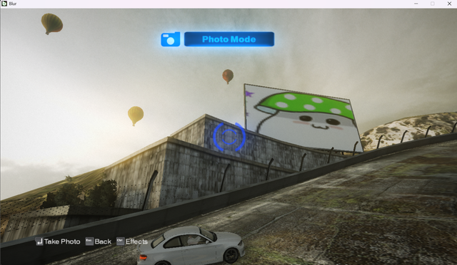

# Blur in-game advertising

Who like ads in their games? Nobody.

But the lucrative untapped market for showing ads for gamers has been attracting developers and ads agencies since 2000s.

There are at the very least 2 such solutions existing to my knowledge:

- Massive Ad Client
- Anzu whatever-its-name-is. Which was recently [reversed](https://www.atredis.com/blog/2025/5/19/in-game-ads)

There are many more of other companies at this time and day, but those 2 were the most prominent one in my favorite era of 2000s-2010s so let's pretend other doesn't exists.

But we're here will talk about Blur in-game ads, which are using `Massive Ad Client`. To some degree in some form. It's a long story.

## Massive ad client in general

I'm planning to make a dedicated write up about ins and outs of Massive ad client eventually and properly dissect it, so here I will just briefly touch some story related facts, nothing too fancy.

Massive Incorporated was created in 2002 as a `advertising company that provided software and services to dynamically host advertisements within video games`. It's rather hard to track down the very first title, but according to [this](https://web.archive.org/web/20220817143603/https://www.gamesindustry.biz/massive-incorporated-unleashes-next-gen-version-of-its-in-game-advertising-technology) article at the end of 2005 they were already on version 3 and boasting about "over 100 titles"

I personally have several encounters with their stuff in NFS: Carbon, Far Cry 2 and Blur (and Blur 2).

Massive Incorporated closed their doors in 2010, and all of their services got disabled as a result. Technically, nothing of value was lost but I love doing silly stuff, and in-game ads sound silly enough.

From a technical standpoint Massive Ad Client is a simple http (and later on https) SOAP api, which can supply not only textures, but also sounds and even 3d models in stl format. 

But I'll stop talking about it for now, and get back to Amax Racing. I mean Blur.

## Activision and Massive Incorporated

There is an amazing piece of news posted in 2008, with a title of `Activision signs 18-game ad deal with Massive` which you can read [here](https://web.archive.org/web/20210409034132/https://www.gamesindustry.biz/articles/activision-signs-18-game-ad-deal-with-massive).

It's rather straightforward and just tells about both companies and their partnership, but there is a tiny detail, which was left unnoticed for years.

```
The deal with Activision is primarily focused on in-game ads however, and covers Xbox 360 and PC titles, including Tony Hawk games, Transformers: Revenge of the Fallen and AMAX Racing. 
```

"Hey now, what the hell is `Amax Racing`?", you may ask. "Activision never released something named `Amax Racing`!", you may add.

The thing is, that this is the early name of Blur. This tiny piece of info slipped through corporate stuff about the yet unannounced title, and nobody picked it up.

At this point in time we have beta logo of Blur, which looks like this:


And pretty much everything in the code is labeled as `Amax`. 

From what I know now, from talking with ex-devs, it was used as "Placeholder name so they could talk about it during launches in public places". And now you're also familiar with this fun fact about Blur.

But now we know for sure that Blur should be using Massive Ad Client. Let's get digging.

## Blur and Massive Ad Client

Blur was way, way beyond schedule for release, so a lot of things got cut. This somewhat applies to Massive Ad Client, but it's really complicated.

The code is there. Debug system for in-game ads is there. Placeholder textures are there. But nothing works. I have a slight suspicion it was only properly working on Xbox 360, if at all, but never actually checked.

Since I've spent an unhealthy amount dumping everything network related about Blur, when I decided to look into in-game ads, I was already well aware that there are no network calls to Massive backend unlike other titles I've checked.

And just like that my journey begin.

## Pinpointing the functions

Since we have the royalty of being able to open Blur data archives, it's possible to snoop around the files and take a direct look at what's inside.

And since a long time I was aware that the game has curious files of

```
@/graphics/textures/jpn_mharuna/advert1.texture
@/graphics/textures/jpn_mharuna/advert2.texture
@/graphics/textures/jpn_mharuna/advert3.texture
@/graphics/textures/jpn_mharuna/advert4.texture
...
```

Doing a simple string search we can find the exact place where those textures are being loaded

```C++
void __thiscall FUN_0085de70(int param_1_00,undefined4 param_1,undefined4 param_2)

{
  char *_Size;
  char cVar1;
  undefined4 *puVar2;
  undefined4 ****ppppuVar3;
  int iVar4;
  undefined4 ****_Src;
  undefined4 ***_Dst;
  byte *pbVar5;
  undefined4 ***local_6c;
  undefined4 ****ppppuStack_68;
  char *pcStack_64;
  undefined4 uStack_60;
  undefined4 ****ppppuStack_5c;
  undefined4 local_40;
  undefined2 local_3c;
  undefined4 local_36;
  undefined4 ****local_30 [3];
  char local_21;
  undefined local_20 [16];
  undefined local_10 [16];
  
  ppppuStack_5c = (undefined4 ****)0x85de89;
  FUN_004e80b0();
  *(undefined4 *)(param_1_00 + 0x54) = param_2;
  if (*(int *)(param_1_00 + 0x60) < 1) {
    iVar4 = 0;
  }
  else {
    iVar4 = *(int *)(param_1_00 + 0x58);
  }
  pbVar5 = (byte *)(iVar4 + 0x20);
  while( true ) {
    if (*(int *)(param_1_00 + 0x60) < 1) {
      iVar4 = 0;
    }
    else {
      iVar4 = *(int *)(param_1_00 + 0x58);
    }
    if (pbVar5 + -0x20 == (byte *)(iVar4 + *(int *)(param_1_00 + 0x60) * 0x24)) break;
    ppppuStack_5c = (undefined4 ****)(uint)pbVar5[-2];
    pcStack_64 = local_20;
    uStack_60 = "advert%d";
    local_20[0] = 0;
    ppppuStack_68 = (undefined4 ****)0x85ded9;
    FUN_00c20050();
    ppppuStack_5c = (undefined4 ****)local_20;
    uStack_60 = (char *)&local_40;
    pcStack_64 = (char *)0x85def1;
    FUN_0087de10();
    pcStack_64 = (char *)0x85def8;
    FUN_00723cf0();
    if ((short)local_40 == -1) {
      ppppuStack_5c = (undefined4 ****)(uint)pbVar5[-2];
      pcStack_64 = local_10;
      uStack_60 = "advert%02d";
      local_10[0] = 0;
      ppppuStack_68 = (undefined4 ****)0x85df19;
      FUN_00c20050();
      ppppuStack_5c = (undefined4 ****)local_10;
      uStack_60 = (char *)&local_36;
      pcStack_64 = (char *)0x85df2d;
      FUN_0087de10();
      pcStack_64 = (char *)0x85df34;
      puVar2 = (undefined4 *)FUN_00723cf0();
      local_40 = *puVar2;
      local_3c = *(undefined2 *)(puVar2 + 1);
    }
    *(undefined4 *)(pbVar5 + -8) = local_40;
    *(undefined2 *)(pbVar5 + -4) = local_3c;
    if ((*pbVar5 & 3) == 0) {
      uStack_60 = (char *)(param_1_00 + 0x24);
      local_30[0] = (undefined4 ****)((uint)local_30[0] & 0xffffff00);
      local_21 = '\0';
      if (*(char *)(param_1_00 + 0x33) != '\0') {
        uStack_60 = *(char **)uStack_60;
      }
      ppppuStack_5c = (undefined4 ****)local_20;
      ppppuStack_68 = local_30;
      pcStack_64 = "graphics/textures/%s/%s.texture";
      local_6c = (undefined4 ***)0x85df86;
      FUN_00411fc0();
      ppppuStack_5c = (undefined4 ****)(pbVar5 + -0x14);
      local_6c = (undefined4 ***)((uint)local_6c & 0xffffff00);
      uStack_60 = (char *)((uint)uStack_60 & 0xffffff);
      if ((undefined4 *****)&local_6c != local_30) {
        _Src = local_30;
        if (local_21 != '\0') {
          _Src = local_30[0];
        }
        ppppuVar3 = _Src;
        do {
          cVar1 = *(char *)ppppuVar3;
          ppppuVar3 = (undefined4 ****)((int)ppppuVar3 + 1);
        } while (cVar1 != '\0');
        _Size = (char *)((int)ppppuVar3 + (1 - (int)((int)_Src + 1)));
        FUN_004039d0(_Size);
        _Dst = &local_6c;
        if (uStack_60._3_1_ != '\0') {
          _Dst = local_6c;
        }
        memcpy(_Dst,_Src,(size_t)_Size);
      }
      cVar1 = FUN_005aabf0();
      if (cVar1 != '\0') {
        *pbVar5 = *pbVar5 | 2;
      }
      if (local_21 != '\0') {
        ppppuStack_5c = local_30[0];
        uStack_60 = (char *)0x85dffe;
        FUN_0042c8a0();
        local_21 = '\0';
        local_30[0] = (undefined4 ****)((uint)local_30[0] & 0xffffff00);
      }
    }
    pbVar5 = pbVar5 + 0x24;
  }
  ppppuStack_5c = (undefined4 ****)0x85e01a;
  FUN_0085d870();
  ppppuStack_5c = (undefined4 ****)0x85e023;
  FUN_004e80d0();
  return;
}
```

So, what do we have here? This def looks like a `thiscall`, and beings a function that format file names in a loop, based on some counter.

Potentially `this` is an instance of Massive Ad Client or some other ads related structure, which should have an array of ads textures. Since this is clearly a backup handling for local placeholder textures, we can potentially override it and supply our own files into appropriate locations.

But as it usually goes with the first Ghidra auto pass, I suspected that a lot of things there could be slightly off. So the next step I usually do with Blur is "consulting Ps3 certification build with debug symbols", before we get from static analysis to breakpoints step.

## Getting more info

When things comes to Blur reversing, we have a massive cheat code. We have **symbols**!

For uninitiated readers, symbols are an info about functions and variables to aid with debugging. So instead of gibberish like above you get human readable names for a majority of things. This helps tremendously with reversing and any symbols file is like a holy grail for people doing said reversing.

We got our holy grail back in 2023 in the form of Blur Ps3 certification build, which since then had led to a lot of discoveries and advancements in Blur related research.

So, let's take a peek into what Ps3 build will tell us.

Going the same path as "do a search for `advert%d` and check the function" leads nowhere, since decompilation is not always perfect.


But hey, we have function names, what if we search for "Advert" instead.


Now we're getting something!

After checking functions one by one I finally found our suspect

```C++
void __thiscall
.Advertising::AdvertManager::EnterZone_PostLoad
          (AdvertManager *this,C_LevelResource *pLevelResource,C_LevelInstance *pLevelInstance)

{
  int iVar1;
  ulonglong uVar2;
  undefined8 uVar3;
  int iVar4;
  char cVar6;
  C_RenderModelData *pCVar5;
  undefined4 *puVar7;
  undefined2 *puVar8;
  undefined8 local_138;
  short local_f0;
  undefined2 local_ee;
  undefined2 local_ec;
  undefined local_e8 [16];
  undefined local_d8 [32];
  undefined4 local_b8;
  char local_a9;
  short local_a0;
  undefined2 local_9e;
  undefined2 local_9c;
  
  FUN_00c4079c(this + 0x28);
  *(C_LevelInstance **)(this + 0x6c) = pLevelInstance;
  iVar1 = *(int *)(this + 0x78);
  iVar4 = 0;
  if (0 < iVar1) {
    iVar4 = *(int *)(this + 0x70);
  }
  puVar8 = (undefined2 *)(iVar4 + 0x44);
  uVar3 = local_138;
  do {
    iVar4 = 0;
    if (0 < iVar1) {
      iVar4 = *(int *)(this + 0x70);
    }
    if ((undefined2 *)(iVar4 + *(int *)(this + 0x78) * 0x50) == puVar8 + -0x22) {
      FixUpDownloadedTextures(this);
      FUN_00c407ac(this + 0x28);
      return;
    }
    Btl::StringBase<>::Printf
              ((StringBase<> *)local_d8,*(char **)((int)uVar3 + -0x13c0),
               (ulonglong)*(byte *)(puVar8 + 1));
    pCVar5 = (C_RenderModelData *)
             .GameResource::C_LevelResource::GetRenderModelData((C_LevelResource *)pLevelResourc e);
    WorldRender::C_RenderModelData::GetParameter(pCVar5,(char *)(StringBase<> *)local_d8);
    if (local_f0 == -1) {
      pCVar5 = (C_RenderModelData *)
               .GameResource::C_LevelResource::GetRenderModelData((C_LevelResource *)pLevelResou rce)
      ;
      local_d8[16] = '\0';
      Btl::StringBase<>::Printf
                ((StringBase<> *)(local_d8 + 0x10),*(char **)((int)uVar3 + -0x13bc),
                 (ulonglong)*(byte *)(puVar8 + 1));
      WorldRender::C_RenderModelData::GetParameter(pCVar5,(char *)(StringBase<> *)(local_d8 + 0x 10))
      ;
      local_f0 = local_a0;
      local_ee = local_9e;
      local_ec = local_9c;
    }
    *puVar8 = local_ec;
    puVar8[-2] = local_f0;
    puVar8[-1] = local_ee;
    if ((-1 < (longlong)*(ulonglong *)(puVar8 + 2)) &&
       (uVar2 = *(ulonglong *)(puVar8 + 2) >> 0x3e & 1, (int)uVar2 == 0)) {
      local_a9 = (char)uVar2;
      local_b8 = (undefined4 *)CONCAT13(local_a9,local_b8._1_3_);
      if (this[0x4b] == (AdvertManager)0x0) {
        FUN_00c3fb4c(&local_b8,*(undefined4 *)((int)uVar3 + -0x13a0),this + 0x3c,local_d8);
        if (local_a9 != '\0') goto LAB_006d3200;
LAB_006d3008:
        puVar7 = &local_b8;
        iVar4 = FUN_00c3f8fc(puVar7);
        iVar4 = iVar4 + 1;
        FUN_00c3f8ac(local_e8,iVar4);
      }
      else {
        FUN_00c3fb4c(&local_b8,*(undefined4 *)((int)uVar3 + -0x13a0),*(undefined4 *)(this + 0x3c) ,
                     local_d8);
        if (local_a9 == '\0') goto LAB_006d3008;
LAB_006d3200:
        puVar7 = local_b8;
        iVar4 = FUN_00c3f8fc(local_b8);
        iVar4 = iVar4 + 1;
        FUN_00c3f8ac(local_e8,iVar4);
      }
      FUN_00c3f7ec(local_e8,puVar7,iVar4);
      cVar6 = FUN_00c418bc(local_e8,puVar8 + -0x12);
      if (cVar6 != '\0') {
        *(ulonglong *)(puVar8 + 2) = *(ulonglong *)(puVar8 + 2) | 0x4000000000000000;
      }
      uVar3 = local_138;
      if (local_a9 != '\0') {
        if (local_b8 != (undefined4 *)0x0) {
                    /* WARNING: Subroutine does not return */
          FUN_00c3f7fc(local_b8);
        }
        local_a9 = '\0';
        local_b8 = (undefined4 *)0x0;
      }
    }
    puVar8 = puVar8 + 0x28;
    iVar1 = *(int *)(this + 0x78);
  } while( true );
}
```

This looks so far off from what we have on PC, but after I had a particular incident with presenting my findings where I was asked "How the hell you figured that out?" I try to show and explain my conclusions in a rather detailed manned.

### 1. Same number of variables number and calling type

#### PC
```C++
void __thiscall FUN_0085de70(int param_1_00,undefined4 param_1,undefined4 param_2)
```

#### PS3
```C++
void __thiscall
.Advertising::AdvertManager::EnterZone_PostLoad
          (AdvertManager *this,C_LevelResource *pLevelResource,C_LevelInstance *pLevelInstance)
```

This is where more proficient RE people will tear me apart, saying that this means absolutely nothing, but it's a good start.

### 2. Very similar early code

#### PC
```C++
  ppppuStack_5c = (undefined4 ****)0x85de89;
  FUN_004e80b0();
  *(undefined4 *)(param_1_00 + 0x54) = param_2;
  if (*(int *)(param_1_00 + 0x60) < 1) {
    iVar4 = 0;
  }
  else {
    iVar4 = *(int *)(param_1_00 + 0x58);
  }
```

#### PS3
```C++
  FUN_00c4079c(this + 0x28);
  *(C_LevelInstance **)(this + 0x6c) = pLevelInstance;
  iVar1 = *(int *)(this + 0x78);
  iVar4 = 0;
  if (0 < iVar1) {
    iVar4 = *(int *)(this + 0x70);
  }
```

There we can see that second param coming into the function is being assigned to `this` offset. And such behavior is not a mere coincedence.

`iVar4` being set in both in somewhat similar fashion also looks suspicions.

### 3. Loop

In both decompilation we can see that the main part of the function is a loop, which has a rather similar initial variable assignment.

#### PC
```C++
  while( true ) {
    if (*(int *)(param_1_00 + 0x60) < 1) {
      iVar4 = 0;
    }
    else {
      iVar4 = *(int *)(param_1_00 + 0x58);
    }
    ...
  }
```

#### PS3
```C++
  do {
    iVar4 = 0;
    if (0 < iVar1) {
      iVar4 = *(int *)(this + 0x70);
    }
    ...
    } while( true );
```

Just to be clear, I'm not claiming that "since `iVar4` is present at both it's the same variable and so the code is the same". It's obviously a coincidence, that a 4th variable used inside the function is related to the loop in both decompilations. But sometimes we do get lucky, since source C++ code is the same, and it results in stuff like this. (Where those are the very same variable, but I know it while you don't, and here I'm providing my arguments for it.)


### 3. Various similiar checks

When you cross-referencing the code, your best bet is checks. Setting up stack and function evocations could be drastically different, but those ifs are not only properly decompiled in 90% of the time, but in most cases are the same.
#### PC
```C++
if ((short)local_40 == -1) {
...
if (*(char *)(param_1_00 + 0x33) != '\0') {
```

#### PS3
```C++
if (local_f0 == -1) {
...
if (this[0x4b] == (AdvertManager)0x0) 
```
---

Those comparisons can go for a while, like checking inside the called functions on PS3, where we would find a call to `Util::C_StringBase<>::Printf` which an indication of string formatting, which we know is happening.

For now let's declare the search as a success and move forward.


## Next step

Since we now have found the function, it means all of our problems are gone since we have symbols, right?

Well, if you check the function for Ps3 one more time, trying to find any names, you quickly realize that there are none. And for those functions hidden inside the wrapper function there is not much to do.

But symbols don't only contain names, they contain structures definitions! What if we check those?

```
AdvertManager *
32 bit Pointer
Length: 4 Alignment: 4

WARNING! Empty Structure
/*
PlaceHolder Class Structure

struct AdvertManager
Length: 0 Alignment: 1
{
} pack (disabled)
```

Cool. 

So the only really valuable thing we got is the variables names in function calling

```C++
void __thiscall
.Advertising::AdvertManager::EnterZone_PostLoad
          (AdvertManager *this,C_LevelResource *pLevelResource,C_LevelInstance *pLevelInstance)
```

## Sidenote - some more digging in PC decompilation

Just to be sure you picked all the little details you usually check the called functions inside the target function one by one.

```C++
    uStack_60 = "advert%d";
    local_20[0] = 0;
    ppppuStack_68 = (undefined4 ****)0x85ded9;
    FUN_00c20050();
```

Like `FUN_00c20050` here. And we see that Ghidra did a bad job

```C++
void * FUN_00c20050(void *param_1,char *param_2)

{
  char cVar1;
  char *pcVar2;
  char local_400 [1024];
  
  vsprintf_s(local_400,0x400,param_2,&stack0x0000000c);
  pcVar2 = local_400;
  do {
    cVar1 = *pcVar2;
    pcVar2 = pcVar2 + 1;
  } while (cVar1 != '\0');
  memcpy(param_1,local_400,(int)pcVar2 - (int)(local_400 + 1));
  *(undefined *)(((int)pcVar2 - (int)(local_400 + 1)) + (int)param_1) = 0;
  return param_1;
}
```

This is clearly just a string formatter via `vsprintf_s`.

Let's force Ghidra to do it job, by changing it's calling convention. And add some naming, while we're at.

```C++
      local_10[0] = 0;
      ppppuStack_68 = (undefined4 ****)0x85df19;
      StringFormatter(local_10,"advert%02d");
      FUN_0087de10();
```

Much better!

If we look some more we will see yet another function `FUN_005aabf0` called incorrectly.

```C++
cVar1 = FUN_005aabf0();
```

Which when opened looks like

```C++
undefined4
FUN_005aabf0(undefined4 *param_1,undefined4 param_2,undefined4 param_3,undefined4 param_4)
```

If we scroll down we'll see a curious block

```C++
...
  iVar5 = FUN_004d1400(".texture",0);
  if (iVar5 == -1) {
    iVar5 = FUN_004d1400(&DAT_00e8d09c,0);
    if (iVar5 == -1) {
      iVar5 = FUN_004d1400(&DAT_00e8d0ac,0);
      if (iVar5 == -1) {
        iVar5 = FUN_004d1400(&DAT_00e8d0a4,0);
...
```

`.texture` is a default texture format of Blur, which is a DXT5 texture with the header removed (genius move, I know). But what are the others? If we open `DAT_00e8d09c` we see

```
2e 64 64 73   
```
which is a 

```
.dds
```

And by doing some fixes we get

```
  iVar5 = FUN_004d1400(".texture",0);
  if (iVar5 == -1) {
    iVar5 = FUN_004d1400(".dds",0);
    if (iVar5 == -1) {
      iVar5 = FUN_004d1400(".tga",0);
      if (iVar5 == -1) {
        iVar5 = FUN_004d1400(".bmp",0);
```

So we have found a "type-based texture loader, which is great news for understanding the decompiled code.

## Dynamic analysis

After you're done picking apart statically decompiled code and finally hit a wall, it's time to load the binary into the decompiler and look at the memory.

Since it's not exactly too much fun showing you memory segments before and after the function has run, and then doing it 100-500 times to trace every buffer and register, I will give you some brief info about each step I took. For the task we will use `x32dbg`. Technically it's possible to use debuggers in Ghidra and IDA, but I just prefer to do it this way.

### Step 1 - set a break point at the `EnterZone_PostLoad`


This way we'll make the game pause when we hit it, so we can check data structures.

### Step 2 - hit the function and examine stack and memory before execution


Since we know this is a `thiscall` let's pick it


This is my "main" x32dbg project, so some variables would be already labeled, sorry for this. And it's a good time to mention that Blur memory layout is very static, so `AdvertManager` has its own static address, which I've labeled.

Let's check how `AdvertManager` looks in memory **before** the execution.


For uninitiated this looks like a lot of nothing, but more experienced people see this like


So what do we have here?

- a header of all zeroes
- at 0x12 we have some pointer
- at 0x16 we probably have another pointer
- 2 strings, which are represents client title id and version

Let's take a look at `C_LevelResource` which we know comes second:

 [alt text](readme.md)

And we strike gold! Here we are a level name file in plain text, which is very handy. By grabbing this data from the second variable we're able to properly figure out which files to load, when we actually get to implementing our solution.


### Step 3 - hit the function and examine stack and memory after execution

After the function runs, one value of `AdvertManager` gets populated, and it looks like a pointer to something!


Could this be our array of textures?

 [alt text](readme.md)

Looks like another class? Hard to say. But let's try loading level that we do know have advertising textures.

### Step 4 - Repeat step 2 and 3 for 100 times

> You see, the thing about reverse engineering is that it require tremendous dedication. You are trying the same thing with tiny changes hundreds of times, to check if data you have got changed. Here I make it look like I did it in one sitting, but I'm not a genius. The process I'm describing here took at least 2 weeks. But with this aside, let's continue.

If we try to load a game level, instead of main menu location we get a much much more populated structure of `AdvertManager`:


Let's try to break it down


Now we have a **very** suspicious numbers here, which weren't present before. 0xB is 11 and 0xA is 10. Could this be num of ads to load?

Since we have files exported we can verify the number to be sure! This level is called `\levels\spa_barcelona_oval\level.level`.


And what do you know! Those numbers are equal. Great, let's assume this is a number of ads for now.

Let's let the function run and check the state after the function runs.


Only the highlighted value got changed. Strange!

The only way to get somewhere, is to check all the pointers by hand. Most of them usually will have more data and more pointers, but a pointer at offset 0x58 finally showed some promise.


Do you see it? It's a lot of repeating data! This must be array. And if we squint our eyes some more, we can notice a pattern.


Same object size! Small numbers, not exceeding 10! More numbers! Now this looks promising. If we do the same "check pointers one by one" we struck another gold.


This is texture data! `DXT1` and everything is here. You probably are scratching your head here at my "everything" claim, but if you have worked with d3d9 hacking you know that this is a texture right here.

So now we have all we need:

- Level name
- Num of files
- Location of ad structure array pointer

We can finally get to write some actual code and try to make it work!

## Sidenote - So is it Massive Ad Client or not?

To put it bluntly - it's definitely not.

There is an internal subsystem of `Advertising`, which consists of

- `AdvertDownload`
- `AdvertManager`
- `AdvertObject`
- `AdvertResource`

 Those classes point to the fact that the interface between game and provider of ads was built, but in the end never shipped. So while calls such as

 - `EnterZone`
 - `EnterZone_PostLoad`
 - `Update`
 - `ExitZone`
 - `Initialize`

 exist and are being called at the right time and doing the right thing with local placeholders, it was never finished to do the actual thing.

 But the interesting thing, that the `EnterZone` function in-game `AdvertManager` is a direct reference to Massive Ad Client function of `XMassiveAdClient::EnterZone`, which I know now, after digging not too deep into it.

 So **by design** `AdvertManager` was made to function with Massive Ad Client, but this was never implemented on PC and PS3.

For other people curious in Massive Ad Client the dead gave away that it's present in a title is an inclusion of strings like

- `XMassiveAdClient::EnterZone`
- `XMassiveAdClient Failed Initialization`
- `Software\\Microsoft\\Massive\\AdClient`
- `CMassiveZoneManager`
- `HTTP/1.1\r\nHost:%s\r\nContent-Length:%d\r\nContent-Type:application/massive\r\nUser-Agent:%s%s\r\n\r\n`

Which are not present in Blur (PC and PS3) at all. But, surprisingly, those are present in Blur 2 leaked build. And there is even a debug log for it!

```
1969-12-31 16:00:00,000 ERROR [CACHE] CURL: failed to initialize CURL (status: 32770)
1969-12-31 16:00:00,064 ERROR [CMassiveAssetCache] CMassiveAssetCache::Initialize(): CCacheFile initialization failed
1969-12-31 16:00:00,065 ERROR [XMassiveAdClient] Initialization failed for CMassiveAssetCache, Disabling Cache
2010-09-29 00:32:20,323 ERROR [CMassiveSystem] Retrieval of PlayerId for player 0 failed (result: -2147483638, extended: 0x2733).
2010-09-29 00:32:20,824 ERROR [CNetworkManager] Error while receiving.  Still have original request data, will try resending the request..
2010-09-29 00:32:20,824 ERROR [CNetworkManager] ERROR: 804 - Network receive error
2010-09-29 00:32:20,825 ERROR [XMassiveAdClient] ERROR: 804 - Network receive error
2010-09-29 00:32:47,848 ERROR [XMassiveAdClient] ERROR: 300 - Zone name is unknown or improperly formatted - Cannot Find Zone: traffictestlevel2_01
```

So while trying to find Massive Ad Client I was left only with a game frontend for it. Which is probably a better outcome, all in all. As I mentioned earlier, I plan to properly reverse Massive Ad Client eventually and make a proper write up for it.

## Describing structures in the code

So, let's start with describing the structures, using what we saw in memory of the game.

```rust

#[repr(C)]
struct AdvertManager {
    pub unk1: u32,
    pub unk2: u32,
    pub unk3: u32,
    pub unk4: [u8; 0x28],
    pub platform_name: [u8; 0xC],
    pub unk5: u32,
    pub platform_version: [u8; 0x4],
    pub unk6: [u8; 0xC],
    pub level_instance_ptr: *mut c_void,
    pub ptr_to_textures: *mut AdvertTexture,
    pub unk7: u32, //num of ads + 1
    pub num_of_ads: u32,

}

#[repr(C)]
struct AdvertTexture {
    pub unk1: [u8; 0xC],
    pub size: u32,
    pub zero: u32,
    pub ptr_to_dx_texture: IDirect3DTexture9,
    pub unk_id: u32,
    pub size_x10: u16,   //always 0x10
    pub texture_id: u16, //advert[10]
    pub mode: u32, //Not sure what it exactly represents. To make textures to show up in game a value of 2 is required. It can be altered up to 4, then cycle back to 0. When in game, can goes as high as 6.
}

struct PLevelResource {
    pub header1: [u8; 0x10],
    byte1: u8,
    level_name: [c_char; 0x107],
}
```

So good so far.

Then I thought a lot about the best approach for the file sideloading. Since there are no network calls and no actual Massive Ad Client code, I don't need to build a backend for Massive Ad client and just focus on a simple detour.

But in the end I slided with my initial idea of "load my files instead of placeholder ones". So I just decided to hook `EnterZone_PostLoad` and replace it completely with my own implementation, and load my own files into the game and place them into the correct places in memory.

## Some more labeling and research

To properly replace an existing function I spend some more time labeling and fixing Ghidra output. This resulted in this decompiled code:

```C++
void __thiscall
AutoClass1::EnterZone_PostLoad(AutoClass1 *this,int pLevelResource,int pLevelInstance)

{
  char *_Size;
  char cVar1;
  int *LevelData;
  undefined4 *ads_position;
  uint **ppuVar2;
  undefined4 ****ppppuVar3;
  undefined4 uVar4;
  int iVar5;
  undefined4 ****_Src;
  undefined4 ***_Dst;
  byte *pbVar6;
  undefined4 ****ppppuVar7;
  char *pcVar8;
  undefined4 local_40;
  undefined2 local_3c;
  undefined4 local_36;
  undefined4 ****local_30 [3];
  char local_21;
  byte local_20 [16];
  byte local_10 [16];
  uint PotentialTexturePTR;
  byte *TextureName;
  undefined4 ***texture_path;
  
  FUN_004e80b0(&this->field16_0x10);
  this->LevelInstance = pLevelInstance;
  if (this->NumOfAds < 1) {
    iVar5 = 0;
  }
  else {
    iVar5 = this->PtrToTextures;
  }
  pbVar6 = (byte *)(iVar5 + 0x20);
  while( true ) {
    if (this->NumOfAds < 1) {
      iVar5 = 0;
    }
    else {
      iVar5 = this->PtrToTextures;
    }
    if (pbVar6 + -0x20 == (byte *)(iVar5 + this->NumOfAds * 0x24)) break;
    local_20[0] = 0;
    ConstructString(local_20,"advert%d");
    TextureName = local_20;
    ads_position = &local_40;
    LevelData = (int *)FUN_0087de10(pLevelResource);
    GetAdsPosition(LevelData,ads_position,TextureName);
    if ((short)local_40 == -1) {
      local_10[0] = 0;
      ConstructString(local_10,"advert%02d");
      TextureName = local_10;
      ads_position = &local_36;
      LevelData = (int *)FUN_0087de10(pLevelResource);
      ads_position = (undefined4 *)GetAdsPosition(LevelData,ads_position,TextureName);
      local_40 = *ads_position;
      local_3c = *(undefined2 *)(ads_position + 1);
    }
    *(undefined4 *)(pbVar6 + -8) = local_40;
    *(undefined2 *)(pbVar6 + -4) = local_3c;
    if ((*pbVar6 & 3) == 0) {
      ppuVar2 = &this->field33_0x24;
      local_30[0] = (undefined4 ****)((uint)local_30[0] & 0xffffff00);
      local_21 = '\0';
      if (this->field_0x33 != '\0') {
        ppuVar2 = (uint **)*ppuVar2;
      }
      ppppuVar7 = local_30;
      pcVar8 = "graphics/textures/%s/%s.texture";
      texture_path = (undefined4 ***)0x85df86;
      FUN_00411fc0(ppppuVar7,"graphics/textures/%s/%s.texture");
      texture_path = (undefined4 ***)((uint)texture_path & 0xffffff00);
      PotentialTexturePTR = (uint)ppuVar2 & 0xffffff;
      if ((undefined4 *****)&stack0xffffff94 != local_30) {
        _Src = local_30;
        if (local_21 != '\0') {
          _Src = local_30[0];
        }
        ppppuVar3 = _Src;
        do {
          cVar1 = *(char *)ppppuVar3;
          ppppuVar3 = (undefined4 ****)((int)ppppuVar3 + 1);
        } while (cVar1 != '\0');
        _Size = (char *)((int)ppppuVar3 + (1 - (int)((int)_Src + 1)));
        FUN_004039d0((undefined4 *)&stack0xffffff94,(uint)_Size);
        _Dst = (undefined4 ***)&stack0xffffff94;
        if ((char)(PotentialTexturePTR >> 0x18) != '\0') {
          _Dst = texture_path;
        }
        memcpy(_Dst,_Src,(size_t)_Size);
      }
      uVar4 = LoadTextureFromPath(texture_path,ppppuVar7,pcVar8,PotentialTexturePTR);
      if ((char)uVar4 != '\0') {
        *pbVar6 = *pbVar6 | 2;
      }
      if (local_21 != '\0') {
        FUN_0042c8a0(local_30[0]);
        local_21 = '\0';
        local_30[0] = (undefined4 ****)((uint)local_30[0] & 0xffffff00);
      }
    }
    pbVar6 = pbVar6 + 0x24;
  }
  FUN_0085d870((int)this);
  FUN_004e80d0(&this->field16_0x10);
  return;
}
```

So to reimplement it, we need something like

1. hook `EnterZone_PostLoad`
2. Set all variables correctly
3. In a loop go though all files and load them into `LPDIRECT3DTEXTURE9` via `D3DXCreateTextureFrom*` d3d9 call
4. Populate pointers with array with pointers to our `LPDIRECT3DTEXTURE9`
5. ???
6. Profit

During the first initial tests I was able to display ads, but only 1 or 2 of them were working.



I got back to `x32dbg` and found out that there is one very crucial piece of data I was missing.

This function which I now have labeled as

```C++
GetAdsPosition(LevelData,ads_position,TextureName);
```

Is in charge of taking the texture name and returning its correct id of its position which doesn't correspond with the sequential id of the texture. Those are labeled green here:


Now is the time to properly present to you the code that was made.

## The part where I show my code

Since I've already toyed with d3d9 stuff in Blur for profile pictures (this story will be told in another write up) I borrowed my own code

```rust
pub unsafe fn get_d3d9_device() -> Option<*mut IDirect3DDevice9> {
    let start = crate::EXE_BASE_ADDR + 0x00D44EE4;

    let ptr = start as *const i32;
    debug!("Addr of start: {:?}", start);
    debug!("Addr of ptr1: {:p},value: {}", ptr, *ptr);

    if *ptr == 0 {
        warn!("Failed to aquire d3d9 device handle");
        return None;
    }

    let step2 = *ptr;

    let step3 = step2 + 0x14;

    let step4 = step3 as *const i32;
    debug!("Addr of step4: {:p},value: {}", step4, *step4);
    let d3d9_ptr_real = *step4 as *mut IDirect3DDevice9;
    info!("Addr of d3d device: {:p}", d3d9_ptr_real);

    return Some(d3d9_ptr_real);
}
```

This was probably the earliest code I wrote when I started my journey into rust dlls injections, so pardon the poor naming and not the best chain of pointers handling.

From my previous research of Blur internals, I knew that `IDirect3DDevice9` position in memory is static, so it made my life rather easy.

For uninitiated `IDirect3DDevice9` is a pointer to the graphical device interface, exposed though the d3d9 system library. The very DirectX graphical API games force upon you on every install. So to interface with anything related to graphics on a low level, like textures loading, you need this ptr.

As for "How did you get it?" - every texture has a ptr to it. And if you manage to find a texture in memory, you can also do a pointer scan in Cheat Engine to find a chain of pointers to get to it. And since Blur memory layout is almost static, this is rather trivial.

Next is a wrapper around `D3DXCreateTextureFromFileInMemoryEx` which I prefer to use to have full control over what is loaded.

```rust

type D3DXCreateTextureFromFileInMemoryEx = extern "stdcall" fn(
    device: &IDirect3DDevice9,
    pSrcData: *mut u8,
    SrcDataSize: usize,
    Width: u32,
    Height: u32,
    MipLevels: u32,
    Usage: u32,
    Format: D3DFORMAT,
    Pool: D3DPOOL,
    Filter: u32,
    MipFilter: u32,
    ColorKey: u32, //D3DCOLOR
    pSrcInfo: *mut c_void,
    pPalette: *mut c_void,
    ppTexture: *mut IDirect3DTexture9,
) -> HRESULT;

pub fn d3d9_load_texture_from_memory_ex_new(
    d3d9_device: *mut IDirect3DDevice9,
    mut tex_buffer: Vec<u8>,
) -> Result<Option<IDirect3DTexture9>, ()> {
    let func_addr =
        get_module_symbol_address("d3dx9_42.dll", "D3DXCreateTextureFromFileInMemoryEx")
            .expect("could not find 'D3DXCreateTextureFromFileInMemoryEx' address");

    let mut texture: Option<IDirect3DTexture9> = None;

    let d3d9_func: D3DXCreateTextureFromFileInMemoryEx = unsafe { std::mem::transmute(func_addr) };

    unsafe {
        let result = d3d9_func(
            &*d3d9_device,
            tex_buffer.as_mut_ptr(),
            tex_buffer.len(),
            u32::MAX,
            u32::MAX,
            1,
            0,
            D3DFMT_R8G8B8,
            D3DPOOL(0),
            3 << 0,
            3 << 0,
            0,
            ptr::null_mut(),
            ptr::null_mut(),
            ptr::addr_of_mut!(texture) as *mut _,
        );

        debug!(
            "Result of D3DXCreateTextureFromFileInMemoryEx: {:?}",
            &result
        );

        if result.is_ok() {
            Ok(texture)
        } else {
            Err(())
        }
    }
}
```

Now we have a way to load files into the game! Now we need to actually do some file loading.

```rust
fn zone_postload(
    AdvertManager: *mut AdvertManager,
    pLevelResource: *mut PLevelResource,
    pLevelInstance: *mut c_void,
) {
    unsafe {
        (*AdvertManager).level_instance_ptr = pLevelInstance;

        let level_name_full = CStr::from_ptr((*pLevelResource).level_name.as_ptr())
            .to_str()
            .unwrap_or_default();

        debug!("Level file path - {}", level_name_full);

        let level_name = level_name_full
            .replace(".\\levels\\", "")
            .replace("\\level.level", "");

        debug!("Level name - {}", &level_name);

        let num_of_ads = (*AdvertManager).num_of_ads;
        debug!("num_of_ads - {}", num_of_ads);
        if num_of_ads < 1 {
            return;
        }

        let get_ads_pos_fn: GetAdPositionOnLevel = unsafe { std::mem::transmute(0x00723cf0) };
        let get_level_ads_data: GetLevelAdsData = unsafe { std::mem::transmute(0x0087de10) };

        let mut j: isize = 0;

        let appdata_amax_path = get_appdata_amax_path().unwrap();
        let d3d9_device = match get_d3d9_device() {
            Some(device) => device,
            None => {
                return;
            }
        };

        for i in (1..num_of_ads + 1).rev() {
            let texture_name = format!("advert{}", i);
            debug!("Checking texture {}", &texture_name);
            let name_of_texture = CString::new(texture_name).unwrap();

            let mut adv_pos = 0;
            let level_ads_data = get_level_ads_data(pLevelResource as _);
            get_ads_pos_fn(
                level_ads_data as _,
                ptr::addr_of_mut!(adv_pos),
                name_of_texture.as_ptr(),
            );

            debug!("Ads pos - {:x}", adv_pos);

            let full_path = appdata_amax_path
                .join("ads")
                .join(&level_name)
                .join(format!("advert{}.png", i));
            debug!("File path {:?}", &full_path);

            let img_data = match std::fs::read(&full_path) {
                Ok(img_data) => img_data,
                Err(e) => {
                    error!("Failed to read file {:?} - {e}", &full_path);
                    continue;
                }
            };

            let size = img_data.len() as u32;

            let new_texture = match d3d9_load_texture_from_memory_ex_new(d3d9_device, img_data) {
                Ok(texture_result) => match texture_result {
                    Some(texture) => texture,
                    None => {
                        continue; //this is safe
                    }
                },
                Err(_) => {
                    continue; //this is safe
                }
            };

            let temp = AdvertTexture {
                unk1: [0; 0xC],
                size: size as u32,
                zero: 0,
                ptr_to_dx_texture: new_texture,
                unk_id: adv_pos,
                size_x10: 0x10,
                texture_id: i as u16,
                mode: 2,
            };
            let offset_to_write = (*AdvertManager).ptr_to_textures.wrapping_offset(j);
            offset_to_write.write(temp);

            j += 1;
        }
    }
}
```

`how_to_draw_an_owl.jpg`

I sadly don't have the earliest version of the code anymore to show you the whole process of developing this exact function, but this is the first MVP version, which is still dirty and early enough to demonstrate the approach.

Let's break it down for easier understanding of what is going on

### 1. Set the `pLevelInstance`

This one is coming from the decompilation directly

#### Decompiled code
```C++
  FUN_004e80b0(&this->field16_0x10); //EnterCriticalSection
  this->LevelInstance = pLevelInstance;
```

#### Rust code
```rust
    (*AdvertManager).level_instance_ptr = pLevelInstance;
```

### 2. Extract level name

```rust
        let level_name_full = CStr::from_ptr((*pLevelResource).level_name.as_ptr())
            .to_str()
            .unwrap_or_default();

        debug!("Level file path - {}", level_name_full);

        let level_name = level_name_full
            .replace(".\\levels\\", "")
            .replace("\\level.level", "");

        debug!("Level name - {}", &level_name);
```

### 3. Check if ads num is zero

#### Decompiled code
```C++
  if (this->NumOfAds < 1) {
    iVar5 = 0;
  }
  else {
    iVar5 = this->PtrToTextures;
  }
```

#### Rust code
```rust
        let num_of_ads = (*AdvertManager).num_of_ads;
        debug!("num_of_ads - {}", num_of_ads);
        if num_of_ads < 1 {
            return;
        }
```

### 4. Define functions used in original function and get d3d9 device

```rust
        let get_ads_pos_fn: GetAdPositionOnLevel = unsafe { std::mem::transmute(0x00723cf0) };
        let get_level_ads_data: GetLevelAdsData = unsafe { std::mem::transmute(0x0087de10) };

        let mut j: isize = 0;

        let appdata_amax_path = get_appdata_amax_path().unwrap();
        let d3d9_device = match get_d3d9_device() {
            Some(device) => device,
            None => {
                return;
            }
        };
```

### 5. Start the loop and check if such ad position exists

So while advertisement textures are named `advert1.texture`, `advert2.texture` and so, their actual position on track can differ. So to set the ad position correctly, we need to call the `get_ads_pos_fn` function, which tells us where this texture goes.

```rust
        for i in (1..num_of_ads + 1).rev() {
            let texture_name = format!("advert{}", i);
            debug!("Checking texture {}", &texture_name);
            let name_of_texture = CString::new(texture_name).unwrap();

            let mut adv_pos = 0;
            let level_ads_data = get_level_ads_data(pLevelResource as _);
            get_ads_pos_fn(
                level_ads_data as _,
                ptr::addr_of_mut!(adv_pos),
                name_of_texture.as_ptr(),
            );

            debug!("Ads pos - {:x}", adv_pos);
```

### 6. Load texture from local file

```rust
            let full_path = appdata_amax_path
                .join("ads")
                .join(&level_name)
                .join(format!("advert{}.png", i));
            debug!("File path {:?}", &full_path);

            let img_data = match std::fs::read(&full_path) {
                Ok(img_data) => img_data,
                Err(e) => {
                    error!("Failed to read file {:?} - {e}", &full_path);
                    continue;
                }
            };

            let size = img_data.len() as u32;

            let new_texture = match d3d9_load_texture_from_memory_ex_new(d3d9_device, img_data) {
                Ok(texture_result) => match texture_result {
                    Some(texture) => texture,
                    None => {
                        continue; //this is safe
                    }
                },
                Err(_) => {
                    continue; //this is safe
                }
            };
```

### 7. Populate array with our new data

```rust
            let temp = AdvertTexture {
                unk1: [0; 0xC],
                size: size as u32,
                zero: 0,
                ptr_to_dx_texture: new_texture,
                unk_id: adv_pos,
                size_x10: 0x10,
                texture_id: i as u16,
                mode: 2,
            };
            let offset_to_write = (*AdvertManager).ptr_to_textures.wrapping_offset(j);
            offset_to_write.write(temp);

            j += 1;
        }
```

And that's it!

Given, there are some more checks, function calls and whatnot in the original code, but doing it like this made the game to not crash during long testing sessions and level restarts. So it's as good as it gets.

And now, let's check it in-game.


Great, it works. Unless you switch from fullscreen to windowed.

### `IDirect3DDevice9` getting away

So when you switch from fullscreen to windowed a lot of things are happening internally. One of such things is `IDirect3DDevice9` being replaced, switching its location and textures being reloaded.

This was not up to our hook liking, crashing the game, as a result.

This nasty bug was fixed by another Blur coder (there are 4 of us, we are many) `tobii`. Who did it by loading all the textures in the memory on `AdvertManager` initialization. This created a huge overhead of 10mb of memory, which made Blur to consume ~10mb more from its base ~500mb. Sadly, we'll have to live with such major drawbacks.

tobii was kind enough to weight in on the matter, so I will just put his comment as is.

> It would be possible to only have the textures loaded and unloaded from VRAM, but the requirements for doing so are annoying:
 
> - you have to keep track of the resources AND game state
> - you have to free them before reset, but NOT too soon OH NO NO then I segfault uwu
> - that also means some way of "handling" reset, which could be done from d3d9.dll notifying plugins, but also extremely annoying in rust cause that means shared access to raw pointers (ew ew yucky compiler error uwu v2)
> - you have to re-create them after reset. WHICH ONES THO? go figure it out from game state. also you can't do it asynchronously, user will have to wait for data to be loaded from disk again (we didnt want it in RAM)
https://learn.microsoft.com/en-us/windows/win32/direct3d9/d3dpool?redirectedfrom=MSDN

> the thing that actually makes the textures work and survive reset right now is the D3DPOOL_MANAGED flag
https://github.com/Amax-Emu/amax-ads/blob/f53c068e9a092a43af74c7378dfc12660b6673d4/src/dx_tools.rs#L90C3-L90C18

> downside, as you know, is that they stay in RAM

> upside, is that they stay in ram lmao

> THOSE 10MB BOTHER ME SO HEKING MUCH THOUGH

The final code of `EnterZone_PostLoad` now looks like

```rust
pub fn hook_enter_zone_post_load(
	advert_manager: *mut AdvertManager,
	p_level_resource: *mut PLevelResource,
	p_level_instance: *mut c_void,
) {
	unsafe {
		(*advert_manager).level_instance_ptr = p_level_instance;
	}

	let level_name_full = unsafe { CStr::from_ptr((*p_level_resource).level_name.as_ptr()) }
		.to_str()
		.unwrap_or_default();

	log::trace!("level_name_full: \"{level_name_full}\"");

	let level_name = level_name_full
		.trim_start_matches(".\\levels\\")
		.trim_end_matches("\\level.level");
	log::trace!("level_name: {level_name}");

	let ad_count = unsafe { (*advert_manager).ad_count };
	log::trace!("ad_count: {ad_count}");
	if ad_count < 1 {
		return;
	}

	let cache = AdCache::g();
	let cache_read = cache.read().unwrap();

	let mut j: isize = 0;
	for idx in (1..=ad_count).rev() {
		let texture_name = format!("advert{idx}");
		log::trace!("texture_name: {texture_name}");

		let Some((tex_ptr, img_size)) = cache_read.get_tex_data(level_name, &texture_name) else {
			log::warn!("{level_name}/{texture_name} not found in cache?");
			// j not incremented!
			continue;
		};

		let adv_pos = PLevelResource::get_ad_pos(p_level_resource, &texture_name);
		log::debug!("adv_pos = {adv_pos}");
		if adv_pos == 0xFFFFFFFF {
			// TODO: Something Something?
		}

		unsafe {
			(*advert_manager)
				.ptr_to_textures
				.wrapping_offset(j)
				.write(AdvertTexture {
					unk1: [0; 0xC],
					size: img_size,
					zero: 0,
					ptr_to_dx_texture: tex_ptr,
					unk_id: adv_pos,
					size_x10: 0x10,
					texture_id: idx as u16,
					mode: 2,
				});
		}

		j += 1;
	}
}
```
And there you have it. In-game ads fully working and supplied as a single `.dll` file. Code is available at https://github.com/Amax-Emu/amax-ads if you want to take a look yourself.

Thanks for making it this far! And great thanks to tobii for fixing a lot of bugs in my code. 

This is one of many Blur related write ups I plan to do. Next time, we will talk about in-game profile pictures and how those were implemented.

**Until next time, and have a great day!**

### PS - Content Delivery

Since this one is not as interesting, I decided to move it to a post scriptum section.

Since I'm a DevOps, all ads were loaded into a repo, with all the files https://github.com/Amax-Emu/amax-ads-files . And a rather simplistic Github actions script was made

```yaml
name: AMAX ADS S3 deployment

on:
  push:
    branches: [ main ]

  workflow_dispatch:

env:
  BASE_PATH: /

defaults:
  run:
    shell: bash

jobs:
  deploy:
    runs-on: ubuntu-latest

    steps:
    - name: Checkout code
      uses: actions/checkout@v2

    - name: Install requirements
      run: |
        pip install s3cmd
        sudo apt-get install -y libarchive-zip-perl

    - name: Move and zip
      run: |
        mkdir -p ads
        mv jpn_mharuna ads/
        mv jpn_tokyo_shutoko ads/
        mv spa_barcelona_bowl_multiplayer ads/
        mv spa_barcelona_gracia ads/
        mv spa_barcelona_oval ads/
        mv uk_brighton ads/
        mv uk_london_hackney ads/
        mv usa_amboy ads/
        mv usa_la_downtown ads/
        mv usa_la_downtown_multiplayer ads/
        mv usa_la_longbeachdocks ads/
        mv usa_la_river ads/
        mv usa_ny_dumbo ads/
        mv usa_sanfran_russianhill ads/
        mv usa_sanfran_sausalito ads/
        zip -r ads.zip ads/   

    - name: Get CRC32 checksum of ads.zip
      run: crc32 ads.zip | tr [:lower:] [:upper:] > checksum.file

    - name: Syncing data to remote s3
      run: |      
        s3cmd put --host=${{secrets.S3_HOSTNAME}} --host-bucket="%(bucket)s.${{secrets.S3_HOSTNAME}}" --acl-public ./ads.zip s3://${{ secrets.S3_BUCKET }}/ads.zip
        s3cmd put --host=${{secrets.S3_HOSTNAME}} --host-bucket="%(bucket)s.${{secrets.S3_HOSTNAME}}" --acl-public ./checksum.file s3://${{ secrets.S3_BUCKET }}/checksum.file
      env:
        AWS_ACCESS_KEY_ID: ${{ secrets.KEY }}
        AWS_SECRET_ACCESS_KEY: ${{ secrets.SECRET }}

    - name: Purge DO cache
      run: |  
        curl -X DELETE \
          -H "Content-Type: application/json" \
          -H "Authorization: Bearer ${{ secrets.DO_API_TOKEN }}" \
          -d '{"files": ["checksum.file","ads.zip"]}' \
          "https://api.digitalocean.com/v2/cdn/endpoints/***"
```

Which generates 2 files `checksum.file` and `ads.zip`, which are uploaded to S3 storage.

On load, client checks if local stored `checksum.file` content is equal to S3 located `checksum.file`, and if not, it downloads and unpack new `ads.zip` and replaces local `checksum.file`.

With this approach we have version control over files, can see changes being made to them and supply files to the user on source files update in seconds.