# Front Mission Online field notes

This is Work-In-Progress report/personal notes of my ongoing attempts of poking around Front Mission Online. Pardon the dust.

## Intro - What FMO is?

As you might know Front Mission is a series of mecha turn-based strategy/rpg game, which initially happen back in 90s for PS1. It's a decent game, especially considering its sequential re-releases for DS and now remasters for PC and other platform. And in early 00s FMO like many games back then got a MMO treatment, resulting in Front Mission Online, which was a Japan exclusive MMO in Front Mission Universe, which was released on PC and PS2.

I personally not that big of a fan of Front Mission Series, and never had played FMO back in a day, but in my humble opinion a restoration of an MMO is sort of "ascension to godhood" in the world of online video games preservation, if you excuse my love for both esoteric and pretentiousness. And so I thought "why not?" back in 2024, and since then it's been an on/off project for me, which I tends to forgot about more than I don't. 

This games turns out to be a **very** educational experience so far, and recently (in March of 2026) I realized that I never made a write-up about it. So one random monday I decided that it's a good time to talk about this game, in hope that this will give me some motivation to continue and maybe someday (in next 5-10 years if I'm being generous) finish the project. Or give somebody else a guidance and saving them some time figuring out some initial details.

## Chapter 1 - Collecting all the info

Lucky for us game is preserved on web archive, where you can get installation disks for PC or PS2 copy, if you're into that. After installing it you're getting a lot of start up menu entries in Japanese, which I don't know. Aaand that's it.

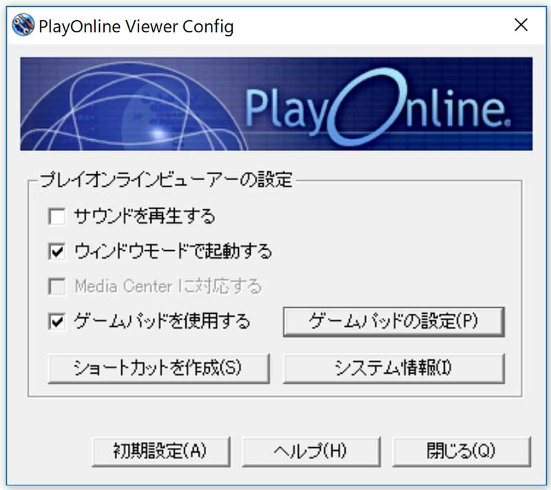

You also get something called `PlayOnline`. Launching PS2 copy also results in a lot of Japanese and that `PlayOnline` thing and that's the very first blocker you'll encounter.

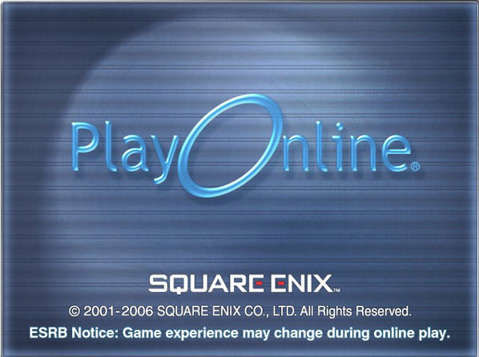

Lucky for you I spend 2 weeks reading about everything related to `PlayOnline` and will be happy to share with you!

In 2000 Square Enix launched a platform called `PlayOnline`, which was a launcher, storefront and a backend for the games, distributed though this platform. Those games included:

- Final Fantasy XI
- Front Mission Online
- Tetra Master

And some less notable others.

While Tetra Master and Final Fantasy XI were released in US version of PlayOnline, Front Mission Online never left Japan and was a very short lived title - from 2005 to 2008. This makes Front Mission Online a very obscure title with next to none publicly available research and data. I was thinking that that's pretty much it - pc version doesn't launch, ps2 version doesn't login, but I keep googling and whenever I searched for `PlayOnline` I stumbled into 1000 of pages about Final Fantasy XI. And checking pages related to it made me quickly realize - it's for better or for worse is very popular. So popular there are custom servers and a lot of tools. And custom servers means somebody knows something about `PlayOnline`.

And I also had a feeling that those games were using a very similar backend, due to them being released at the same time by the same studio and looking very similar.

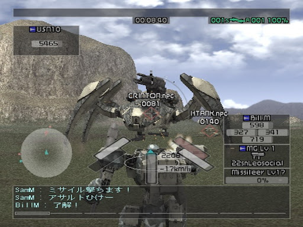

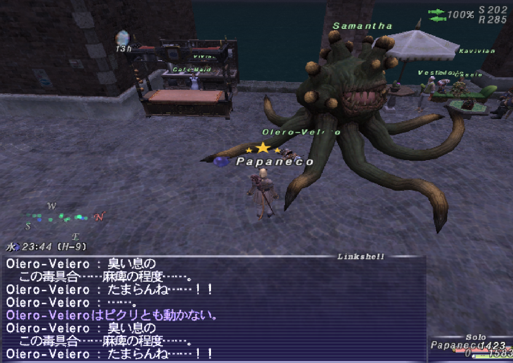

So excited that the answer is that close and that ffxi custom server can be probably repurposed, I begging digging some more, and I uncovered a very curious situation legal-wise.

Due to FFXI being popular, there are custom servers, but to launch game players still use `PlayOnline`with a patcher (more on that later) . There are some parties who have fully reversed `PlayOnline` and made a replacement for it, but since Square Enix is still running `PlayOnline` and official servers, they can't (or won't, but no judgment here) release the files. 

But Front Mission Series can't launch in that patched state, since its `PlayOnline` is unusable, so it require a full replacement, which is somewhat legal to do, since the game is dead.

And so there are 2 games released at the same time using the same tech, but 20 years later one of them is not dead while other is, which blocks preservation of the dead one.

Well, on paper my plan looked simple enough:

- Bypass launch of the game, by restoring `PlayOnline` functionality
- Use FFXI custom server to make one for FMO
- FMO is playable and I'm happy

Which as you could guess wasn't anywhere near simple, since it's not done yet. But we'll get to that in the next chapter.

## Chapter 2 - Game (and not only) architecture

After the installation you're present with a handful of links on you desktop:

- Play Online Viewer
- Configure Front Mission Online
- Play Front Mission Online

And files

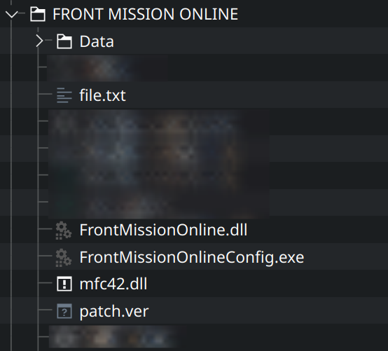

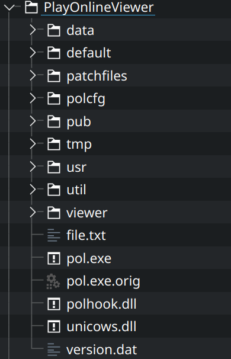

Booting pol.exe resulted in nothing, but I feel like I must show you this funky mess of 00s programming anyway.

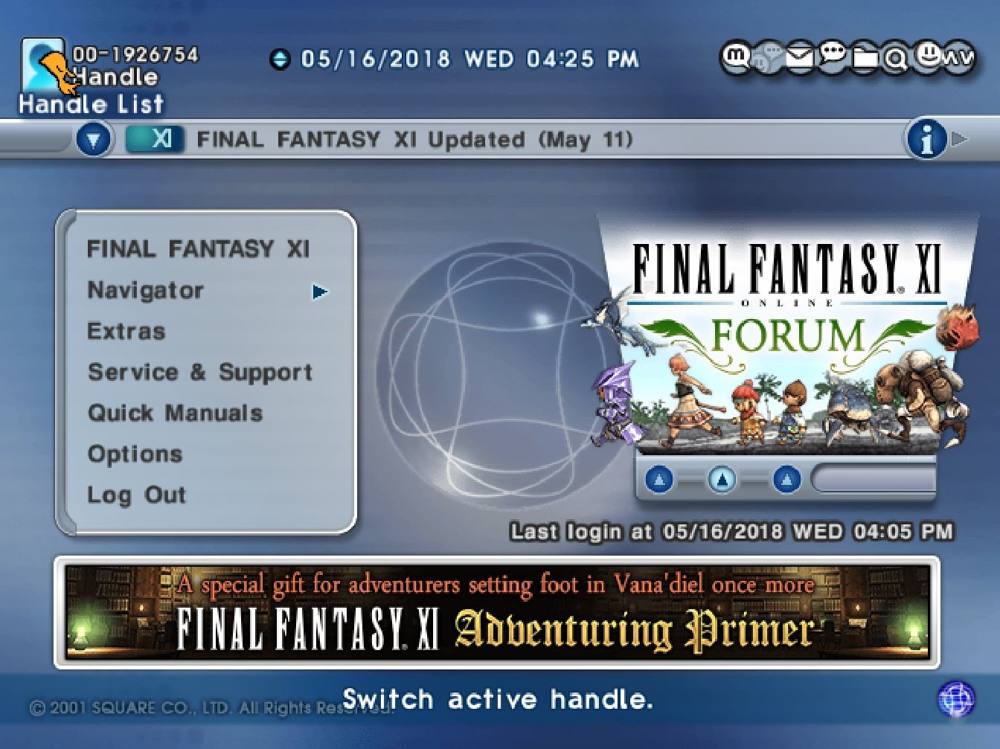

Anyway, `what do`? Launcher not launching. I have several dlls and everything is in Japanese. Adding those dlls and exes into a debugger reveal a grim picture - they're packed with something custom!

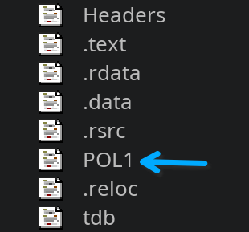

And in entry function `POL1` is getting decrypted and copied to `.text`. Well, not a big deal, I loaded dll via x32dbg and dumping dll via scylla and we now have a decrypted dll, ready to be decompiled. After brief analysis I now have a lot of code to work with, but dll export is strange.

```
DllCanUnloadNow
DllGetClassObject
DllRegisterServer
DllUnregisterServer
```

...what could it be?

Well, lucky for me as I previously talked there are tools for custom servers. And one of said tools is a launcher and a redirector, which is precisely is what I need. I open its code and...

...what the hell is `CoCreateInstance`?

### COM hell

Despite being in my 30 I'm still a rather young developer. As win sysadmin early in my IT career I encountered com libs maybe twice and remembered nothing, except that I had to register them. I suspect that most people have even less experience with COM stuff.

To save time I'll just explain the whole thing.

COM objects are system wide registrable libs with a common interface, which are added to system registry, after that we can call them via their unique uuid v4 called `CLSID`. This is used by Windows to this day for a low-level stuff. And Office and Explorer extension, go figure.

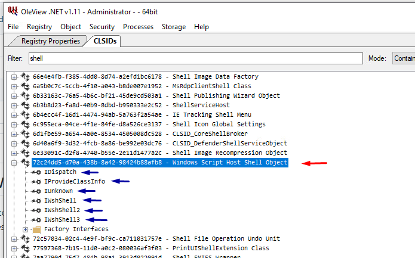

For one reason or another somebody back in 00s decided that splitting `PlayOnline` and its games in several COM objects is the way to go, and it resulted in a mess that `PlayOnline` is. During installation of `PlayOnline` infused title installer register `PlayOnline`COM object and game COM object.

%Screenshot from OleView here%

Under normal conditions a game start happen as

- User launch `PlayOnline Viewer`
- User log in
- User start a game
- `PlayOnline Viewer` create an instance of `IPOL` Object from `polcore.dll`
- `PlayOnline Viewer` initialize it and setup the data by calling its functions
- `PlayOnline Viewer` create an instance of game COM object
- `PlayOnline Viewer` calls `GameStart` function of game COM object and passing `IPOL` COM object ptr into it

The launcher I talked about before (https://github.com/zircon-tpl/xiloader in case you're curious) is doing roughly the same, just doing the whole setup by hand with some patching for redirection.

Now we have a minimally required amount of knowledge to work with COM objects, so, let's try to do it in Rust!

## Chapter 2 - First Attempts

> Before we start, I want to highlight that this is being written 2 years after initial attempts, so not much code survived since very then and mostly replicated from my memory. Some parts can and will look like a stretch and jumping to conclusions, but I will try my best to guide you though my logic.

So on paper the trick is simple - replicate loader logic and pray that it works. The hard part is that we're operating in blind, due to lack of any ways to launch the game "normally" and the source code is made for FFXI, which is similar, but not 1 to 1 for FMO.

And an early step in that flow is to create a COM object of PolCore

```C
        /* Attempt to create polcore instance..*/
        IPOLCoreCom* polcore = NULL;
        if (CoCreateInstance(xiloader::CLSID_POLCoreCom[language], NULL, 0x17, xiloader::IID_IPOLCoreCom[language], (LPVOID*)&polcore) != S_OK)
        {
            xiloader::console::output(xiloader::color::error, "Failed to initialize instance of polcore!");
        }
```

This is what I tried to do first in Rust, which resulted in

```Rust
use std::ffi::{c_char, c_void};

use windows::core::{interface, IUnknown, IUnknown_Vtbl, HRESULT};

#[interface("9A30D565-A74C-4B56-B971-DCF02185B10D")]
pub unsafe trait IPol: IUnknown {
    pub fn GethInstance(&self, hInstance: *mut i32) -> HRESULT;
    pub fn GetlpCmdLine(&self, hInstance: *mut i32) -> HRESULT;
    pub fn SetParamInit(&self, hInstance: *mut c_void, lpCmdLine: *const c_char) -> HRESULT;
    pub fn GetWindowsType(&self, hInstance: *mut i32) -> HRESULT;
    pub fn GetCommonFunctionTable(&self, table: *mut *mut u32) -> HRESULT;
    pub fn PolViewerExec(&self, hInstance: *mut i32) -> HRESULT;
    pub fn GetWindowsVersion(&self, hInstance: *mut i32) -> HRESULT;
    pub fn PressAnyKey(&self, hInstance: *mut i32) -> HRESULT;
    pub fn PolconSetEnableWakeupFuncFlag(&self, hInstance: *mut i32) -> HRESULT;
    pub fn CreateInput(&self, hInstance: *mut i32) -> HRESULT;
    pub fn UpdateInputState(&self, hInstance: *mut i32) -> HRESULT;
    pub fn GetPadRepeat(&self, hInstance: *mut i32) -> HRESULT;
    pub fn GetPadOn(&self, hInstance: *mut i32) -> HRESULT;
    pub fn inPanNum(&self, hInstance: *mut i32) -> HRESULT;
    pub fn FinalCleanup(&self, hInstance: *mut i32) -> HRESULT;
    pub fn SetParamInitW(&self, hInstance: *mut i32) -> HRESULT;
    pub fn GetlpCmdLineW(&self, hInstance: *mut i32) -> HRESULT;
    pub fn PaintFriendList(&self, hInstance: *mut i32) -> HRESULT;
    pub fn CreateFriendList(&self, hInstance: *mut i32) -> HRESULT;
    pub fn DestroyFriendList(&self, hInstance: *mut i32) -> HRESULT;
    pub fn SetMaskWindowHandle(&self, hInstance: *mut i32) -> HRESULT;
    pub fn GetPlayOnlineRegKeyNameW(&self, hInstance: *mut i32) -> HRESULT;
    pub fn GetPlayOnlineRegKeyNameA(&self, hInstance: *mut i32) -> HRESULT;
    pub fn GetSquareEnixRegKeyNameW(&self, hInstance: *mut i32) -> HRESULT;
    pub fn GetSquareEnixRegKeyNameA(&self, hInstance: *mut i32) -> HRESULT;
    pub fn SetAreaCode(&self, inAreaCode: *mut i32) -> HRESULT;
    pub fn GetAreaCode(&self, outAreaCode: *mut i32) -> HRESULT;
    pub fn HideMaskWindow(&self, hInstance: *mut i32) -> HRESULT;
    pub fn ShowMaskWindow(&self, hInstance: *mut i32) -> HRESULT;
    pub fn IsVisibleMaskWindow(&self, hInstance: *mut i32) -> HRESULT;
}
```

Reconstructed from OleView and a code to run it

```Rust
    CoInitializeEx(None, COINIT_APARTMENTTHREADED).unwrap();

    let polcore: IPol = CoCreateInstance(
        &CLSID_POLCORECOM,
        None,
        CLSCTX_ALL,
    )?;

    Ok(polcore)
```

That was okay and was running, but there was a problem that I didn't like - I had to have a properly configured wine/windows installation with registered COMs. And since we're working with COMs, which are dlls in disguise, I was wondering, is it possible to load COM object directly. Turns out, there is!

`DllGetClassObject` exported in any COM dll is what gives you a COM object handle akin to `CoCreateInstance`, but without all of that hustle with registering COMs, meaning you're no longer was binded by COM objects being registered. I even found a C code example for it, which I adapted to Rust, resulting in

```Rust
pub unsafe fn NoRegCoCreate<T: Interface + windows::core::ComInterface>(lib: &str, rclsid: *const GUID) -> Result<T> {
    let mut temp = lib.to_string();
    let dll_name = PCSTR::from_raw(temp.as_ptr());
    println!("{}",dll_name.display());

    
    let instance = LoadLibraryExA(dll_name, HANDLE::default(), LOAD_WITH_ALTERED_SEARCH_PATH)?;
    if !instance.is_invalid() {

        temp = "DllGetClassObject".to_string();
        let dll = PCSTR::from_raw(temp.as_ptr());
        println!("{}",dll.display());

        if let Some(farproc) = GetProcAddress(instance, dll) {
            let get_class_object: DllGetClassObject = std::mem::transmute(farproc);
            let mut factory: Option<IClassFactory> = None;
            if get_class_object(rclsid, &IClassFactory::IID, &mut factory as *mut _ as *mut _).is_ok() {
                return factory.unwrap().CreateInstance(None);
            }
        }
    }

    Err(Error::from_win32())
}
```

Which I now can call as

```Rust
    let polcore_class_guid = GUID::from_u128(0x07974581_0DF6_4EF0_BD05_604B3ADA9BE9);
    let polcore_iface_guid = GUID::from_u128(0x9A30D565_A74C_4B56_B971_DCF02185B10D);
    let riid = IClassFactory::IID;

    
    let mut POL: IPol = NoRegCoCreate("./polcore.dll",ptr::addr_of!(polcore_class_guid)).unwrap();
```

After that for 2 weeks I tried and tried again, with never ending crashes, while adapting xiloader code to my rust needs. That resulted in this code from xiloader

```C
        /* Attempt to create polcore instance..*/
        IPOLCoreCom* polcore = NULL;
        if (CoCreateInstance(xiloader::CLSID_POLCoreCom[language], NULL, 0x17, xiloader::IID_IPOLCoreCom[language], (LPVOID*)&polcore) != S_OK)
        {
            xiloader::console::output(xiloader::color::error, "Failed to initialize instance of polcore!");
        }
        else
        {
            /* Invoke the setup functions for polcore.. */
            polcore->SetAreaCode(language);
            polcore->SetParamInit(GetModuleHandle(NULL), " /game eAZcFcB -net 3");

            /* Obtain the common function table.. */
            void* (**lpCommandTable)(...);
            polcore->GetCommonFunctionTable((unsigned long**)&lpCommandTable);

            /* Invoke the inet mutex function.. */
            auto findMutex = (void* (*)(...))FindINETMutex(language);
            findMutex();

            /* Locate and prepare the pol connection.. */
            auto polConnection = (char*)FindPolConn(language);
            memset(polConnection, 0x00, 0x68);
            auto enc = (char*)malloc(0x1000);
            memset(enc, 0x00, 0x1000);
            memcpy(polConnection + 0x48, &enc, sizeof(char**));

            /* Locate the character storage buffer.. */
            characterList = (char*)FindCharacters((void**)lpCommandTable);

            /* Invoke the setup functions for polcore.. */
            lpCommandTable[POLFUNC_REGISTRY_LANG](language);
            lpCommandTable[POLFUNC_FFXI_LANG](xiloader::functions::GetRegistryPlayOnlineLanguage(language));
            lpCommandTable[POLFUNC_REGISTRY_KEY](xiloader::functions::GetRegistryPlayOnlineKey(language));
            lpCommandTable[POLFUNC_INSTALL_FOLDER](xiloader::functions::GetRegistryPlayOnlineInstallFolder(language));
            lpCommandTable[POLFUNC_INET_MUTEX]();

            /* Attempt to create FFXi instance..*/
            IFFXiEntry* ffxi = NULL;
            if (CoCreateInstance(xiloader::CLSID_FFXiEntry, NULL, 0x17, xiloader::IID_IFFXiEntry, (LPVOID*)&ffxi) != S_OK)
            {
                xiloader::console::output(xiloader::color::error, "Failed to initialize instance of FFxi!");
            }
            else
            {
                /* Attempt to start Final Fantasy.. */
                IUnknown* message = NULL;
                xiloader::console::hide();
                ffxi->GameStart(polcore, &message);
                xiloader::console::show();
                ffxi->Release();
            }
```

```Rust
    unsafe {

    let polcore_class_guid = GUID::from_u128(0x07974581_0DF6_4EF0_BD05_604B3ADA9BE9);
    let polcore_iface_guid = GUID::from_u128(0x9A30D565_A74C_4B56_B971_DCF02185B10D);
    let riid = IClassFactory::IID;

    
    let mut POL: IPol = NoRegCoCreate("./polcore.dll",ptr::addr_of!(polcore_class_guid)).unwrap();
    let mut instance: i32 = 0;
    println!("{:?}",POL.SetAreaCode(ptr::addr_of_mut!(instance)));
    
    let cmd = " /game NcEIDL".as_bytes().to_vec();
    
    println!("{:?}",POL.SetParamInit( ptr::null_mut(),ptr::addr_of!(cmd)));

    let mut settings_table: Box<Vec<u8>> = Box::new(vec![]);
    let mut ptr_table = settings_table.as_mut_ptr();
    println!("{:?}",POL.GetCommonFunctionTable( ptr_table));

    println!("{:?}",settings_table);


        /*
        
        
            uuid(07974581-0DF6-4EF0-BD05-604B3ADA9BE9),
            helpstring("POLCoreCom Class")
        ]
        coclass POLCoreCom {
            [default] interface  IPOLCoreCom;
            [default, source] interface  _IPOLCoreComEvents;
        };

        [
            odl,
            uuid(9A30D565-A74C-4B56-B971-DCF02185B10D),
            helpstring("IPOLCoreCom Interface")
        ]
     */
   
        
    let typelib_guid = GUID::from_u128(0x0308BFE0_5D87_9838_89BC_A4BF023C98CA);
    let class_guid = GUID::from_u128(0x94603A98_0067_4F41_89BC_7F89304D6E28);
    let iface_guid = GUID::from_u128(0x2031D0EF_97FA_48AE_A3FD_8260C380029A);
   


        let result: IFMO = NoRegCoCreate("FrontMissionOnline.dll",ptr::addr_of!(class_guid)).unwrap();
        let mut message: [u8;1024] = [0;1024];
        result.GameStart(ptr::addr_of_mut!(POL),ptr::null_mut());
    }
```

As you can see a lot of things are omited and it doesn't look anything like xiloader. The farest I get is making it display a window and then crashing. Which was getting me nowhere and I gave up for 2 years.

## Chapter 3 - Making it boot

In March of 2026, being under the wieght of numerous projects and upcoming GRFS for PC release, I was procrastinating in my own way of "doing whatever I can, but not what I should". Which resulted in a lot of positive changes for Warehouse project website, but one day I saw a `fmo_launcher_rs` dir looking at me funny, and decided that "hey, maybe it's time to give it another go". And then I remember that I never wrote a piece about it. Both that facts resulted in this very text and me getting back to working on FMO.

So I decided to apply my gained knoledge after numerous dlls and working with windows crust from rust to this, and it resulted in a much nicer code of

```Rust
const CLSID_POLCORE_COM: GUID = GUID::from_u128(0x07974581_0df6_4ef0_bd05_604b3ada9be9);
const CLSID_FMO_ENTRY: GUID = GUID::from_u128(0x94603a98_0067_4f41_89bc_7f89304d6e28);

fn dll_path_near_exe(file_name: &str) -> Result<PathBuf> {
    let exe_path = env::current_exe().map_err(|_| Error::from_win32())?;
    let base_dir = exe_path.parent().ok_or_else(Error::from_win32)?;
    Ok(base_dir.join(file_name))
}

unsafe fn init_polcore(pol: &IPol) -> Result<()> {
    info!("init_polcore: calling SetAreaCode(&mut area_code)");
    let mut area_code = 0_i32;
    let hr = pol.SetAreaCode(&mut area_code);
    if hr.is_err() {
        error!("init_polcore: SetAreaCode failed hr=0x{:08X}", hr.0 as u32);
        return Err(Error::from(hr));
    }
    info!("init_polcore: SetAreaCode succeeded");

    let cmd_line = CString::new(" /game NcEIDL").map_err(|_| Error::from_win32())?;
    info!("init_polcore: calling SetParamInit(\" /game NcEIDL\")");
    let hr = pol.SetParamInit(ptr::null_mut(), cmd_line.as_ptr());
    if hr.is_err() {
        error!("init_polcore: SetParamInit failed hr=0x{:08X}", hr.0 as u32);
        return Err(Error::from(hr));
    }
    info!("init_polcore: SetParamInit succeeded");

    let hr = pol.CreateInput(ptr::null_mut());
    if hr.is_err() {
        error!("init_polcore: SetParamInit failed hr=0x{:08X}", hr.0 as u32);
        return Err(Error::from(hr));
    }
    info!("init_polcore: SetParamInit succeeded");

    let mut common_table: *mut u32 = ptr::null_mut();
    info!("init_polcore: calling GetCommonFunctionTable");
    let hr = pol.GetCommonFunctionTable(&mut common_table);
    if hr.is_err() {
        error!(
            "init_polcore: GetCommonFunctionTable failed hr=0x{:08X}",
            hr.0 as u32
        );
        return Err(Error::from(hr));
    }

    info!("init_polcore: GetCommonFunctionTable succeeded ptr={common_table:p}");
    Ok(())
}

unsafe fn run() -> Result<()> {
    info!("start");
    info!("CoInitialize");
    CoInitialize(None)?;
    info!("CoInitialize succeeded");

    let polcore_path = dll_path_near_exe("polcore.dll")?;
    let fmo_path = dll_path_near_exe("FrontMissionOnline.dll")?;
    info!("polcore path '{}'", polcore_path.display());
    info!("fmo path '{}'", fmo_path.display());

    info!("creating IPol via NoRegCoCreate");
    let pol: IPol = NoRegCoCreate(Path::new(&polcore_path), &CLSID_POLCORE_COM)?;
    info!("IPol created");

    info!("initializing polcore");
    init_polcore(&pol)?;
    info!("polcore initialized");

    info!("creating IFMO via NoRegCoCreate");
    let fmo: IFMO = NoRegCoCreate(Path::new(&fmo_path), &CLSID_FMO_ENTRY)?;
    info!("IFMO created");

    let pol_ptr = pol.as_raw();
    info!("using raw IPol pointer {:p}", pol_ptr);

    // info!("sleeping 1000ms before IFMO::GameStart");
    // thread::sleep(Duration::from_millis(1000));

    // get raw COM pointer
    let fmo_ptr = fmo.as_raw();

    // read vtable pointer
    let vftable = unsafe { *(fmo_ptr as *const *const std::ffi::c_void) };

    info!("IFMO object pointer {:p}", fmo_ptr);
    info!("IFMO vftable pointer {:p}", vftable);

    hook_game_log();
    hook_game_init();

    let mut message_ptr: *mut std::ffi::c_void = ptr::null_mut();
    info!("calling IFMO::GameStart");
    let hr = fmo.GameStart(pol_ptr, &mut message_ptr);
    if hr.is_err() {
        error!("GameStart failed hr=0x{:08X}", hr.0 as u32);
        return Err(Error::from(hr));
    }
    info!("GameStart succeeded");
    info!("GameStart message pointer {:p}", message_ptr);

    Ok(())
    
}

fn main() {
    let _ = simple_logging::log_to_file("fmo_launcher_rs.log", LevelFilter::Info);
    info!("main: entry");
    if let Err(err) = unsafe { run() } {
        error!(
            "main: launcher failed hr=0x{:08X} ({err})",
            err.code().0 as u32
        );
        std::process::exit(1);
    }
    info!("main: exit success");
}

```

Which finally made the game to properly boot and play me an intro cinematic, which I wasn't able to skip, due to uninitialized controls

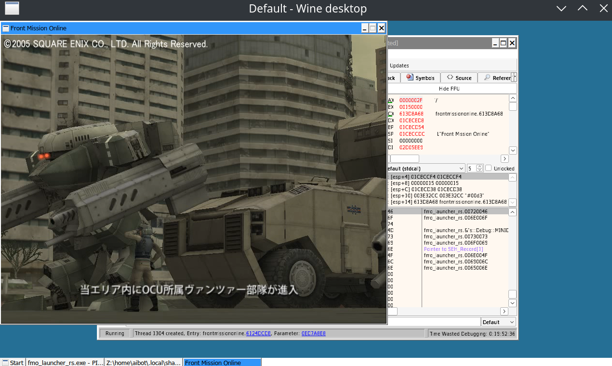

After it (or forcing game to skip it by renaming it) game just crashed with nullpointer and that was it. Well, it was a huge breakthough, none the less.

The issue was clear - `polcore` wasn't properly initialized, so I decided to find a location in `FrontMissionOnline.dll` where it was stored and where game was calling `CommonFunctionTable`.

Tracing the flow I got to `FUN_61001b90` of `FrontMissionOnline.dll` where I found what I needed - write to a ptr and another write to another ptr from offset of vtable of 7, which was exactly a `GetCommonFunctionTable`.

```C
  IPOLComObject = (int ***)ppppiVar4;
  ppppiVar4 = appppiStack_20[0];
  (*(code *)(*appppiStack_20[0])[3])();
  (**(code **)(*unaff_ESI + 0x10))(unaff_ESI,&stack0xffffffdc);
  (*(code *)(*ppppiStack_30)[7])(ppppiStack_30,&GetCommonFunctionsTable);
```

And then I saw IT

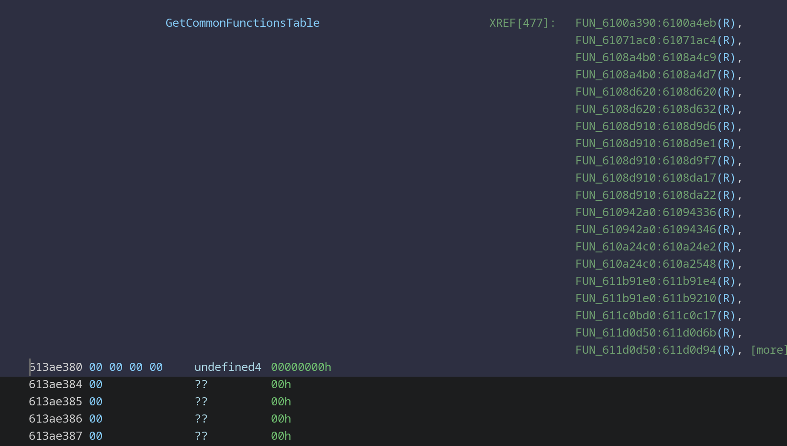

477 calls for read minus 1 for write.

476 calls of `CommonFunctionTable`

Oh boy.

Just to be sure, I cross checked the calls

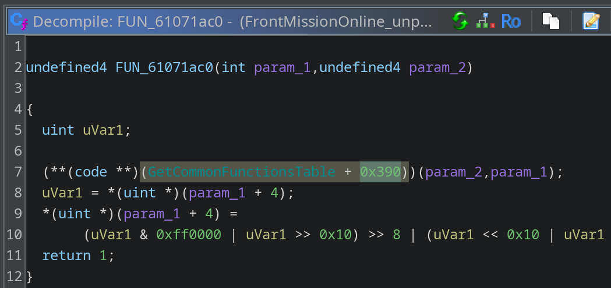

And sure enough at offset `0x10067c48 + 0x390` there was a function taking 2 arguments

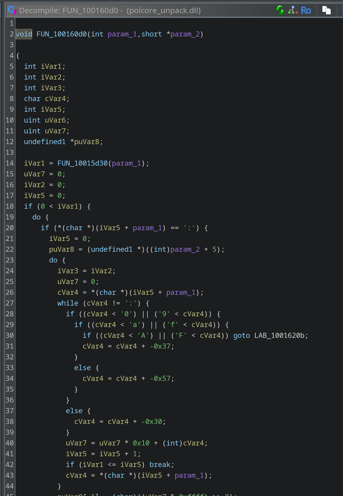

This is gonna take a while.

## Chapter 4 - Making it run

So, after a lot of trial and error my issue finally had boiled down to 1 particular point.

Say hello to `DAT_613b7038`. `DAT_613b7038` is a cunt. It's initialized in as cunty as it is function of `FUN_6106d710` as

```C
DAT_613b7038 = DAT_613cee60;
```

The bad thing is that `FUN_6106d710` is never called, resulting in a nullptr in another function of `FUN_6104f940`

```
        6104f965 8b 0d 38        MOV        ECX,dword ptr [DAT_613b7038]
                 70 3b 61
        6104f96b 56              PUSH       ESI
        6104f96c e8 5f 9b        CALL       CRASH_HERE
                 1c 00
```

And so going in circles for 3 days I still had only a rought idea of that something was related to symbols and me not properly setting `polcore`.

Yes, you might say that `hey, just trace everything calling it and what writes to DAT_613cee60` but that lead me to nowhere. Such situations happen, not my first rodeo.

So instead I decided to change approach and try to find out how `polcore` is being setup. 

### Symbols

I haven't mention it yet, but there are *some* symbols for `PlayOnline`. Well, not for `polcore`, but for Final Fantasy XI for PS2. So I decided that it's better than nothing and take a brief look into it. Who knows, maybe there is something of a use.

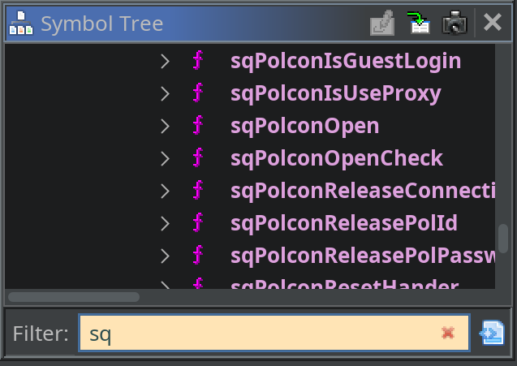

Well, there is something related to `POL` I suppose. I tried to cross reference 1 function I knew that was called for sure

```C
void sqLanguageSetCurrentCode(undefined4 param_1)

{
  _CurrentLanguage = param_1;
  return;
}
```

which looked quite close to `polcore.dll` one

```C
void SET_LANG_CODE(undefined4 param_1)

{
  LANG_CODE = param_1;
  return;
}
```

Then I thought "Well, I have some logging in `polcore.dll` maybe it will help". Searching for a known logging string of `sqPolconOpenCheck` lead me to

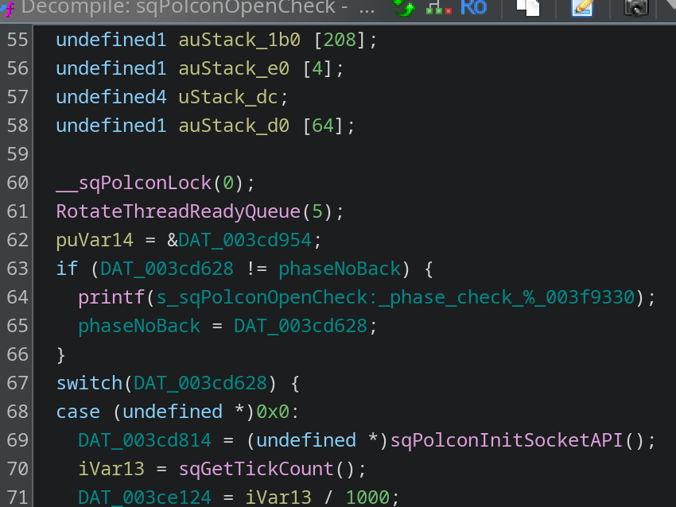

And to my suprise, I found the very same function in `polcore.dll`, which I quickly cross referenced from PS2 binary

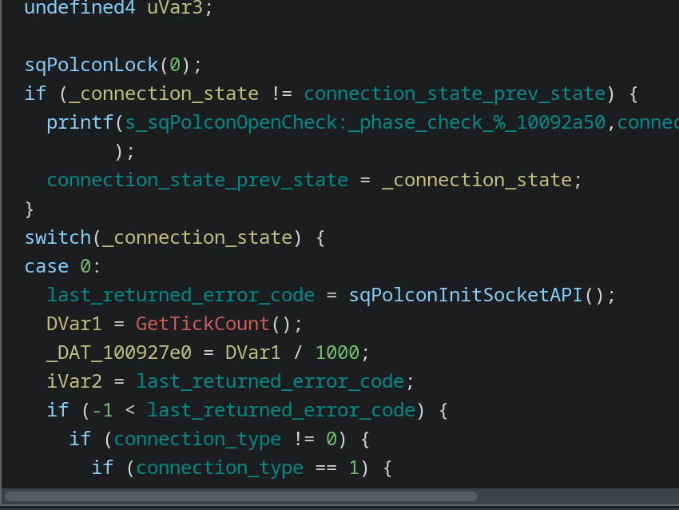

And then it hits me. While on PC we had all of `polcore` functionality as a separate dll, on PS2 it was backed into PS2 binary. But the decompiled code was **the very same**. Meaning we was working with the same C source, meaning it was now possible to cross reference **everything**. I got to work, and in 3 hours I went from 1% of mapped functions to 10%, which is huge.

Things turned from 

```C
int FUN_10046450(void)

{
  DWORD DVar1;
  int iVar2;
  undefined2 extraout_var;
  undefined4 uVar3;
  short local_178 [2];
  undefined1 local_174;
  undefined1 uStack_173;
  undefined1 uStack_172;
  undefined1 uStack_171;
  undefined1 local_164 [12];
  undefined1 local_158 [20];
  undefined1 local_144 [68];
  undefined1 local_100 [256];
  
  FUN_10049530(0);
  if (DAT_100913f0 != DAT_10092a40) {
    FUN_1001ca10(s_sqPolconOpenCheck:_phase_check_%_10092a50,DAT_10092a40,DAT_100913f0);
    DAT_10092a40 = DAT_100913f0;
  }
  switch(DAT_100913f0) {
  case 0:
    DAT_1009169c = FUN_10046050();
    DVar1 = GetTickCount();
    _DAT_100927e0 = DVar1 / 1000;
    iVar2 = DAT_1009169c;
    if (-1 < DAT_1009169c) {
      if (DAT_10091c68 != 0) {
        if (DAT_10091c68 == 1) {
          uVar3 = DAT_100924dc;
          if (DAT_100924d8 == 0) {
            uVar3 = 0xffffffff;
          }
          FUN_10016230(uVar3);
          if (DAT_10091404 != 2) {
            DAT_100913d4 = GetTickCount();
            DAT_10091404 = 2;
          }
          DAT_100913f0 = 0x11;
        }
        else if (DAT_10091c68 == 2) goto LAB_100464ed;
        break;
      }
LAB_100464ed:
      iVar2 = -0x2c04;
    }
    DAT_10091404 = 0;
    DAT_100913f0 = iVar2;
    break;
```

to

```C
int sqPolconOpenCheck(void)

{
  DWORD DVar1;
  int iVar2;
  undefined2 extraout_var;
  short local_178 [2];
  undefined1 local_174;
  undefined1 uStack_173;
  undefined1 uStack_172;
  undefined1 uStack_171;
  undefined1 local_164 [12];
  undefined1 local_158 [20];
  undefined1 local_144 [68];
  CON_STATE local_100;
  undefined4 uVar3;
  
  sqPolconLock(0);
  if (_connection_state != connection_state_prev_state) {
    printf(s_sqPolconOpenCheck:_phase_check_%_10092a50,connection_state_prev_state,_connection_state
          );
    connection_state_prev_state = _connection_state;
  }
  switch(_connection_state) {
  case 0:
    last_returned_error_code = sqPolconInitSocketAPI();
    DVar1 = GetTickCount();
    _DAT_100927e0 = DVar1 / 1000;
    iVar2 = last_returned_error_code;
    if (-1 < last_returned_error_code) {
      if (connection_type != 0) {
        if (connection_type == 1) {
          uVar3 = adapter_id;
          if (DAT_100924d8 == 0) {
            uVar3 = 0xffffffff;
          }
          sqInetSetActiveInterface(uVar3);
          if (Net_state != 2) {
            DAT_100913d4 = GetTickCount();
            Net_state = 2;
          }
          _connection_state = POLCON_PHASE_NETWORK_READY;
        }
        else if (connection_type == 2) goto LAB_100464ed;
        break;
      }
LAB_100464ed:
      iVar2 = -0x2c04;
    }
    Net_state = 0;
    _connection_state = iVar2;
    break;
```

And the more I mapped the more I could cross reference, meaning less unknown and more known stuff. It still didn't explained the crash, but it meant that it's doable to map almost the entire `polcore.dll`, minus PC specific stuff. With mapping a sustainable portion of calls I've met to this point, I decided that it's time to search for something else. Like, a function that lauch the game in `PlayOnline Viewer`.

### PlayOnline Viewer

As you could probably guess at this point, launcher is also a dll, this time an `app.dll`. Applying the very same method of `seaching for code that sets the language` I found this

```C
  iVar2 = FUN_10019933("POL_LANG",unaff_EBP + -0x1a8);
  if (iVar2 != 0) {
    lVar6 = _atol((char *)(unaff_EBP + -0x1a8));
  }
  (**(code **)(polcore_common_table + 0xf14))(lVar6); // Set language offset
  (**(code **)(polcore_common_table + 0x17dc))(lVar6 == 0);
  (**(code **)(polcore_common_table + 0x5bc))((&PTR_s_SOFTWARE\PlayOnline_1042e9e0)[DAT_1054515c]); // Set registry offset
  (**(code **)(polcore_common_table + 0x40c))(unaff_EBP + -0x1a8,0x100);
  FUN_10019933("POL_UCS_AREA_KBN",unaff_EBP + -0x1a8);
  (**(code **)(polcore_common_table + 0x1474))(unaff_EBP + -0x1a8);
  FUN_10186d81();
  FUN_10178cf0();
  FUN_101867de();
  (**(code **)(polcore_common_table + 0xe5c))();
  (**(code **)(polcore_common_table + 0xe48))();
  FUN_1001146a();
  iVar2 = polcore_common_table;
```

This resulted in 2 important finds

1) Turns out `polcore_common_table + 0x17dc` was the very last function in `polcore.dll` vtable, meaning there is **1529** slots to work with. Most of them are empty and I haven't bothered checking how many real functions we had.
2) I had a rought example of what to set

Sadly, implementing those in the code resulted in no changes in FMO booting, but now I had this monstrocity to interact with vtable.

```Rust
#[repr(C)]
pub struct CommonFunctionTable {
    pub functions: [usize; 1529], //last one at 1006942c
}

impl CommonFunctionTable {
    const REGISTRY_LANG: usize = 965;
    const REGISTRY_KEY: usize = 367;
    const INSTALL_FOLDER: usize = 125;
    const INET_MUTEX: usize = 815;
    const JAPANESE_MODE: usize = 1527;

    const POLFUNC_FFXI_LANG: usize = 0x01A4;

    const POL_FILE_PATH: usize = 127;
    const POL_LOAD_FILE: usize = 1006;

    #[inline]
    unsafe fn get<T: Sized + Copy>(&self, index: usize) -> T {
        let addr = self.functions[index] as *const ();
        std::mem::transmute_copy(&addr)
    }

    /// Sets PlayOnline language (0 = JP, 1 = US, 2 = EU)
    pub unsafe fn registry_lang(&self, lang: i32) {
        let f: extern "cdecl" fn(i32) = self.get(Self::REGISTRY_LANG);
        f(lang);
    }

    /// Sets registry base key
    pub unsafe fn registry_key(&self, key: *const c_char) {
        let f: extern "cdecl" fn(*const c_char) = self.get(Self::REGISTRY_KEY);
        f(key);
    }

    /// This one requires PlayOnlineViewer folder, which contains pol.exe, since game resolves files from it via 
    pub unsafe fn install_folder(&self, path: *const c_char) {
        let f: extern "cdecl" fn(*const c_char) = self.get(Self::INSTALL_FOLDER);
        f(path);
    }

    /// Creates PlayOnline network mutex
    pub unsafe fn inet_mutex(&self) {
        let f: extern "cdecl" fn() = self.get(Self::INET_MUTEX);
        f();
    }

    /// Enables Japanese mode flag
    pub unsafe fn japanese_mode(&self, flag: i32) {
        let f: extern "cdecl" fn(i32) = self.get(Self::JAPANESE_MODE);
        f(flag);
    }

    /// Some language flag which appears in FFXI
    pub unsafe fn ffxi_lang(&self, flag: i32) {
        let f: extern "cdecl" fn(i32) = self.get(Self::POLFUNC_FFXI_LANG);
        f(flag);
    }


    /// Takes a lot of data, return a path to a file, polerr.bin and others.
    pub unsafe fn pol_file_path(&self, lang: i32, buf: *mut i8, size: i32, a: i32, b: i32) {
        let f: extern "cdecl" fn(i32, *mut i8, i32, i32, i32) =
            self.get(Self::POL_FILE_PATH);
        f(lang, buf, size, a, b);
    }

    /// Load the file from path?
    pub unsafe fn pol_load_file(&self, data: *mut c_void, size: u32) -> *mut c_void {
        let f: extern "cdecl" fn(*mut c_void, u32) -> *mut c_void =
            self.get(Self::POL_LOAD_FILE);
        f(data, size)
    }
}
```

I won't claim this is a great approach to do it, but this is Rust-y enough way to work with it, and will serve as a great starting point later on, when I decide to re-implement the vtable.

### Making it run, attempt 4

At this point in time I was puzzled. So let's try to make sense out of what we know.

The `DAT_613b7038` is 0. It's being initialized in `FUN_6106d710` as

```C
DAT_613b7038 = DAT_613cee60;
```

`DAT_613cee60` is being written only in 1 location

```
6100b539		MOV [DAT_613cee60],EAX	Write
6100b543		MOV ECX,dword ptr [DAT_613cee60]	Read
6106d713		MOV EAX,[DAT_613cee60]	Read
```

Where it is set as

```C
    pHStack_19bc = (HKEY)operator_new(0x34);
    uStack_4 = 8;
    if (pHStack_19bc == (HKEY)0x0) {
      DAT_613cee60 = 0;
    }
    else {
      DAT_613cee60 = FUN_61219a60();
    }
```

What `FUN_61219a60` does?

```C

void __fastcall FUN_61219a60(undefined4 *param_1)

{
  *param_1 = 0;
  param_1[2] = 0;
  return;
}

```

Strange, seems like decompilation is lying to us.

Well, I opted for manually patching value of `DAT_613b7038` to value of `DAT_613cee60` and that finally

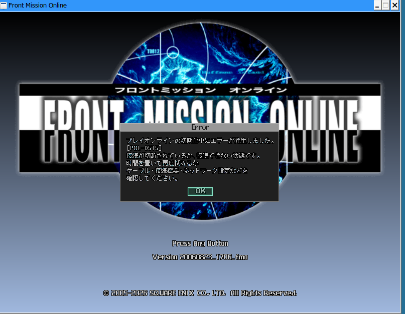

resulted in it loading! Well, it was too early for anything sustainable and real, but we were finally in game! I sadly can't click anything, due to cursor and buttons non-existing, but that was definately a step forward.

Machine translation of this message gave me a clue

```
An error occurred while initializing PlayOnline.

[POL-0515]

The connection is either disconnected or unavailable.

Please try again after some time, or check your cables, connected devices, and network settings.
```


## Chapter 5 - Making it right

~~And so, I'm present with a complicated choice. On one hand, figuring out how to properly initialize `polcore` object will be faster and probably could be done via `PlayOnline Viewer`. On the other hand, going forward full RE of `polcore` is beneficial going forward for preservation and future of not only Front Mission Online, but other titles.~~

~~But while doing it in C++ is probably how it should be done, I don't know C++ and don't want to learn it via this rather monumental task. Doing it in Rust is, well, strange. It will require me convert everything from less than ideal C++ code for Windows 95 into modern equivalent, and doing it for ~470 functions sounds like way above my pay grade of zero. At the same time there is a big difference between something existing and something that don't, so I decided that I can at the very least try to. Plus my gut feeling was telling me that there is not exactly 470 different functions, but somewhere around 100 unique functions. And so, I begin working on a `polcore-rs`.~~

TBD