# Massive Ad Client [DRAFT]

23/08/25 - very early version
17/09/25 - half done client research, history
---

## INTRO

Back in a day, when internet was still young a lot of very serious people in suits were trying their best to apply real-world business practice of old to the new field of the internet. One of such thing was ads. While ads in web and mobile ads are now a staple of the web as a whole, ads in videogames in form of in-game objects are rather uncommon. The most recent example I can recal myself is ads in Battlefield 2042, but that's it.

But in 2000s there were a lot of attempts to capture the market and create another flow of the revenue for developers and publishers. There were many, but Massive Incorporated was probably the most notable one, present in AAA titles of that era.

And so me, being a researcher of silly network things in videogames, couldn't pass the opportunity to take a look into it.

## HISTORY

Massive Incorporated was created in 2002 as a `advertising company that provided software and services to dynamically host advertisements within video games`. It's rather hard to track down the very first title, but according to [this](https://web.archive.org/web/20220817143603/https://www.gamesindustry.biz/massive-incorporated-unleashes-next-gen-version-of-its-in-game-advertising-technology) article at the end of 2005 they were already on version 3 and boasting about "over 100 titles"

There also a portfolio from an ex worker, who was kind enough to include a lot of games with it https://madestream.com/portfolio_v3/project.php?pid=309&name=Massive+Incorporated+Game+Ads . Thanks, David Or!

## Known Versions

At this point in time, thanks to website "dlldownloader" and a lot of games I was able to get in my possession 4 out of 5 known versions of the MAD:

- `m4d.dll` with version 1.2 of MAD
- `MassiveAdClient.dll` with version 2.4
- Need For Speed: Carbon 1.4 with versions 3.2
- Sk8te 2 for Xbox 360 (with debug symbols!) with version >3.2

I've zero idea where first 2 dlls are coming from, and I'm not sure any interesting games utilizing it. So I focused on version 3.5, while utilizing Sk8te 2 symbols to aid me in reversing stuff. Plus from version 4 they switched to https, with ciphers which are now not supported by pretty much anything modern. So I decided to tackle version 3 first, and then work with version 4.

## First packet

On load, NFSC sends a http request to `http://locate.madserver.net/advsrc/locateService`.

If we check the content of data being sent:

```
POST /adsrv/locateService HTTP/1.1
Host:127.0.0.1
Content-Length:31
Content-Type:application/massive
User-Agent:Adclient Massive Inc./3.2.1.55

É=nfs_carbon_pc_na>0.0
```

This payload looks a little bit off. Let's check raw bytes.

```
03c9000000193d0010
6e66735f636172626f6e5f70635f6e61 - nfs_carbon_pc_na
3e0003
302e30 - 0.0
```

Okay. Now things are getting interesting. This is a raw bytes buffer! Curious approach by Massive.

After some snooping around in Sk8te 2 I was able to track down the function responsible for constructing said buffer:

```C++
void WriteLocateServiceRequest@CRequestLocateService@MassiveAdClient3
               (int param_1,undefined8 param_2,undefined8 param_3)

{
  undefined8 uVar1;
  size_t sVar2;
  char *local_30 [12];
  
                    /* Writing Request... */
  ?Log@CLog@MassiveAdClient3@@SAXW4__MASSIVE_ENUM_LOG_LEVEL@2@PAD1ZZ
            (5,*(undefined4 *)(param_1 + 0xc),0xffffffff8236faec);
  ?WriteU8@CRequestObject@MassiveAdClient3@@IAAXEH@Z(param_1,0x3d,0);
  ?WriteString@CRequestObject@MassiveAdClient3@@IAAXPADH@Z(param_1,param_2,0);
                    /* Writing SKU Name: %s */
  ?Log@CLog@MassiveAdClient3@@SAXW4__MASSIVE_ENUM_LOG_LEVEL@2@PAD1ZZ
            (5,*(undefined4 *)(param_1 + 0xc),0xffffffff8236fbdc,param_2);
  ?WriteU8@CRequestObject@MassiveAdClient3@@IAAXEH@Z(param_1,0x3e,0);
  ?WriteString@CRequestObject@MassiveAdClient3@@IAAXPADH@Z(param_1,param_3,0);
                    /* Writing SKU Version: %s */
  ?Log@CLog@MassiveAdClient3@@SAXW4__MASSIVE_ENUM_LOG_LEVEL@2@PAD1ZZ
            (5,*(undefined4 *)(param_1 + 0xc),0xffffffff8236fbc4,param_3);
  local_30[0] = (char *)0x0;
  uVar1 = ?Instance@CMassiveSystem@MassiveAdClient3@@SAPAV12@XZ();
  ?GetHardwareAddress@CMassiveSystem@MassiveAdClient3@@QAAXPAPAD@Z(uVar1,local_30);
  if (local_30[0] != (char *)0x0) {
    sVar2 = strlen(local_30[0]);
    if (sVar2 != 0) {
      uVar1 = CalculateMD5Hash(local_30[0]);
      ?WriteU8@CRequestObject@MassiveAdClient3@@IAAXEH@Z(param_1,0x1d,0);
      ?WriteString@CRequestObject@MassiveAdClient3@@IAAXPADH@Z(param_1,uVar1,0);
                    /* Writing Hashed Hardware ID: %s */
      ?Log@CLog@MassiveAdClient3@@SAXW4__MASSIVE_ENUM_LOG_LEVEL@2@PAD1ZZ
                (5,*(undefined4 *)(param_1 + 0xc),0xffffffff8236fba4,uVar1);
      (*(code *)PTR_free_84494774)(local_30[0]);
      goto LAB_834b1648;
    }
  }
                    /* Could not get Hardware ID from system. */
  ?Log@CLog@MassiveAdClient3@@SAXW4__MASSIVE_ENUM_LOG_LEVEL@2@PAD1ZZ
            (2,*(undefined4 *)(param_1 + 0xc),0xffffffff8236fb7c);
LAB_834b1648:
  ?FinishBaseBlock@CRequestObject@MassiveAdClient3@@IAAXEHH@Z(param_1,0xc9,0,0);
  return;
}
```

And things become crystal clear! Thanks symbols, you're trully a biggest gift to humanity.

Using the function above we're able to fully understand the payload:

```
03 - unknown
c9000000 - task id (Locate service)
19 - payload size
3d00 - field id (SKU name)
10 - string size
6e66735f636172626f6e5f70635f6e61 - SKU name (nfs_carbon_pc_na)
3e00 - field id (SKU version)
03 - string size
302e30 - SKU version (0.0)
```

Great, now we can implement some sort of a parsing. For server I decided to use my beloved `actix-web` web server framework and bytes reader via `scroll`.

```rust
async fn locate_service_v3(
    mut req: HttpRequest,
    mut body: web::Payload,
) -> actix_web::Result<String> {
    let mut bytes: BytesMut = web::BytesMut::new();
    while let Some(item) = body.next().await {
        bytes.extend_from_slice(&item?);
    }
    let hex_string = hex::encode(bytes.clone());
    info!("payload: {hex_string}");

    let mut bytes_cur = Cursor::new(bytes.clone());

    let unk1: u8 = bytes_cur.ioread::<u8>().unwrap();
    let task_id: u32 = bytes_cur.ioread::<u32>().unwrap();

    let payload_size: u8 = bytes_cur.ioread::<u8>().unwrap();

    let sku_name_field: u16 = bytes_cur.ioread::<u16>().unwrap();

    let sku_name_size: u8 = bytes_cur.ioread::<u8>().unwrap();

    let mut sku_name_vec: Vec<u8> = Vec::with_capacity(sku_name_size.into());

    for i in 0..sku_name_size {
        let mut buf: [u8; 1] = [0; 1];
        bytes_cur.read(&mut buf);
        sku_name_vec.push(buf[0]);
    }

    let sku_name: String = String::from_utf8(sku_name_vec).unwrap();

    let sku_version_field: u16 = bytes_cur.ioread::<u16>().unwrap();

    let sku_version_size: u8 = bytes_cur.ioread::<u8>().unwrap();
    let mut sku_version_vec: Vec<u8> = Vec::with_capacity(sku_version_size.into());

    for i in 0..sku_version_size {
        let mut buf: [u8; 1] = [0; 1];
        bytes_cur.read(&mut buf);
        sku_version_vec.push(buf[0]);
    }

    let sku_version: String = String::from_utf8(sku_version_vec).unwrap();

    info!("Task id: {task_id} | payload_size: {payload_size} | sku_name: {sku_name} | sku_version: {sku_version}");

    Ok(format!("Request Body Bytes:\n{:?}", bytes))
}
```

Quick and dirty, but it gets the job done.

```
[2025-06-06T06:11:44Z INFO  mad_server] payload: 03c9000000193d00106e66735f636172626f6e5f70635f6e613e0003302e30
[2025-06-06T06:11:44Z INFO  mad_server] Task id: 201 | payload_size: 25 | sku_name: nfs_carbon_pc_na | sku_version: 0.0
[2025-06-06T06:11:44Z INFO  actix_web::middleware::logger] 127.0.0.1 "POST /adsrv/locateService HTTP/1.1" 200 74 "-" "Adclient Massive Inc./3.2.1.55" 0.001149
```

Now it's time to figure out the reply for this request.

## Reply to LocateService request

Just below `WriteLocateServiceRequest` I found `Parse@CRequestLocateService@MassiveAdClient3` and it's a rather long function.

% SCREENSHOT HERE %

If we look though the function flow, it's rather simple.

- Check first byte for version value (3 in our case with NFS:Carbon)
- Check reply task id to be equal `0xCA`
- Read u32 of packet size
- Parse fields with values of `0x48`, `0x22`, `0x2d`, `0x49`, `0x4A`, `0x4B`, `0x3A`, `0x3B`, `0x0D` and `0x54`
- Return from the function

Not all values are mandatory, and since we have names for all of them from Sk8te 2 symbols we can construct this enum

```rust
#[repr(u8)]
pub enum LocationResponseMADFields {
    ZoneServerUrl=0x48,
    ZoneServerPort=0x49,
    MediaServerUrl=0x2d,
    MediaServerPort=0x4a,
    ImpressionsServerUrl=0x22,
    ImpressionsServerPort=0x4b,
    HeartBeatPeriod=0x54,
    ServerConfigurableOptions=0x3a,
    ReadingServerTime=0x3b

}
```

By checking logic in `ReadU8`, `ReadString` and others we can construct a rather simple reply writer of:

```rust
#[derive(Debug, Eq, PartialEq, TryFromPrimitive, IntoPrimitive)]
#[repr(u8)]
pub enum MadServerProtocolVersion {
    Version1 = 0x01,
    Version2 = 0x02,
    Version3 = 0x03,
    Version4 = 0x04,
}

#[derive(Debug, Eq, PartialEq, TryFromPrimitive, IntoPrimitive)]
#[repr(u8)]
pub enum MadReplyTaskId {
    LocateService = 0xCA,
}

pub struct MADReply {
    version: MadServerProtocolVersion,
    task_id: MadReplyTaskId,
    buf: Vec<u8>,
}

impl MADReply {
    pub fn new(protocol_version: MadServerProtocolVersion, task_id: MadReplyTaskId) -> Self {
        MADReply {
            version: protocol_version,
            task_id: task_id,
            buf: Vec::new(),
        }
    }

    pub fn add_string<E: Into<u8>>(&mut self, field: E, value: &str) {
        let data = value.as_bytes();
        self.buf.push(field.into());
        self.buf
            .write_u16::<LittleEndian>(data.len() as u16)
            .unwrap();
        self.buf.extend_from_slice(data);
    }

    pub fn add_u8<E: Into<u8>>(&mut self, field: E, value: u8) {
        self.buf.push(field.into());
        self.buf.write_u8(value).unwrap();
    }

    pub fn add_u16<E: Into<u8>>(&mut self, field: E, value: u16) {
        self.buf.push(field.into());
        self.buf.write_u16::<LittleEndian>(value).unwrap();
    }

    pub fn add_u32(&mut self, field: LocationResponseMADFields, value: u32) {
        self.buf.push(field as u8);
        self.buf.write_u32::<LittleEndian>(value).unwrap();
    }

    pub fn add_u64(&mut self, field: LocationResponseMADFields, value: u64) {
        self.buf.push(field as u8);
        self.buf.write_u64::<LittleEndian>(value).unwrap();
    }

    pub fn into_bytes(self) -> Vec<u8> {
        self.buf
    }

    pub fn build_reply(self) -> Vec<u8> {

        let mut final_buf: Vec<u8> = Vec::new();
        final_buf.push(self.version.into());
        final_buf.push(self.task_id.into());
        final_buf.write_u32::<LittleEndian>(self.buf.len() as u32);
        final_buf.extend_from_slice(&self.buf);

        final_buf
    }
}
```

Which we utilize as

```rust
    let mut reply = MADReply::new(
        MadServerProtocolVersion::Version3,
        MadReplyTaskId::LocateService,
    );

    reply.add_string(LocationResponseMADFields::ZoneServerUrl, "http://127.0.0.1");
    reply.add_u16(LocationResponseMADFields::ZoneServerPort, 80);
    reply.add_string(
        LocationResponseMADFields::MediaServerUrl,
        "http://127.0.0.1",
    );
    reply.add_u16(LocationResponseMADFields::MediaServerPort, 80);
    reply.add_string(
        LocationResponseMADFields::ImpressionsServerUrl,
        "http://127.0.0.1",
    );
    reply.add_u16(LocationResponseMADFields::ImpressionsServerPort, 80);
    reply.add_u32(LocationResponseMADFields::HeartBeatPeriod, 60);
    reply.add_u64(
        LocationResponseMADFields::ReadingServerTime,
        SystemTime::now()
            .duration_since(UNIX_EPOCH)
            .unwrap()
            .as_secs(),
    );

    let bytes = reply.build_reply();


    HttpResponse::Ok()
    .content_type("application/massive")
    .body(bytes)
```

We launch the game, see the request, send the reply and then...

**Nothing**

Okay, time to set a breakpoint in the function in NFS:Carbon and see where we fail exactly.

And we find out that function to parse the reply is not being called.

## Figuring out what are we missing

After some snooping in the binary we find the function which looks like a http reply header parser at `FUN_00873504`

```C++
undefined4 __fastcall FUN_00873504(int param_1)

{
  char *pcVar1;
  char *pcVar2;
  int iVar3;
  undefined4 *puVar4;
  undefined local_108;
  undefined4 local_107;
  int local_8;
  
  if (*(int *)(param_1 + 0x30) == 0) {
    return 0;
  }
  if (*(char **)(param_1 + 0x20) == (char *)0x0) {
    return 0;
  }
  pcVar1 = strtok(*(char **)(param_1 + 0x20),&DAT_009e9b80);
  if (pcVar1 == (char *)0x0) {
    return 0;
  }
  local_8 = 0;
  local_108 = 0;
  puVar4 = &local_107;
  for (iVar3 = 0x3f; iVar3 != 0; iVar3 = iVar3 + -1) {
    *puVar4 = 0;
    puVar4 = puVar4 + 1;
  }
  *(undefined2 *)puVar4 = 0;
  *(undefined *)((int)puVar4 + 2) = 0;
  sscanf(pcVar1,s_%*s_%d_%256[_a-zA-Z0-9]_009fe964,&local_8,&local_108);
  if (local_8 == 200) {
    *(undefined4 *)(param_1 + 8) = 1;
    while (pcVar1 = strtok((char *)0x0,&DAT_009e9b80), pcVar1 != (char *)0x0) {
      pcVar2 = strstr(pcVar1,s_Content-Length:_009fe954);
      if (pcVar2 != (char *)0x0) {
        sscanf(pcVar1,s_%*s_%d_009fe94c,param_1 + 0x40);
      }
      pcVar1 = strstr(pcVar1,s_Transfer-Encoding:_chunked_009fe930);
      if (pcVar1 != (char *)0x0) {
        *(undefined4 *)(param_1 + 0x34) = 1;
      }
    }
    return 1;
  }
  if (local_8 < 400) {
    if (local_8 < 500) goto LAB_0087361c;
  }
  else if (local_8 < 500) {
    *(undefined4 *)(param_1 + 8) = 1;
    do {
      pcVar1 = strtok((char *)0x0,&DAT_009e9b80);
    } while (pcVar1 != (char *)0x0);
    return 0;
  }
  if (local_8 < 600) {
    *(undefined4 *)(param_1 + 8) = 1;
    do {
      pcVar1 = strtok((char *)0x0,&DAT_009e9b80);
    } while (pcVar1 != (char *)0x0);
    return 0;
  }
LAB_0087361c:
  *(undefined4 *)(param_1 + 8) = 1;
  return 0;
}
```

Let's try to set breakpoint in it and check step by step where are we failing exactly. And after one long long run though all op codes we realize that issue is not a missing header, but that the MassiveAdClient lib expecte camel case headers, instead of default lowercased once.

With a simple fix of:

```rust
    let mut reply = HttpResponse::Ok().body(bytes);    
    reply.head_mut().set_camel_case_headers(true);
    reply
```

we're now hitting the reply parser!

Sadly, this didn't trigger the game to request more data, so, we're back to the debugger.

## Debugging parser issues

This one took a while to figure out, generally to my own stupidity. But it changed perception of the protocol for good, and will help tremendously moving forward.

To leave the loop with a value of 1 we need to have a flag of `if_all_required_variables_were_parsed` of 1

```C++
    if (message_size <= (uint)(param_1->field32_0x20 - iVar1)) {
      if (if_all_required_variables_were_parsed != '\x01') {
        return 0;
      }
      return 1;
    }
```

which is set here

```C++
          else if (field_id_2 == 0x3b) {
            server_time = ReadU64((u_long)param_1);
            if_all_required_variables_were_parsed = if_all_required_variables_were_parsed + '\x01';
            param_1->server_time = server_time;
          }
```

So, we could trigger a "good ending" with only sending a packet consisting of field `0x3b` and U64 following it. Which again, didn't work.

So I decided to take a step back (instead of setting breakpoint at the location of `message_size` check and check the content of `param_1->field32_0x20` like I should have done first thing) and take a broader look at the data.

### Going though what we have learned once more time just to be sure

The starting message which I mapped as

```
03 - unknown
c9000000 - task id (Locate service)
19 - payload size
3d00 - field id (SKU name)
10 - string size
6e66735f636172626f6e5f70635f6e61 - SKU name (nfs_carbon_pc_na)
3e00 - field id (SKU version)
03 - string size
302e30 - SKU version (0.0)
```

But if we ACTUALLY try to think a little bit more here about the payload as a whole we would notice some huge mistakes I made.

1) Why task id is u32 and payload size is 1 byte? It makes more sense to have task id of 1 byte and payload size of u32.

2) In the source code I provided the string is written as 

```C++
                    /* Writing SKU Name: %s */
  ?Log@CLog@MassiveAdClient3@@SAXW4__MASSIVE_ENUM_LOG_LEVEL@2@PAD1ZZ
            (5,*(undefined4 *)(param_1 + 0xc),0xffffffff8236fbdc,param_2);
  ?WriteU8@CRequestObject@MassiveAdClient3@@IAAXEH@Z(param_1,0x3e,0);
  ?WriteString@CRequestObject@MassiveAdClient3@@IAAXPADH@Z(param_1,param_3,0);
```

No U16 for id, but inside `WriteString` there is a `WriteU16`. 

And that was the moment where I realized that me, being so used to little endianness on PC, got very, very wrong. Integers were written in big endianness all along!

And if we look at the payload with our newly gained knowledge the **proper** format of the message is:

```
03 - protocol version
c9 - task id (Locate service)
00000019 - payload size
3d - field id (SKU name)
0010 - string size
6e66735f636172626f6e5f70635f6e61 - SKU name (nfs_carbon_pc_na)
3e - field id (SKU version)
0003 - string size
302e30 - SKU version (0.0)
```

And now that we know that, we can finally fix it.

```rust
    pub fn build_reply(self) -> Vec<u8> {

        let mut final_buf: Vec<u8> = Vec::new();
        final_buf.push(self.version.into());
        final_buf.push(self.task_id.into());
        final_buf.write_u32::<LittleEndian>(self.buf.len() as u32); //<< riiight here
        final_buf.extend_from_slice(&self.buf);

        final_buf
    }
```

And by verifying that check I mentioned earlier 

```C++
if (message_size <= (uint)(param_1->field32_0x20 - iVar1))
```

I was able to confirm that data in memory was messed up, which failed the check, so we never hit the check for the flag. And just like that a small oversight at the very beginning lead me to 2 days of debugging of a *really* dumb issue.

So a simple fix of 

```rust
final_buf.write_u32::<BigEndian>(self.buf.len() as u32);
```

and

```rust
    pub fn add_string<E: Into<u8>>(&mut self, field: E, value: &str) {
        let data = value.as_bytes();
        self.buf.push(field.into());
        self.buf
            .write_u16::<BigEndian>(data.len() as u16) //<< Here
            .unwrap();
        self.buf.extend_from_slice(data);
    }
```

finally made it all work as it should. And now we have a new request!

```
[2025-08-25T04:37:29Z INFO  actix_web::middleware::logger] 127.0.0.1 "POST /adsrv/locateService HTTP/1.1" 200 56 "-" "Adclient Massive Inc./3.2.1.55" 0.000963
[2025-08-25T04:37:48Z INFO  actix_web::middleware::logger] 127.0.0.1 "POST /adsrv/openSession HTTP/1.1" 404 0 "-" "Adclient Massive Inc./3.2.1.55" 0.000210
```

## OpenSession request

We check new request payload and

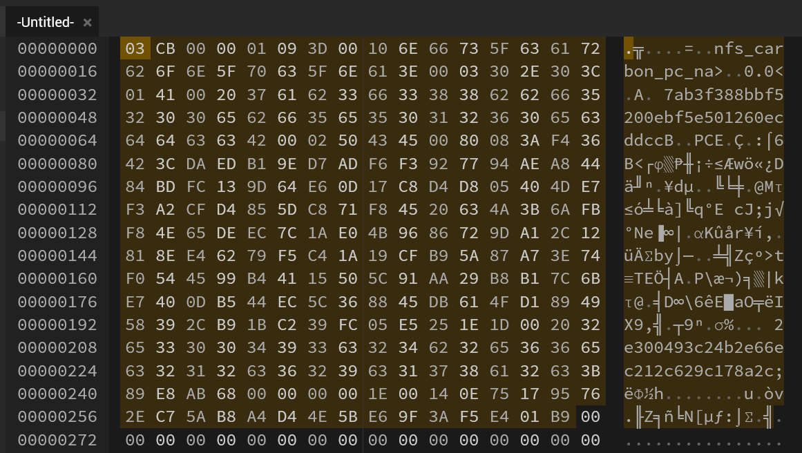

Oh. It's gonna take a while. But we do have symbols!

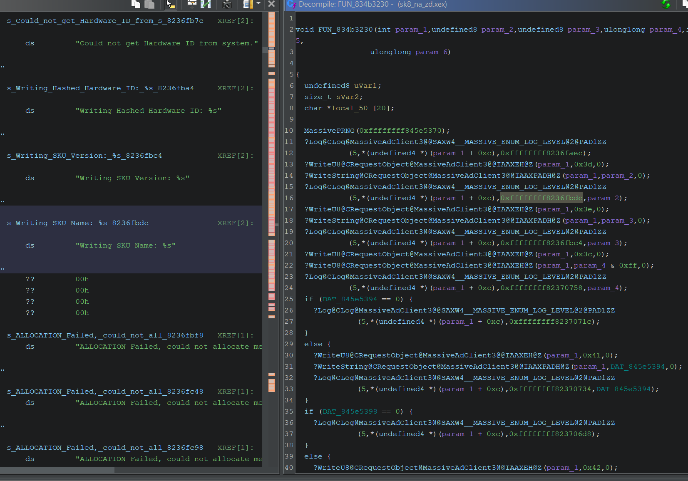

As usual, using logging messages I reconstructed yet another enum of field ids:

```rust
#[derive(Debug, Eq, PartialEq, TryFromPrimitive, IntoPrimitive)]
#[repr(u8)]
pub enum OpenSessionRequestMADFields {
    //OpenSession
    SKUName = 0x3d, //String
    SKUVersion=0x3e, //String
    SessionType=0x3c, //U8
    ThirdPartyID=0x41, //String
    ThirdPartyServiceName=0x42, //String
    MultiplayerGUID=0x1c, //String
    Token=0x44, //String
    HashedHardwareID=0x1d, //String
    AdClientVersion=0x16, //String
}
```

And in return it expects:

```rust
#[derive(Debug, Eq, PartialEq, TryFromPrimitive, IntoPrimitive)]
#[repr(u8)]
pub enum OpenSessionResponseMADFields {
    //OpenSession
    HMACSignature = 0x1e, //ByteArray
    MassivePlayerID=0x2a, //U32
    MassiveSessionID=0x2b, //U32
    ZoneName=0x47, //String
}
```

> HMACSignature

Ah, so it's not gonna be easy.

> `VerifyHMACSignature@CRequestObject@MassiveAdClient3`

Yep.

## HMAC and signatures

We finally got a new fence to jump over - message signatures. Lucky for us, MassiveAdClient is using not something funny or home-made, but just SHA1 HMAC, at least judging by its name (but I have trust issues at this point):

**Parse@CRequestOpenSession@MassiveAdClient3**
```C++
...
      if (all_required_fields_are_present == '\x03') {
        ?Log@CLog@MassiveAdClient3@@SAXW4__MASSIVE_ENUM_LOG_LEVEL@2@PAD1ZZ
                  (5,uVar8,"Response contains all of the required fields.",uVar10,param_5,param_ 6,
                   param_7,uVar12);
        iVar6 = ?VerifyHMACSignature@CRequestObject@MassiveAdClient3@@IAAHXZ(param_1);
        if (iVar6 != 0) {
          ?Log@CLog@MassiveAdClient3@@SAXW4__MASSIVE_ENUM_LOG_LEVEL@2@PAD1ZZ
                    (5,(char)*(undefined4 *)(param_1 + 0xc),"Response successfully read and parsed. "
                     ,uVar10,param_5,param_6,param_7,uVar12);
          return 1;
        }
      }
      else {
        ?Log@CLog@MassiveAdClient3@@SAXW4__MASSIVE_ENUM_LOG_LEVEL@2@PAD1ZZ
                  (2,uVar8,"Response does not contain all of the required fields.",uVar10,param_ 5,
                   param_6,param_7,uVar12);
      }
...
```

and inside of `VerifyHMACSignature` in Sk8te

```C++
bool ?VerifyHMACSignature@CRequestObject@MassiveAdClient3@@IAAHXZ(int param_1)

{
  size_t sVar2;
  longlong lVar1;
  int iVar3;
  bool bVar4;
  undefined uVar5;
  undefined uVar6;
  undefined in_r7;
  undefined in_r8;
  undefined in_r9;
  undefined in_r10;
  
  sVar2 = strlen(&DAT_845e5370);
  uVar6 = (undefined)sVar2;
  lVar1 = ?CalculateSHA1HMac@@YAPBXPAEH0H@Z
                    (*(undefined4 *)(param_1 + 0x1c),*(undefined4 *)(param_1 + 0x24),
                     0xffffffff845e5370);
  if (lVar1 == 0) {
    ?Log@CLog@MassiveAdClient3@@SAXW4__MASSIVE_ENUM_LOG_LEVEL@2@PAD1ZZ
              (1,(char)*(undefined4 *)(param_1 + 0xc),
               "Could not allocate space to calculate actual signature.",uVar6,in_r7,in_r8,in_r9 ,
               in_r10);
    bVar4 = false;
  }
  else {
    iVar3 = memcmp(*(void **)(param_1 + 0x30),(void *)lVar1,0x14);
    bVar4 = iVar3 == 0;
    uVar5 = (undefined)*(undefined4 *)(param_1 + 0xc);
    if (bVar4) {
      ?Log@CLog@MassiveAdClient3@@SAXW4__MASSIVE_ENUM_LOG_LEVEL@2@PAD1ZZ
                (5,uVar5,"Message passed signature verification",uVar6,in_r7,in_r8,in_r9,in_r10) ;
    }
    else {
      ?Log@CLog@MassiveAdClient3@@SAXW4__MASSIVE_ENUM_LOG_LEVEL@2@PAD1ZZ
                (2,uVar5,"Message failed signature verification",uVar6,in_r7,in_r8,in_r9,in_r10) ;
    }
    (*(code *)PTR_free_84494774)(lVar1);
  }
  return bVar4;
}
```

After some cross-referencing with PC version I was finally able to track down `CalculateSHA1HMac` on PC:

```C++
void * __cdecl CalculateSHA1HMac(undefined *param_1,int param_2,undefined *param_3,size_t param_ 4)

{
  int iVar1;
  void *_Dst;
  byte local_108 [68];
  byte local_c4 [68];
  uint local_80 [26];
  undefined local_18 [20];
  
  if (0x40 < (int)param_4) {
    SHA1Reset(local_80);
    SHA1Input(local_80,param_3,param_4);
    SHA1Result(local_80,(int)local_18);
    param_3 = local_18;
    param_4 = 0x14;
  }
  memset(local_c4,0,0x41);
  memset(local_108,0,0x41);
  memcpy(local_c4,param_3,param_4);
  memcpy(local_108,param_3,param_4);
  iVar1 = 0;
  do {
    local_c4[iVar1] = local_c4[iVar1] ^ 0x36;
    local_108[iVar1] = local_108[iVar1] ^ 0x5c;
    iVar1 = iVar1 + 1;
  } while (iVar1 < 0x40);
  SHA1Reset(local_80);
  SHA1Input(local_80,local_c4,0x40);
  SHA1Input(local_80,param_1,param_2);
  SHA1Result(local_80,(int)local_18);
  SHA1Reset(local_80);
  SHA1Input(local_80,local_108,0x40);
  SHA1Input(local_80,local_18,0x14);
  SHA1Result(local_80,(int)local_18);
  _Dst = (void *)(*(code *)PTR_malloc_00a7b944)(0x14);
  if (_Dst != (void *)0x0) {
    memcpy(_Dst,local_18,0x14);
  }
  return _Dst;
}
```

Which looks like...a default HMAC-SHA1 stuff? 

SHA1 key hashing if key is too long
```C++
  if (0x40 < (int)param_4) {
    SHA1Reset(local_80);
    SHA1Input(local_80,param_3,param_4);
    SHA1Result(local_80,(int)local_18);
    param_3 = local_18;
    param_4 = 0x14;
  }
```

`ipad` and `opad` xoring

  do {
    local_c4[iVar1] = local_c4[iVar1] ^ 0x36;
    local_108[iVar1] = local_108[iVar1] ^ 0x5c;
    iVar1 = iVar1 + 1;
  } while (iVar1 < 0x40);

Then another SHA1 pass and we have out signature. This raises only 1 question - what is the key and the payload? Well, this is a simple question of 1 mock reply and 1 breakpoint.

## OpenSession reply 

We already know the fields:

```rust
#[derive(Debug, Eq, PartialEq, TryFromPrimitive, IntoPrimitive)]
#[repr(u8)]
pub enum OpenSessionResponseMADFields {
    //OpenSession
    HMACSignature = 0x1e, //ByteArray
    MassivePlayerID=0x2a, //U32
    MassiveSessionID=0x2b, //U32
    ZoneName=0x47, //String
}
```

All except `HMACSignature` data format is know, so let's steal some more code. Lucky for me, it seems it's 1 to 1 to `String` format. Which is good news.

```C++
...
    uVar1 = ReadU16@CRequestObject@MassiveAdClient3(param_1_00);
    *param_3 = uVar1;
    if (uVar1 == 0) {
      *param_2 = (void *)0x0;
    }
    else {
      uVar2 = CanRead@CRequestObject@MassiveAdClient3(param_1_00,(uint)uVar1);
...
```

By constructing a very crude

```rust

#[post("/adsrv/openSession")]
pub async fn open_session_v3(mut req: HttpRequest, mut body: web::Payload) -> impl Responder {
    let hex_string = hex::encode(web::BytesMut::new());
    info!("openSession payload: {hex_string}");

    //We will ignore payload here

    let mut reply = MADReply::new(
        MadServerProtocolVersion::Version3,
        MadReplyTaskId::OpenSession,
    );

    reply.add_bytes(OpenSessionResponseMADFields::HMACSignature, &vec![0; 24]);

    reply.add_u32(OpenSessionResponseMADFields::MassivePlayerID, 1);

    reply.add_u32(OpenSessionResponseMADFields::MassiveSessionID, 1);

    reply.add_string(OpenSessionResponseMADFields::ZoneName, "lobby");

    let bytes = reply.build_reply();

    let hex_string = hex::encode(bytes.clone());
    info!("reply payload: {hex_string}");

    let mut reply = HttpResponse::Ok().body(bytes);

    reply.head_mut().set_camel_case_headers(true);

    reply
}
```

I was able to hit `CalculateSHA1HMac` function in NFS: Carbon

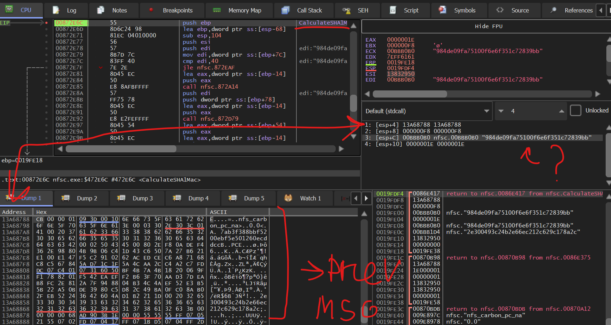

Good news: The data that gets hashes is "OpenSession request bytes payload". So this part is rather easy. And key is a string, not raw bytes. So we probably a dealing with some rather simplistic hash from something.

Bad news: The key is not in the payload, which I suspected. And in the decompiler I can see it's location to be unpopulated:

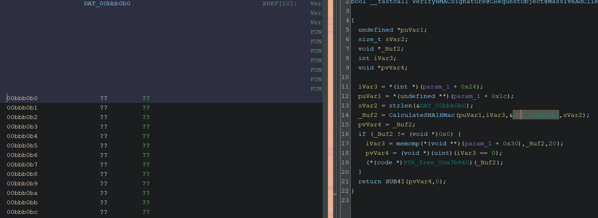

More snooping, and we find what no Reverse Engineer wants to see.

Something called `MassivePRNG`

## MassivePRNG

`PRGN` or `Pseudo RNG` or Pseudorandom are a pain to work with. Each developer go nuts at the sign of an opportunity to implement "ingenious" anti-tampering feature, and this case is not an exception.

Some cross-reference later and we have a complete function

```C++
void __cdecl MassivePRNG(char *param_1)

{
  int iVar1;
  uint uVar2;
  uint uVar3;
  uint uVar4;
  uint uVar5;
  longlong lVar6;
  char *pcVar7;
  size_t sVar8;
  undefined local_128 [128];
  char local_a8 [128];
  char local_28 [36];
  
  pcVar7 = local_a8;
  sVar8 = 0x80;
  iVar1 = Instance@CMassiveClientCore@MassiveAdClient3();
  lVar6 = GetTime@CMassiveClientCore@MassiveAdClient3(iVar1);
  Instance@CMassiveSystem@MassiveAdClient3();
  GetServerTimeFormatted((uint)lVar6,(uint)((ulonglong)lVar6 >> 0x20),pcVar7,sVar8);
  sVar8 = strlen(local_a8);
  memcpy(local_128,local_a8,sVar8);
  sVar8 = strlen(local_a8);
  init_by_array((int)local_128,(int)sVar8 / 4);
  uVar2 = genrand_int32();
  uVar3 = genrand_int32();
  uVar4 = genrand_int32();
  uVar5 = genrand_int32();
  _snprintf(local_28,0x21,s_%x%x%x%x_009fec18,uVar2,uVar3,uVar4,uVar5);
  strncpy(param_1,local_28,0x21);
  return;
}
```

`GetServerTimeFormatted` is also required to better undestand the flow, so, here

```C++
void GetServerTimeFormatted(uint timestamp,uint seconds,char *return_buffer,size_t param_4)

{
  tm *ptVar1;
  undefined4 extraout_ECX;
  undefined8 uVar2;
  char local_44 [32];
  char local_24 [32];
  
  uVar2 = __aulldvrm(timestamp,seconds,1000,0);
  seconds = (uint)uVar2;
  ptVar1 = localtime((time_t *)&seconds);
  if (ptVar1 == (tm *)0x0) {
    _snprintf(return_buffer,param_4,s_Time_Unavailable_009fe538);
  }
  else {
    _snprintf(local_44,0x20,s_%d-%.2d-%.2d_009fe560,ptVar1->tm_year + 0x76c,ptVar1->tm_mon + 1,
              ptVar1->tm_mday);
    _snprintf(local_24,0x20,s_%.2d:%.2d:%.2d,%.3d_009fe54c,ptVar1->tm_hour,ptVar1->tm_min,
              ptVar1->tm_sec,extraout_ECX);
    _snprintf(return_buffer,param_4,&DAT_009c5fc8,local_44,local_24);
  }
  return;
}
```
This math jumpscare here 

```c++
  uVar2 = __aulldvrm(timestamp,seconds,1000,0);
```

confused me at first, but turns out it's a simple `%` math operation, as confirmed by Xbox 360 decompilation:

```C++
int GetServerTimeFormatted(undefined8 param_1,ulonglong param_2,char *param_3,size_t param_4)

{
  uint *puVar1;
  int iVar2;
  ulonglong local_80 [2];
  char acStack_70 [32];
  char acStack_50 [80];
  
  local_80[0] = param_2 / 1000;
  puVar1 = (uint *)_localtime64(local_80);
  if (puVar1 == (uint *)0x0) {
    iVar2 = _snprintf(param_3,param_4,"Time Unavailable");
  }
  else {
    _snprintf(acStack_50,0x20,"%d-%.2d-%.2d ",(ulonglong)puVar1[5] + 0x76c,(ulonglong)puVar1[4] + 1,
              (ulonglong)puVar1[3]);
    _snprintf(acStack_70,0x20,"%.2d:%.2d:%.2d,%.3d",(ulonglong)puVar1[2],(ulonglong)puVar1[1],
              (ulonglong)*puVar1,param_2 % 1000);
    iVar2 = _snprintf(param_3,param_4,"%s%s",acStack_50,acStack_70);
  }
  return iVar2;
}
```

After a lot of debugging, googling function names and random variables I was able to narrow down the whole flow:

- get timestamp in milliseconds from `locateService` response
- add a number of full seconds that had passed since known timestamp (in NFS: Carbon case for `openSession` it's zero)
- format the timestamp into `2025-01-01 00:00:00,000`
- initialize a `Mersenne Twister PRNG` with 5 u32 from `2025-01-01 00:00:00,000` as byte array (`init_by_array`)
- generate 4 u32 to get the key

Which is fine, give or take. At this moment in time I still have concern regarding `GetTickCount` in the function responsible for the current time, since debuggers could mess this up.

But! It seems like it's only used in `WriteOpenSessionRequest` and `Parse@OpenSessionRequest` which means other messages don't perfrom any signatures checks, and we don't have to worry about it. Hopefully.

So to save us some time I'll just hardcode the value to `1735689600000` which is January 1, 2025 12:00:00 AM. 

### Note for the future.

After some test runs I find out that the string, from which key is generated is adding your local timezone for into parsed time string:

`1735689600000` transforms into `2025-01-01 03:00:00,000` at client side.

This is pose an issue, since client timezone info (at least to my current understandment) is not being send towards the server, and was deducted by the server based on geo ip data. Since 2000s internet transformed sagnificantly and geo ip is not a valid source of info for such calculations. This breaks HMAC signature verification, since server and client can't generate the same key anymore, and breaks the flow entirely.

Lucky for us we can patch it eventually with dll injections, but for now I'll just utilize hardcoded value.

Anyway, onwards, to the next call!

## Back to HMAC

Now we have the key and the payload to generate hmac-sha1 signature.

Finding a rust library, capable of doing this prng properly took a while, but the whole code is rather simple 

```rust
let time = "2025-01-01 03:00:00,000";
    let mut array = bytes_to_vec_u32(time.as_bytes());
    let (left, _) = array.split_at_mut(5);

    let mut mt = MT19937::new_with_slice_seed(left);

    let a = mt19937::MT19937::next_u32(&mut mt);
    let b = mt19937::MT19937::next_u32(&mut mt);
    let c = mt19937::MT19937::next_u32(&mut mt);
    let d = mt19937::MT19937::next_u32(&mut mt);

    let token = format!("{:08x}{:08x}{:08x}{:08x}", a, b, c, d);
```


Now we just need to set a hmac-sha1 combo and we're golden!

## 8 hours later
Update: we're not golden.

As it usually goes, the simplest things turns out the most troublesome. At first, I assumed that signature for a reply is a body of an incoming message, because `CalculateSHA1HMac` was triggered with it as a payload and in `WriteOpenSessionRequest` function there is no mentions of signatures. And since I can check the output of MassiveAdClient HMAC-SHA1 function I can verify if my output is okay or not.

But time and time again I failed to generate the same signature as the one game was generating and at this point you big to loot at each idividual byte and trace all the buffers.

So my breakpoint is set at `CalculateSHA1HMac` and it triggers with `OpenSession` payload.

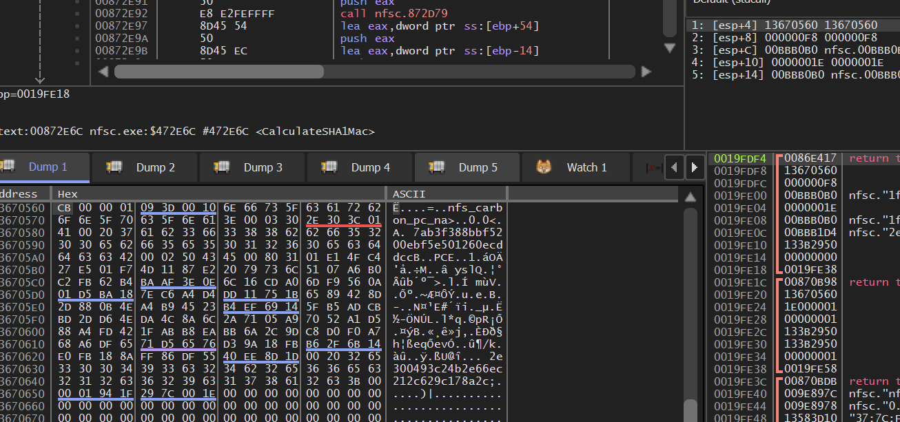

I try to generate an answer to it, push "Run" in x32dbg and... `CalculateSHA1HMac` gets hit again!

But now with my reply payload:

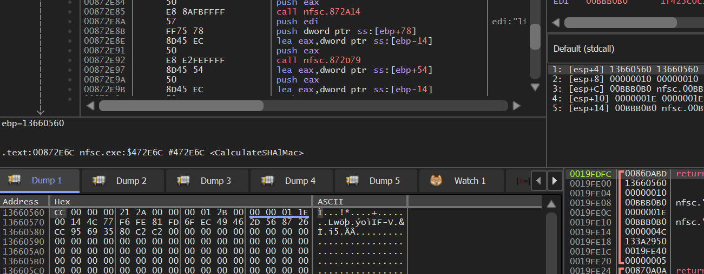

What is going on here?

Well turns out game append timestamp and signature to messages after generating the main request payload.

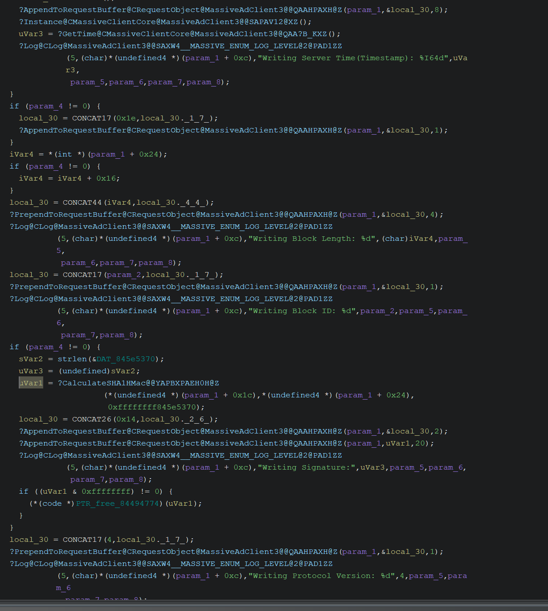

And this is up to server to parse and verify it. Which I didn't. And the message signature is based on the message payload with 

**MESSAGE BODY WITHOUT PROTOCOL VERSION BYTE AND WITH SIGNATURE FIELD BYTE (`0x1e`) AT THE END INCLUDED**

*sigh* okay, okay. Those thing happen, you need to be prepared. You would think that after fixing that and adding to my reply builder function the required code with hmac-sha1 of outgoing packet it will finally be working.

And you would be wrong!

For one reason or another HMAC-SHA1 in MassiveAdClient is not compatible with real world implementations and instead is using what looks like a one according to documentations, but all rust and python libs are failing to produce the same result as it.

So I gave up and cheated, by asking ChatGPT to rewrite the source code from the decompiler. Which FINALLY worked.

the final code for the reply with signature looks like:

```rust
    pub fn build_reply_with_signature(self) -> Vec<u8> {

        let mut pre_final_buf: Vec<u8> = Vec::new();

        pre_final_buf.push(self.task_id.into());
        pre_final_buf.write_u32::<BigEndian>(self.buf.len() as u32 + 23); 
        pre_final_buf.extend_from_slice(&self.buf);

        let time = "2025-01-01 03:00:00,000";
        let mut array = bytes_to_vec_u32(time.as_bytes());
        let (left, _) = array.split_at_mut(5);
    
        let mut mt = MT19937::new_with_slice_seed(left);
    
        let a = mt19937::MT19937::next_u32(&mut mt);
        let b = mt19937::MT19937::next_u32(&mut mt);
        let c = mt19937::MT19937::next_u32(&mut mt);
        let d = mt19937::MT19937::next_u32(&mut mt);
    
        let token = format!("{:08x}{:08x}{:08x}{:08x}", a, b, c, d); 
        println!("token = {}", token);
        
        let mut mac = Hmac::<Sha1>::new_from_slice(token.as_bytes()).unwrap();

        let mut temp = pre_final_buf.clone();
        temp.push(0x1e);
  
        let digest = calculate_sha1_hmac_exact(token.as_bytes(), &temp);
        info!("digest: {}", hex::encode(&digest));

        let mut final_buf: Vec<u8> = Vec::new();
        final_buf.push(self.version.into());
        final_buf.extend_from_slice(&pre_final_buf);
        final_buf.push(OpenSessionResponseMADFields::HMACSignature as u8);
        final_buf.write_u16::<BigEndian>(digest.len() as u16).unwrap();
        final_buf.extend_from_slice(&digest);

        final_buf
    }
```
And finally, after all of those struggles and shamefull ChatGPT request I was getting

```
[2025-08-27T05:33:22Z INFO  actix_web::middleware::logger] 127.0.0.1 "POST /adsrv/openSession HTTP/1.1" 200 39 "-" "Adclient Massive Inc./3.2.1.55" 0.001453
[2025-08-27T05:34:32Z INFO  actix_web::middleware::logger] 127.0.0.1 "POST /adsrv/enterZone HTTP/1.1" 404 0 "-" "Adclient Massive Inc./3.2.1.55" 0.000088
```

Time to supply textures.

## EnterZone

`03cd00000033470006746e2e332e312a000000012b000000013b000001941f2a89e61e00146ea45f3718b214bb80c6233886d8db549dbb6459`

And if we break it down:

```
03 - protocol
cd - call
00000033 - size
47 0006 746e2e332e31 - zone name 'tn.3.1'
2a 00000001 -user id
2b 00000001 - session id
3b 000001941f2a89e6 - timestamp from the client
1e 0014 6ea45f3718b214bb80c6233886d8db549dbb6459 - Hmac signature
```
And by analyzing the decompiled code we finally got to the part where game expects assets. But there are some caveats, but let's go step by step.

```C++
  cVar12 = '\0';
  *(undefined4 *)(param_1 + 0x20) = 0;
  ?Log@CLog@MassiveAdClient3@@SAXW4__MASSIVE_ENUM_LOG_LEVEL@2@PAD1ZZ
            (5,(char)*(undefined4 *)(param_1 + 0xc),"Reading Response...",param_4,param_5,param_6 ,
             param_7,param_8);
  iVar5 = ?ReadRemoveVerifyProtocolVersion@CRequestObject@MassiveAdClient3@@IAAHXZ(param_1);
  if (iVar5 != 0) {
    cVar7 = ?ReadU8@CRequestObject@MassiveAdClient3@@IAAEXZ(param_1);
    uVar10 = 0;
    ?Log@CLog@MassiveAdClient3@@SAXW4__MASSIVE_ENUM_LOG_LEVEL@2@PAD1ZZ
              (5,(char)*(undefined4 *)(param_1 + 0xc),"Block ID: %d",cVar7,param_5,param_6,param_ 7,0
              );
    if (cVar7 == -0x32) {
      uVar2 = ?ReadU32@CRequestObject@MassiveAdClient3@@IAAIXZ(param_1);
      uVar4 = uVar2;
      ?Log@CLog@MassiveAdClient3@@SAXW4__MASSIVE_ENUM_LOG_LEVEL@2@PAD1ZZ
                (5,(char)*(undefined4 *)(param_1 + 0xc),"Block Length: %d",(char)uVar2,param_5,
                 param_6,param_7,(char)uVar10);
      uVar9 = (undefined)uVar4;
      uVar1 = *(uint *)(param_1 + 0x20);
      uVar14 = 0;
      uVar13 = 0;
      if ((uVar2 & 0xffffffff) != 0) {
        do {
          cVar7 = ?ReadU8@CRequestObject@MassiveAdClient3@@IAAEXZ(param_1);
          if (cVar7 == '\x1e') {
            ?ReadRemoveSignature@CRequestObject@MassiveAdClient3@@IAAXXZ(param_1);
            ?Log@CLog@MassiveAdClient3@@SAXW4__MASSIVE_ENUM_LOG_LEVEL@2@PAD1ZZ
                      (5,(char)*(undefined4 *)(param_1 + 0xc),"Reading HMAC Signature:",(char)uVa r4,
                       param_5,param_6,param_7,(char)uVar10);
            ?DumpByteArray@CRequestObject@MassiveAdClient3@@QAAXPACG@Z
                      (param_1,*(undefined4 *)(param_1 + 0x30),0x14);
            uVar2 = uVar2 - 0x16;
LAB_834b721c:
            cVar12 = cVar12 + '\x01';
          }
          ...
```

We can see the familiar checks for block id, block lenght and signature checks, which we have already implemented in previous steps. But after it an issue arise in form of 

```C++
...
            if (cVar7 == '%') {
              uVar4 = ?ReadU16@CRequestObject@MassiveAdClient3@@IAAGXZ();
              pcVar8 = "IE Count: %d";
              *(short *)(param_1 + 0x60) = (short)uVar4;
LAB_834b71cc:
              uVar4 = uVar4 & 0xffff;
              ?Log@CLog@MassiveAdClient3@@SAXW4__MASSIVE_ENUM_LOG_LEVEL@2@PAD1ZZ
                        (5,(char)*(undefined4 *)(param_1 + 0xc),pcVar8,(char)uVar4,param_5,param_6 ,
                         param_7,(char)uVar10);
              goto LAB_834b721c;
            }
            if (cVar7 == 'U') {
              uVar4 = ?ReadU16@CRequestObject@MassiveAdClient3@@IAAGXZ();
              *(short *)(param_1 + 0x88) = (short)uVar4;
              pcVar8 = "Order Count: %d";
              goto LAB_834b71cc;
            }
            if (cVar7 == -0x23) {
              iVar5 = ?ReadIEBlock@CRequestEnterZone@MassiveAdClient3@@AAAPAVCMassiveAdObject@2@XZ ()
...
```

What is `IE` ? Well, if we check `ReadIEBlock` we will learn that

```C++
  ?Log@CLog@MassiveAdClient3@@SAXW4__MASSIVE_ENUM_LOG_LEVEL@2@PAD1ZZ
            (5,(char)*(undefined4 *)(param_1 + 0xc),"Reading Inventory Element Block...",param_4,
             (char)param_5,(char)param_6,(char)param_7,(char)param_8);
```

It wasn't very clear to me, what `Inventory Element` is, but a quick google let us know that it stands for `Ad inventory refers to the available ad space on digital platforms like websites, apps, and videos that publishers sell to advertisers to display their advertisements. `. So it seems like we need to let the game know which Inventory Elements exists on the Zone, and this pose a very, very sagnificat challenge for RE. I honestly expected that game would let the backend know about places and sizes of files it wants. But it seems like backend should be already have this data. And I have no idea how to extract this data from NFS: Carbon, let alone any game. Let's put it aside for now and check the rest, because it's more interesting.

Below the `ReadIEBlock` we can see `ReadOrderBlock`

```C++
            else if (cVar7 == -0x1d) {
              iVar5 = ?ReadOrderBlock@CRequestEnterZone@MassiveAdClient3@@AAAPAVCMassiveOrder@2@XZ ()
              ;
```

And inside it we finally get to the juicy part

```C++
        uVar18 = ?ReadU16@CRequestObject@MassiveAdClient3@@IAAGXZ(param_1);
        pcVar10 = "Asset Count: %d";
        uVar4 = uVar18 & 0xffff;
```

And if we follow into `ReadAssetBlock`

```C++
        if (cVar8 == -0x22) {
          iVar5 = ?ReadAssetBlock@CRequestEnterZone@MassiveAdClient3@@AAAPAVCMassiveAsset@2@XZ() ;
```

And inside it

```C++
      case 9:
        uVar3 = ?ReadU32@CRequestObject@MassiveAdClient3@@IAAIXZ(param_1);
        local_c4 = (undefined4)uVar3;
        pcVar10 = "Asset Type: %d";
        break;
      case 10:
        uVar3 = ?ReadString@CRequestObject@MassiveAdClient3@@IAAPADXZ(param_1);
        uVar18 = uVar3;
        pcVar10 = "Asset URL: %s";
        break;
```

We finally get to the fun part!

And so to sum up all the findings, the `EnterZone` request contain `IE` block and `Order` block, and `Order` block contain `Asset` block which are actual assets, well, urls to assets. I omended some less interesting parts of the `Order` block, but we will get to them, don't you worry.

And now we have a problem in form of unknown `IE` block flow and how are we suppose to get all the placements on the level. But one problem at a time, let's get back to writing the code.

# EnterZone implementation

By doing the familiar dance I mapped all the values into rust:

```rust

#[derive(Debug, Eq, PartialEq, TryFromPrimitive, IntoPrimitive)]
#[repr(u8)]
pub enum ZoneEnterResponseMADFields {
    IECount = 0x25,    //U16
    OrderCount = 0x55, //U16
    IEBlock = 0xDD,
    OrderBlock = 0xE3,
}

#[derive(Debug, Eq, PartialEq, TryFromPrimitive, IntoPrimitive)]
#[repr(u8)]
pub enum ZoneEnterIDResponseMADFields {
    //Inventory Element
    IEAssetArray = 0x24,           // U32 array
    IEAngleThreshold = 0x08,       // Float
    IEDistanceThreshold = 0x09,    // Float
    IESizeThreshold = 0x0a,        // U16
    IEMediaType = 0x0b,            // U32
    IEAdjustment = 0x23,           // Float
    IEId = 0x26,                   // U32
    IEName = 0x27,                 // String
    IERotationType = 0x28,         // U16
    IEPrimaryMatchListSize = 0x2e, // U8
}

#[derive(Debug, Eq, PartialEq, TryFromPrimitive, IntoPrimitive)]
#[repr(u8)]
pub enum ZoneEnterOrderBlockResponseMADFields {
    OrderAssetCount = 0x01,   //U16
    OrderFrequencyCap = 0x03, //U32
    OrderId = 0x13,           //U32
    OrderAssetBlock = 0xDE,
}

#[derive(Debug, Eq, PartialEq, TryFromPrimitive, IntoPrimitive)]
#[repr(u8)]
pub enum ZoneEnterAssetBlockResponseMADFields {
    //Skate 2 decompilation shows switch((FieldId & 0xff) - 2) instead of common if block, so those could be wrong
    AssetExpiration = 0x00,       //U64, timestamp
    AssetHash = 0x02,             //Byte Array
    AssetId = 0x03,               //U32
    AssetRotationDuration = 0x04, //U32
    AssetSize = 0x05,             //U32
    AssetAngleTreshold = 0x06,    //f32
    AssetDistanceTreshold = 0x07, //f32
    AssetSizeTreshold = 0x08,     //u16
    AssetType = 0x09,             //u32
    AssetUrl = 0x0A,              //String
    AssetCrexId = 0x13,           //U32
}
```
While it's satisfactory to look at the properly formatted data, a lot of here is unknown. What are angle, distance and size tresholds? What is `Crex Id` ? Are inventory items retrivable from the game? Do we need to know their in-game names?

Truth to be told, I took a month long break after I hit `EnterZone` function and saw all of the params. And usually when I hit a wall like this, I like to get back to getting samples, look out for clues and just googling for anything related.

And suprisingly for me I found this extrimely patriotic post from a proud American.

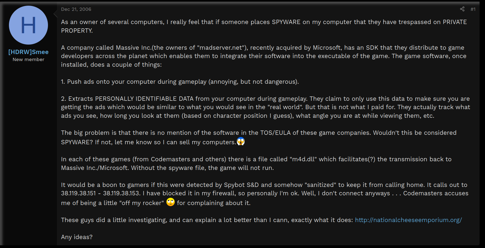

Content aside, that part

> These guys did a little investigating, and can explain a lot better than I cann, exactly what it does: http://nationalcheeseemporium.org/

is eyebrow-rising.

What are the chances that on a website http://nationalcheeseemporium.org/ somebody posted a very detailed research of Massive Ad Client back in 2006?

Like, **really?**

Turns out, it's one of those "10th page of Google" wonders you find once in a lifetime. And lucky for us it's avaliable though webarchive.

http://web.archive.org/web/20050901032347/http://nationalcheeseemporium.org/#expand

And it's a motherload of data!

```xml
...
 <enterZoneResponse sig="4e94632c2cca5333434670c7fd4400d4">
 <mediaList>
  <media>
   <id>4089</id>
   <name>Coke_c_128x256.dds</name>
   <mimeType>image/dxt3</mimeType>
   <size>43856</size>
   <md5sum>344d99d07bda2ceecf79720d59d58ae9</md5sum>
   <urlpath>/187/1631/Coke_c_128x256.dds</urlpath>
   <crex>
    <id>1631</id>
    <minSize>100</minSize>
    <minDuration>5000</minDuration>
    <minAngle>50</minAngle>
   </crex>
  </media>
  <media>
   <id>4327</id>
   <name>SWAT_GameFly_256x128.dds</name>
   <mimeType>image/dxt3</mimeType>
   <size>43856</size>
   <md5sum>5bf9e25025e46a5d78b08f0b9d3c0dd7</md5sum>
   <urlpath>/190/1686/SWAT_GameFly_256x128.dds</urlpath>
   <crex>
    <id>1686</id>
    <minSize>100</minSize>
    <minDuration>5000</minDuration>
    <minAngle>50</minAngle>
   </crex>
  </media>
  ...
```

Aside from the fact, that it's a Massive Ad Client v1, the structures are very close to what we have in v3. And now we know how a reply for assets should looks like.

```xml
 <mediaTarget>
   <id>803</id>
   <name>poster18</name>
  </mediaTarget>
  <mediaTarget>
   <id>783</id>
   <name>cereal1</name>
  </mediaTarget>
   <mediaTarget>
    <id>808</id>
    <name>sodasign3</name>
  </mediaTarget>
  <mediaTarget>
   <id>788</id>
   <name>poster3</name>
   <mediaRef id="4323"/>
  </mediaTarget>
  <mediaTarget>
   <id>796</id>
   <name>poster11</name>
  </mediaTarget>
  <mediaTarget>
   <id>786</id>
   <name>poster1</name>
   <mediaRef id="4300"/>
  </mediaTarget>
```

My worst fears were confirmed, backend is supplying client with ids and names of ads placements in a zone. But at the very least we now have some sort of a reference.

```xml
 <mediaZones>
  <mediaZone>
   <id>70</id>
   <name>SP-ConvenienceStore</name>
   <mediaTargetRef id="800"/>
   <mediaTargetRef id="794"/>
   <mediaTargetRef id="793"/>
   <mediaTargetRef id="799"/>
   <mediaTargetRef id="791"/>
   <mediaTargetRef id="804"/>
   <mediaTargetRef id="803"/>
```
and this seems to be just a zone data, which we don't have in v3. Oh well.

But we also get a glimpce into next request - `/impsrv/impressionUpdate`

```xml
 <impressionRecords>
  <impressionRecord type="view">
   <timestamp>1120347977797</timestamp>
   <crexId>1685</crexId>
   <inventoryID>800</inventoryID>
   <duration>1060</duration>
   <avgSize>88</avgSize>
   <avgAngle>0.963</avgAngle>
  </impressionRecord>
  <impressionRecord type="impression">
   <timestamp>1120347980104</timestamp>
   <crexId>1685</crexId>
   <inventoryID>800</inventoryID>
   <duration>792</duration>
   <avgSize>117</avgSize>
   <avgAngle>0.905</avgAngle>
  </impressionRecord>
```

And now `Angle` and `Size` tresholds makes a little more sense. Those are params for minimal texture size/angle on the screen to be displayed. 

While original authors state that 

> The most shocking part was next. The client contacted madserver to tell the advertisers how long the gamer spent with each advert in their view. This is mapped to the gamer id, so they know which player in the game saw the advert, and when, for how long, and from how far away (by virtue of the size attribute). Even the average viewing angle is passed back. 

this is "shocking", this data makes a lot of sense for "billing" part of the business, to actually bill the advertisers based on impression of their ads. While somewhat intrusive, thise is mild, compared to algorithms of current day and age. Just like the original authors said:

> If this stuff is just first generation, then who knows how invasive and/or detailed this technology could become.

Ironic, isn't it?

Anyway, now we know for sure, that we need some way to extract data from ads placements on the level for each title by hand. And a little bit more fluet with all the values present in `EnterZone` reply.

Time to dig deeper into games.

# Getting placements data

My attempts with NFS: Carbon and publicly avaliable tools lead to almost nowhere.

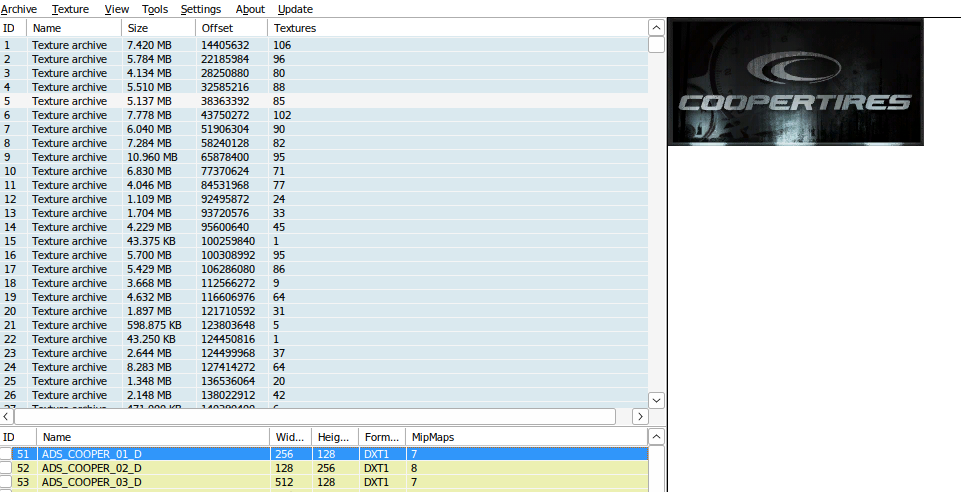

There are several files with `ADS_` prefix, but it's not very clear, if those are used as names, or there is some other translation layer. So I decided to switch my test subject to a more approachable `Rainbow Six: Vegas`.

Thanks to `UPK Explorer` and their attempt to support all known to humankind Unreal games, it's possible to browse Vegas 1 data structs. And in map files (and `MassiveConfig` struct) I was able to find all the ads names, which I suspect are correct. Vegas 1 is also a fine test subject, due to me being a bit familiar with Unreal Engine 3 approaches to structs and data.

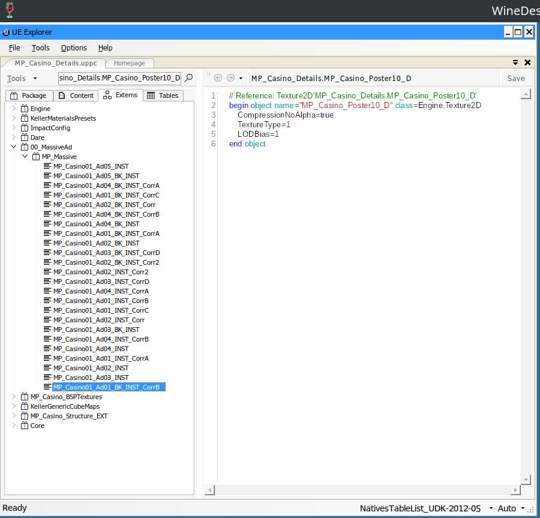

And if we export all of them we get a nice list of:

```
MP_Casino01_Ad02b_CorrA
MP_Ad04
MP_MASSIVE_RackFiles03c
MP_MASSIVE_RackFiles03b
MP_MASSIVE_RackFiles03a
MP_Ad02c
MP_Casino01_Ad03b
MP_Casino01_Ad02b
MP_Ad03b
MP_Ad02b
MP_Ad01b
MP_RackFiles03_D
MP_Massive_CrateWrappedShipping01_D
MP_Massive_CrateWrappedShipping01b
MP_Massive_CrateWrappedShipping01c
MP_Massive_Box07
MP_Massive_Box07b
06_VendingMachine01_Massiv_E
06_VendingMachine02_Massiv_E
99_Billboard01_E
MP_Casino01_Ad01_D
MP_Massive_PosterDisplay01c5_D
MP_Massive_PosterDisplay01c3
MP_Massive_ChinesePosters01h_D
MP_Massive_CasinoSign01a_E
MP_Massive_AdboardSha01_D
MP_DantesAd02_D
MP_Dantes_Ad01_D
MP_Casino_Ad01_D
MP_Casino02_Ad01_D
MP_Casino01_Ad05
MP_Casino01_Ad04
MP_Casino01_Ad03
MP_Casino01_Ad02_D
Massive_Poster10_D
Massive_Poster09_D
Massive_Poster08_D
Massive_Poster07_D
Massive_Poster04_D
Massive_Poster03_D
Massive_AdboardSha03Glow_E
Massive_AdboardSha02Glow_E
Massive_AdboardSha01Glow_E
```

Now let's try to build something suplying textures.

# Building the ads function (and doing a lot of other things) in 16 hours.

> After a wrote a title for this part, I took a week long break from working on the Massive Ad Client. And then a week later I suddenly got inspired and spend 16 hours in sitting working on it. And so in this 16 hours a lot of things were discovered. But I'm getting ahead of myself, let's proceed from where I left last time.

While symbols are a great way to peak into the original code and reversing stuff, the moment I actually checked v3 of the Massive Ad Client I realized that `EnterZone` reply is different from v4.

In v4 we have 3 blocks

- `Inventory Object` block, describing all ads placements on a level
- `Order`, which set rules for showing the ads
- `Assets` for `Order`, where ads media objects are described

In v3 howere we have 2: `Inventory Object` and `Assets`. In v3 `Order` block data in bundled with `Assets`. I still haven't figured all the fields, but those are probably the same fields as in `Order` v4.

```rust
#[derive(Debug, Eq, PartialEq, TryFromPrimitive, IntoPrimitive)]
#[repr(u8)]
pub enum ZoneEnterV3ResponseMADFields {
    IECount = 0x25,    //U16
    AssetCount = 0x01, //U16
    IEBlock = 0xDD,
    AssetBlock = 0xDE,
}

#[derive(Debug, Eq, PartialEq, TryFromPrimitive, IntoPrimitive)]
#[repr(u8)]
pub enum ZoneEnterIEResponseMADFields { //Same for v3 and v4
    IEAssetArray = 0x24,           // U32 array !!!Mandatory!!!
    IEAngleThreshold = 0x08,       // Float
    IEDistanceThreshold = 0x09,    // Float
    IESizeThreshold = 0x0a,        // U16
    IEMediaType = 0x0b,            // U32 !!!Mandatory!!!
    IEAdjustment = 0x23,           // Float
    IEId = 0x26,                   // U32 !!!Mandatory!!!
    IEName = 0x27,                 // String !!!Mandatory!!!
    IERotationType = 0x28,         // U16 !!!Mandatory!!!
    IEPrimaryMatchListSize = 0x2e, // U8 !!!Mandatory!!!
}

#[derive(Debug, Eq, PartialEq, TryFromPrimitive, IntoPrimitive)]
#[repr(u8)]
pub enum ZoneEnterV3AssetBlockResponseMADFields {
    AssetExpiration = 0x02, //U64? !!!Mandatory!!!
    unk2 = 0x03,               //U32
    AssetHash = 0x04,             //Byte Array !!!Mandatory!!!
    AssetId = 0x05,             //U32 !!!Mandatory!!!
    unk3 = 0x06,             //U32 !!!Mandatory!!!
    AssetSize = 0x07,             //U32 !!!Mandatory!!!
    AssetAngleTreshold = 0x08,             //F32
    AssetDistanceTreshold = 0x09,             //F32
    AssetSizeTreshold = 0x0a,             //U16
    AssetMediaType = 0x0b,             //U32 !!!Mandatory!!!
    AssetUrl = 0x0c,              //String !!!Mandatory!!!
    unk5 = 0x15,           //U32 Crex? !!!Mandatory!!!
} 

```
And by constructing a very crude

```rust

let mut reply = MADReply::new(
        MadServerProtocolVersion::Version3,
        MadReplyTaskId::EnterZone,
    );

    let inventory_elements_count: u16 = 1;
    reply.add_u16(
        ZoneEnterV3ResponseMADFields::IECount,
        inventory_elements_count,
    );

    let assets_count: u16 = 1;
    reply.add_u16(ZoneEnterV3ResponseMADFields::AssetCount, assets_count);

    let mut ie_item: Vec<u8> = Vec::new();
    ie_item.write_u8(ZoneEnterIEResponseMADFields::IEAssetArray.into());
    ie_item.write_u16::<BigEndian>(1);
    ie_item.write_u32::<BigEndian>(1);

    ie_item.write_u8(ZoneEnterIEResponseMADFields::IEMediaType.into());
    ie_item.write_u32::<BigEndian>(MadAssetType::MAD_MEDIA_IMAGE_DXT1.into());

    ie_item.write_u8(ZoneEnterIEResponseMADFields::IEId.into());
    ie_item.write_u32::<BigEndian>(1);

    let url = "MP_Casino01_Ad02b_CorrA";

    ie_item.write_u8(ZoneEnterIEResponseMADFields::IEName.into());
    ie_item.write_u16::<BigEndian>(url.len() as u16);
    ie_item.extend_from_slice(url.as_bytes());

    // Rotation_None	0
    // Rotation_Any	1
    // Rotation_LineOfSight	2

    ie_item.write_u8(ZoneEnterIEResponseMADFields::IERotationType.into());
    ie_item.write_u16::<BigEndian>(1);

    ie_item.write_u8(ZoneEnterIEResponseMADFields::IEPrimaryMatchListSize.into());
    ie_item.write_u8(0);

    reply.add_block(ZoneEnterV3ResponseMADFields::IEBlock, &ie_item);

    //================================

    let url = "/assets/test.dds";
    let path = Path::new("./assets/test.dds");

    let mut file = File::open(&path).unwrap();

    let metadata = file.metadata().unwrap();
    let file_size = metadata.len();
    info!("file_size: {file_size}");

    let mut buffer = Vec::new();
    file.read_to_end(&mut buffer).unwrap();

    // Compute MD5 hash
    let md5 = md5::compute(&buffer);

    let mut asset: Vec<u8> = Vec::new();
    asset.write_u8(ZoneEnterV3AssetBlockResponseMADFields::AssetExpiration.into());
    asset.write_u64::<BigEndian>(1735689600000 + 86400);

    asset.write_u8(ZoneEnterV3AssetBlockResponseMADFields::AssetHash.into());
    asset.write_u16::<BigEndian>(md5.len() as u16);
    asset.extend_from_slice(md5.0);

    asset.write_u8(ZoneEnterV3AssetBlockResponseMADFields::AssetId.into());
    asset.write_u32::<BigEndian>(1); //ID!!

    asset.write_u8(ZoneEnterV3AssetBlockResponseMADFields::unk3.into());
    asset.write_u32::<BigEndian>(0xFFAABBCC); 

    asset.write_u8(ZoneEnterV3AssetBlockResponseMADFields::AssetSize.into());
    asset.write_u32::<BigEndian>(file_size as u32); //SIZE 

    asset.write_u8(ZoneEnterV3AssetBlockResponseMADFields::AssetMediaType.into());
    asset.write_u32::<BigEndian>(MadAssetType::MAD_MEDIA_IMAGE_DXT1.into());

    asset.write_u8(ZoneEnterV3AssetBlockResponseMADFields::AssetUrl.into());
    asset.write_u16::<BigEndian>(url.len() as u16);
    asset.extend_from_slice(url.as_bytes());

    asset.write_u8(ZoneEnterV3AssetBlockResponseMADFields::unk5.into());
    asset.write_u32::<BigEndian>(1);
```

I begin trying to send data. As you can guess - with no success at all. At first it was some issues with missing data, which I debugged with breakpoints, but after that it become rather clear that I'm not supplying a correct name for the `Iventory Element`. What do?

If we imagine the code flow for the ads thing, there should be a function performing a "if name is correct" check. Which should access the name in the memory. And since we know exactly where object is created, thanks to the symbols, we can quite easily setup an access breakpoint.

**Step 1 - locate the function, that creates `MassiveAdObjectTexture`**

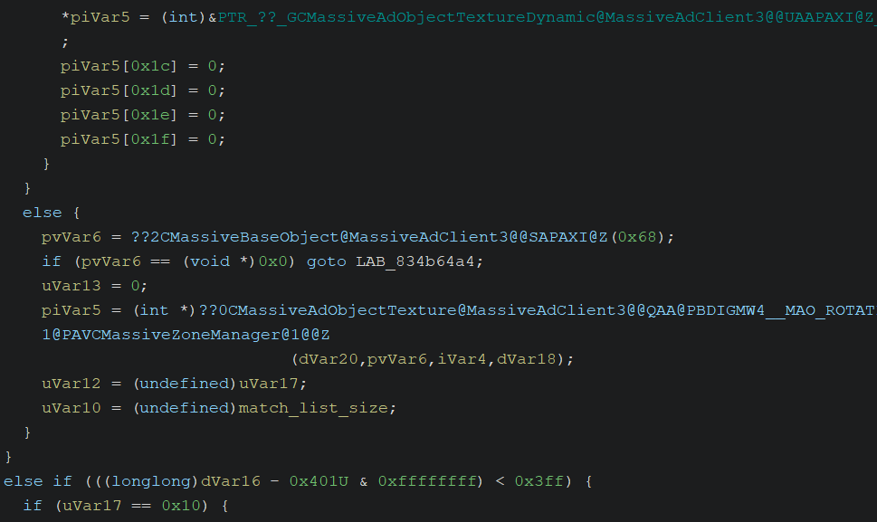

**Step 2 - set a breakpoint in it**

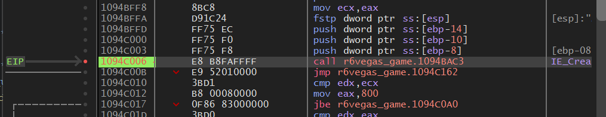

**Step 3 - make it run, and setup a breakpoint in name**

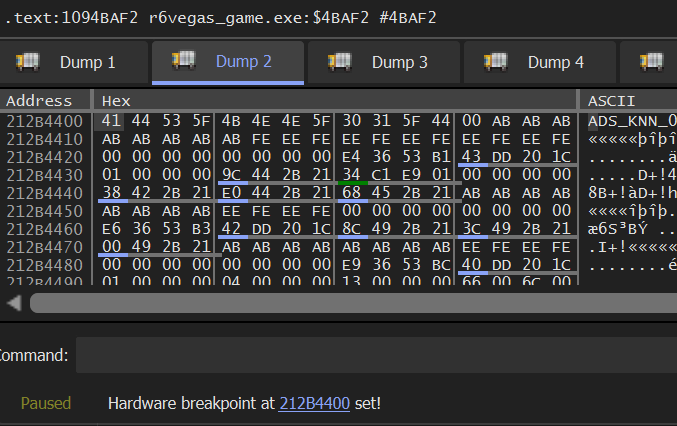

**Step 4 - hope that memory is not dynamic, name is not accessed by anything else and the function we caught is actually one we need**

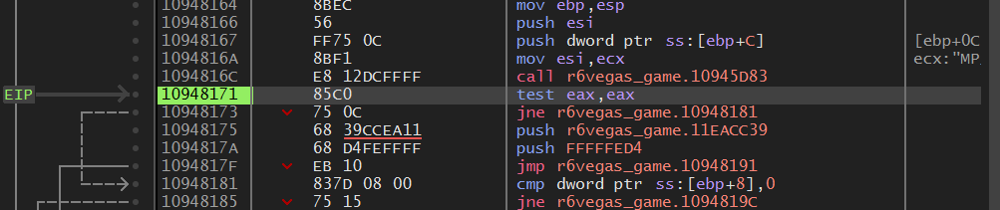

**Step 5 - realize that you had found the most important function for this project**

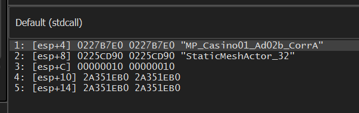

Let me explain a bit.

So this breakpoint, a little bit of cross reference with Sk8te symbols and some more debugging made me realized that I stuck gold. This function, named `CompareStrings` is a Massive Ad Client internal function, present in both version 3 and 4, which is used to check if an object, request by the game, is present in data, that came from the server.

Not only that, but one of the functions (and the most important one, named `FindMAO`) calling it also has a log line, which made it exceptional easy to search and hook.

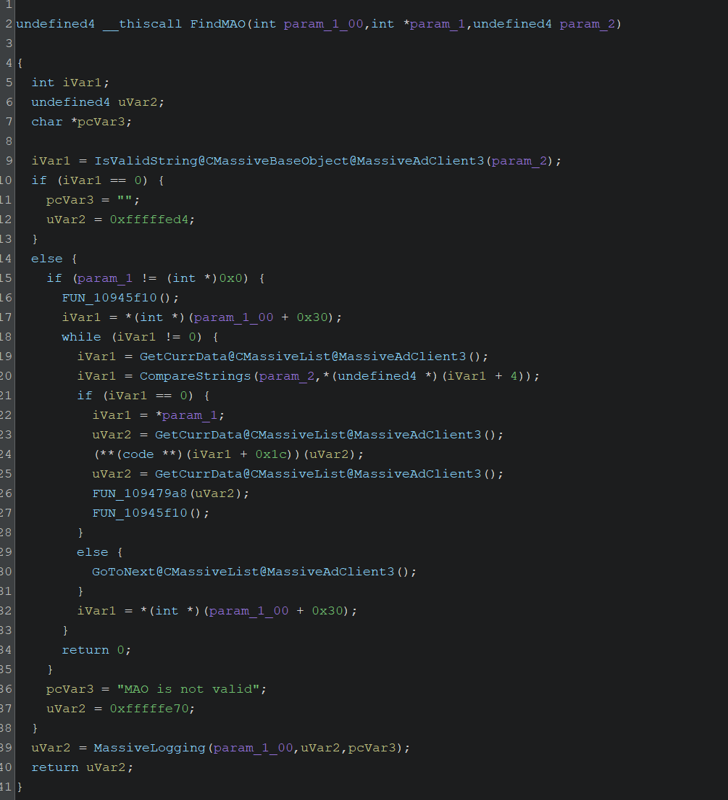

Which makes it possible to make a simple dumper for ads names and easily add support to any PC game.

With my newly gained power I quickly learned that Vegas 1 on Casino level requests:

-`StaticMeshActor_32`
-`R6BreakableActor_44`
-`R6BreakableActor_46`
-`R6BreakableActor_46`
-`R6BreakableActor_175`
-`R6BreakableActor_176`
-`R6BreakableActor_179`
-`R6BreakableActor_9`
-`R6BreakableActor_32`
-`R6BreakableActor_140`
-`R6BreakableActor_178`

I'm sorry, what? What is this naming? I looked at this for a minute, thinking if I really want to bother and switched back to NFS:Carbon. Sorry Vegas, next time I guess.

Thankfully, ads names in NFS:Carbon are actually makes sense and are the same as the names of texture files.

-`ADS_MAZDAMX5_02_D`
-`ADS_FASTFOOD_01_D`
-`ADS_TMOBILE_02_D`
-`ADS_MAZDASPEED3_01_D`
-`ADS_KNN_01_D`
-`ADS_AUTOZONE_02_D`

## Wasting 8 hours of my life due to protocol being idiotic

When I switched back to NFS:Carbon and fixed all the bugs I could figure out I hit the wall. Game properly parsed my data, it properly requested the texture file and then absolutely nothing.

I changed the values I sent, I debugged the code, I run every related function step by step, nothing.

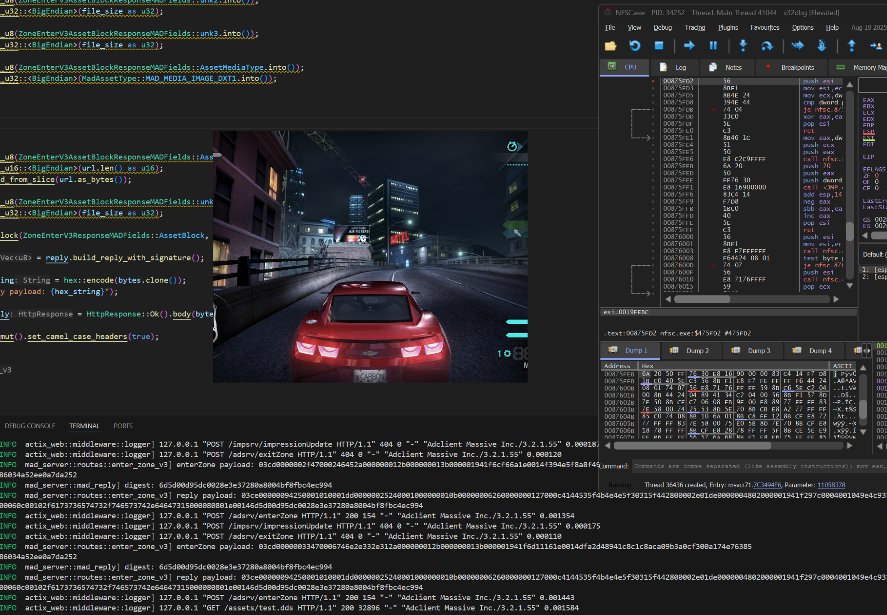

This damn billboard refused to change.

I decided to check the remnants of logging system, hoping I can get some data.

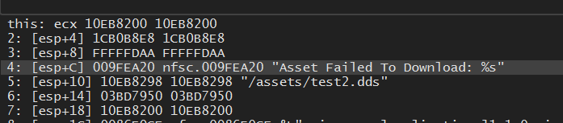

Okay, that's something. I checked and double checked the file serving code. I even confirmed though memory that the file I was sending was in process memory. So I figured out it was some checks we weren't passing. That thought lead me to a function of 

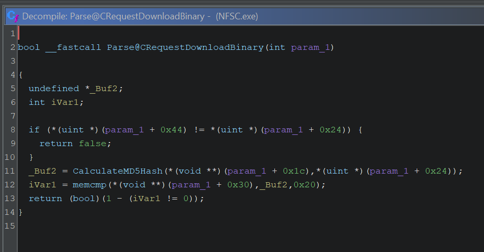

First check was verifying the size and the second one was verifying the md5 hash. I could see me passing the size check, but failing the md5 check.

```rust
    asset.write_u8(ZoneEnterV3AssetBlockResponseMADFields::AssetHash.into());
    asset.write_u16::<BigEndian>(md5.len() as u16);
    asset.extend_from_slice(md5.0);
```

Game was reading a byte buffer, I was sending md5 as bytes. I could very easily verify that my hash is correct, since the game was generating the very same hash in this function.

And after all of that, which took me 8 hours, I finally realised that game was expecting md5 hash as string in the byte buffer.

```rust
    let md5 = md5::compute(&buffer);

    let md5_string = format!("{:x}",md5);

    asset.write_u8(ZoneEnterV3AssetBlockResponseMADFields::AssetHash.into());
    asset.write_u16::<BigEndian>(md5_string.len() as u16);
    asset.extend_from_slice(md5_string.as_bytes());
```

Why? Who knows! Why I didn't catch it sooner, when `Verify` function was returning `0`? Who knows! That's RE for you. Being dumb is a part of the journey.

But after all of that, it finally worked.


19 years since NFS: Carbon release and 13 years since Massive Interactive closure the system for in-game ads was working again. Good job me!

Oh and, I did get back to Vegas 1 and made it work.

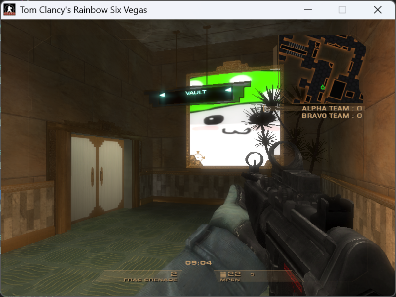

# What's next?

While technically I achieved my goal, this is a mere proof of concept at this point. I still need to finish the server code, so I can put it on github without too much shame. Plus a dumper for ads names. Plus v4 support (this probably will be a separate write-up). Plus v1 and v2 research and support, just because I can.

Thanks to making it this far. And thanks to halvors, lasercar and RedLine for their support and listening to my rumblings.