# Medius

Sometimes you stumble into a territory you never thought you will. One of those is a Medius online middleware, made by Sony for their titles somewhere around 2004, and kept in use until ~2012.

Since this is going to be a long ongoing series, I'll separate parts by months, and not logical pieces. At least for now.

## November 2025

So, one particular day I decided to look into Motorstorm series.

- Good news: Motorstorm 1 has debug symbols
- Bad news: Motorstorm 3 doesn't, and Motorstorm 1 symbols are not very compatible

I quickly found out that Motorstorm is utilizing `Medius`.

Motorstorm 1: `Medius Client Library Version 3.01.0001` (or `3.01.200611141700`)
Motorstorm 3 MP Demo: `Medius Client Library Version 3.05.201012031800`

So 4 years apart, which usually mean that only key concepts have stayed the same, but who knows!

Another quick google and we can find 2 repos with older Medius - https://github.com/hashsploit/clank and https://github.com/DestinationHome/Destination-Home-Online , which are mainly aimed at PS3 games. There are also some not public server emulators, like DestinationHome, and some public, which I'll talk later on.

For my testing endeavors I downloaded Motorstorm 3 MP Demo, booted it up, sniffed a dns resolve request of `motorstorm3ps3-beta.ws.online.scee.com`, redirected in to 127.0.0.1, saw `RST` from port 10060 TCP, spin up a dummy TCP server on port 10060 and was able to dump a...

```
Frame 4420: 325 bytes on wire (2600 bits), 325 bytes captured (2600 bits) on interface lo, id 0
Ethernet II, Src: 00:00:00_00:00:00 (00:00:00:00:00:00), Dst: 00:00:00_00:00:00 (00:00:00:00:00:00)
Internet Protocol Version 4, Src: 127.0.0.1, Dst: 127.0.0.1
Transmission Control Protocol, Src Port: 57340, Dst Port: 10060, Seq: 1, Ack: 1, Len: 259
Hypertext Transfer Protocol
    GET /motorstorm3ps3_xml/binary/actionList HTTP/1.1\r\n
    Host: motorstorm3ps3-beta.ws.online.scee.com:10060\r\n
    User-Agent: SCEE SLiCC 1.0.0\r\n
    Connection: Keep-Alive\r\n
    Accept-Encoding: identity\r\n
    X-SCEE-WebCore-Title: MotorStorm Apocalypse\r\n
    X-SCEE-webCore-Version: 3\r\n
    \r\n
    [Full request URI: http://motorstorm3ps3-beta.ws.online.scee.com:10060/motorstorm3ps3_xml/binary/actionList]
    [HTTP request 1/1]
```

http request!

By searching for `/motorstorm3ps3_xml/binary/actionList` at Github I was able to found a repo I somewhat familiar with - https://github.com/GitHubProUser67/MultiServer3 . I won't get into a lot of details about it and keep my opinions to myself.

But thanks to its author we now have sources for Motorstorm 3 server. Since I'm not a big fan of C# and coping code 1 to 1, let's see what we need to implement in order to have a working `SCEE` server with rust and actix-web (sorry axum, no 1.0 - no usage in projects).

### Existing code

And so we have a server code, that has 4 implemented endpoints aaaand that's it.

Well. 

In order to learn something, you need to do said something, so let's start small and eventually get to doing RE for missing parts.

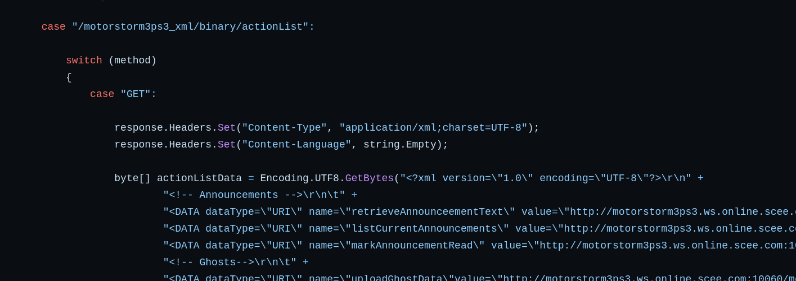

Starting with `actionList`, which turns out to be rather simple endpoint, which sends xml in return. Implementing this endpoint results in a pleasant sign of:

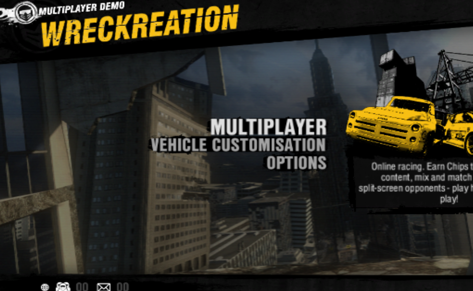

So now we let the game know what it can request and where it can request it from, we're in for some fun http stuff.

After that games sends 3 more calls:

```
POST /motorstorm3ps3_xml/account/TicketLoginAction HTTP/1.1 
POST /motorstorm3ps3_xml/friends/SyncFriendsAction HTTP/1.1 
POST /motorstorm3ps3_xml/announcements/ListCurrentAnnouncementsAction HTTP/1.1
```


## POST /motorstorm3ps3_xml/account/TicketLoginAction

Ah, the login. So vastly different from each other and yet so similar.

```
Frame 37: 326 bytes on wire (2608 bits), 326 bytes captured (2608 bits) on interface lo, id 0
Ethernet II, Src: 00:00:00_00:00:00 (00:00:00:00:00:00), Dst: 00:00:00_00:00:00 (00:00:00:00:00:00)
Internet Protocol Version 4, Src: 127.0.0.1, Dst: 127.0.0.1
Transmission Control Protocol, Src Port: 59878, Dst Port: 10060, Seq: 640, Ack: 5613, Len: 260
[2 Reassembled TCP Segments (640 bytes): #36(380), #37(260)]
Hypertext Transfer Protocol
    POST /motorstorm3ps3_xml/account/TicketLoginAction HTTP/1.1\r\n
    Host: motorstorm3ps3-beta.ws.online.scee.com:10060\r\n
    User-Agent: SCEE SLiCC 1.0.0\r\n
    Connection: Keep-Alive\r\n
    Content-Length: 260\r\n
    Accept-Encoding: identity\r\n
    X-SCEE-WebCore-Title: MotorStorm Apocalypse\r\n
    X-SCEE-webCore-Version: 3\r\n
    X-SCEE-Country: us\r\n
    X-SCEE-Language: 1\r\n
    X-request-signature: 5o7eAROn8BElrtgtKXhRJwqVXDY=\r\n
    \r\n
    [Full request URI: http://motorstorm3ps3-beta.ws.online.scee.com:10060/motorstorm3ps3_xml/account/TicketLoginAction]
    [HTTP request 2/2]
    [Prev request in frame: 32]
    [Response in frame: 39]
    File Data: 260 bytes
    Data (260 bytes)
        Data [truncated]: 0a810242fe0121010000000000f6300000a40008001435333333373800000000000000000000000000000001000400000100000700080000019a725f525a000700080000019a726d0dfa0002000800000000000015c3000400204169626f740000000000000000000000000000000
        [Length: 260]
```

In the payload, as you could guess, a psn ticket. Since it's 4th or 5th time I'm dealing with psn tickets, I'm gonna steal code from my own repo.

But the biggest obstacle here is `X-request-signature`. Sure, I can just copy the code from the repo:

```
response.AddHeader("Set-Cookie", $"id=ddb4fac6-f908-33e5-80f9-febd2e2ef58f; Path=/");
response.AppendHeader("Set-Cookie", $"name={psnname}; Path=/");
response.AppendHeader("Set-Cookie", $"authKey=2b8e1723-9e40-41e6-a740-05ddefacfe94; Path=/");
response.AppendHeader("Set-Cookie", $"timeZone=GMT; Path=/");
response.AppendHeader("Set-Cookie", $"signature=ghpE-ws_dBmIY-WNbkCQb1NnamA; Path=/");
```

But where the fun in that?

### Figuring out the signature

By searching for `signature` in Ghidra and snooping around a bit, I found exactly what I need:

```C++
        bVar6 = FUN_0029c8f4((int)param_1,ZEXT48(DAT_013001b0),
                             ZEXT48(DAT_013001ac) - ZEXT48(DAT_013001b0) & 0xffffffff,
                             (ulonglong)(uint)param_1[0x82]);
        if (bVar6) {
          FUN_007aec24(param_1,0);
        }
        else {
          Logger("\n Data verification failed \n");
          FUN_007aec24(param_1,0);
        }
```


and inside `FUN_0029c8f4`

```C++
bool FUN_0029c8f4(int param_1,undefined8 param_2,undefined8 param_3,longlong param_4)

{
  int iVar1;
  ulonglong auStack_40 [6];
  
  FUN_0029c784(param_1,(int)auStack_40,param_2,param_3,param_4);
  iVar1 = CompareStrings(auStack_40,(ulonglong *)(param_1 + 0x1d8));
  if (iVar1 == 0) {
    Logger("(DEBUG) Data matched - Server is %s, client is %s");
  }
  else {
    Logger("(DEBUG) Data mismatch - Server is %s, client is %s");
  }
  return iVar1 == 0;
}
```

So, what is in `FUN_0029c784` ?

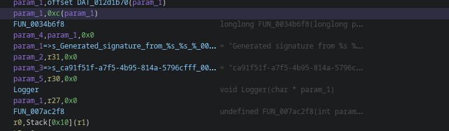

We have a uuid v4 of `ca91f51f-a7f5-4b95-814a-5796cfff586c`, some magic, and a signature which looks like `ghpE-ws_dBmIY-WNbkCQb1NnamA`. Allegedly!

Because the header checker I found checks only for `X-response-signature` and not for `signature`:

```
  iVar3 = CompareStrings((ulonglong *)"X-response-signature",(ulonglong *)*param_2);
  if (iVar3 == 0) {
    Logger("Received Signature: %s = %s");
```

This might be related to me using demo, and not retail, but we'll see about it later.

After some labeling we end up with this:

```C++
void ResponseSignatureGenerator
               (int response_obj,char output_buffer,undefined8 param_3,longlong param_4,
               longlong initial_key)

{
  longlong msg_lenght;
  longlong lVar1;
  undefined4 *hmac_ctx_00;
  ulonglong hmac_result;
  uint uVar2;
  undefined4 hmac_ctx [192];
  
  hmac_ctx_create(hmac_ctx,1);
  msg_lenght = get_lenght(initial_key);
  HmacInit(hmac_ctx,(void *)initial_key,msg_lenght);
  HmacUpdate(hmac_ctx,"ca91f51f-a7f5-4b95-814a-5796cfff586c",0x24);
  msg_lenght = GetSessionKey((ulonglong)*(uint *)(DAT_012d1b70 + 0xc));
  if (((int)msg_lenght != 0) && (*(char *)(response_obj + 0x1c4) != '\0')) {
    msg_lenght = GetSessionKey((ulonglong)*(uint *)(DAT_012d1b70 + 0xc));
    lVar1 = GetSessionKey((ulonglong)*(uint *)(DAT_012d1b70 + 0xc));
    lVar1 = get_lenght(lVar1);
    HmacUpdate(hmac_ctx,(void *)msg_lenght,lVar1);
  }
  hmac_ctx_00 = (undefined4 *)(ZEXT48(&stack0x00000000) - 0x330);
  HmacUpdate(hmac_ctx_00,param_3._4_4_,param_4);
  hmac_result = hmac_end(ZEXT48(&stack0x00000000) - 0x330,0);
  uVar2 = GetOffsetParam112((int)hmac_ctx_00);
  Base64Encoder((int)output_buffer,(undefined1 *)hmac_result,(ulonglong)uVar2,'\0');
  GetSessionKey((ulonglong)*(uint *)(DAT_012d1b70 + 0xc));
  Logger("Generated signature from %s %s %s %d");
  FUN_007ac2f8((int)hmac_ctx_00);
  return;
}

```

Yes, our beloved Hmac is here!

Since we're living in 2025 we can utilize rpcs3 debugger, and set some breakpoints here and there. But first we need an endpoint that do a signature check, since the `actionList` doesn't!

[alt text](img/break_point_request.png)

First we hit outgoing signature for request. The 5th parameter is our hashed payload, which is a psn key. Param 3, which seems to be added is non empty, so it's all a rather complex. First, let's figure out the key!


If we set a break point into HmacInit for any call we will find out that hmac key is...

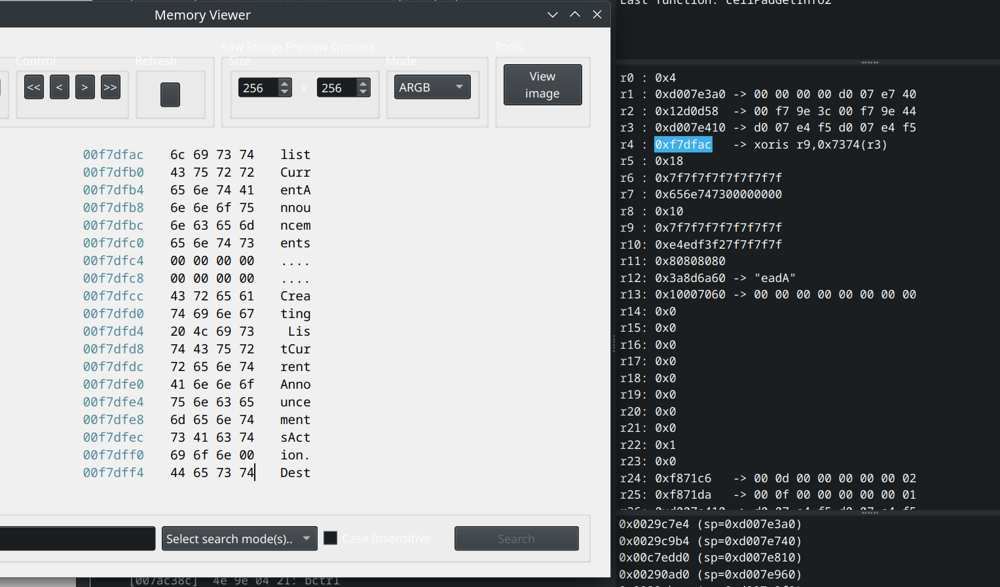

call name!

So if we make request to `/motorstorm3ps3_xml/announcements/ListCurrentAnnouncementsAction` our key for signature will be `listCurrentAnnouncements` and for login it's `ticketLogin`.

- init hmac context of sha-1 with key of `ticketLogin` (key should be sha-1 hashed!)
- update data with `ca91f51f-a7f5-4b95-814a-5796cfff586c`
- update data with session key, if present (it's not)
- update data with 0x105 bytes of psn ticket

Now that we can forge signatures and verify request and replies, let's try to figure out what game wants.

## Passing the login: Part 1

After I managed to figure out the signature, I was met with a problem that I have exactly zero idea what to send back and sign.

Strings from reply from existing code weren't present in the MSA code. So that whole reply was wrong, and I need to find a function, that parse the reply.

There are several potential leads.

Header parser checks for

- `X-response-signature`
- `X-Service-ErrorNumber`
- `X-Service-Error`
- `X-Service-ErrorCode`
- `X-SessionKey`

So potentially we need to return `X-SessionKey`.

Another thing I figured out after digging a lot, that game utilize protobuf. Ye.

As a result, most of the payloads, which are sent towards `scee` web server are in protobuf. This will make me really mad later on, but for now let's just  pretend I saw nothing. But it makes more sense for signature to exists, since we're gonna send a lot of payloads in the body of html requests and responses.

At the same time it means that game server has some endpoints sending xml, some sending protobuf, and it sounds like a total mess.

By setting breakpoints for `CheckHeader` function I was able to label the function that handles `ticketLogin` and `syncFriend` responses. But it wasn't a lot of help, since those functions are identical. Plus none of them triggered a check for signature, meaning I was responding with wrong data, while not being able to understand what is wrong, exactly.

And that's how I ended my first day of Ghidra binge. Not great, not terrible. 

## Passing the login: Part 2

Next day, as it usually goes, I decided to grab as many protos as possible, and check their binaries, in case somebody missed symbols.

And while checking Internal MP Beta, I saw one line, that makes everything crystal clear.

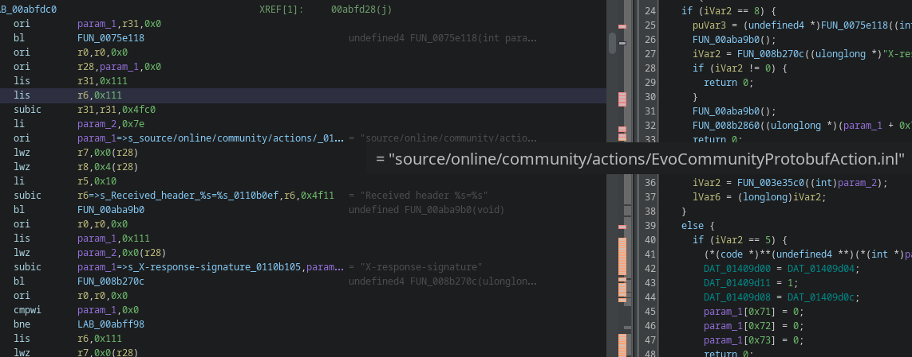

The signature was used with protobuf response. Meaning, everything is protobuf. And then I remember thinking "why PSN ticket starts with `a0`, it usually have size". And then it all aligned.

- Every payload past `actionList` is protobuf
- You need to read protobuf and reply in protobuf
- That's why there is no xml read calls past `actionList` content
- That's why psn ticket starts with `a0`
- That's why there is signature for each message

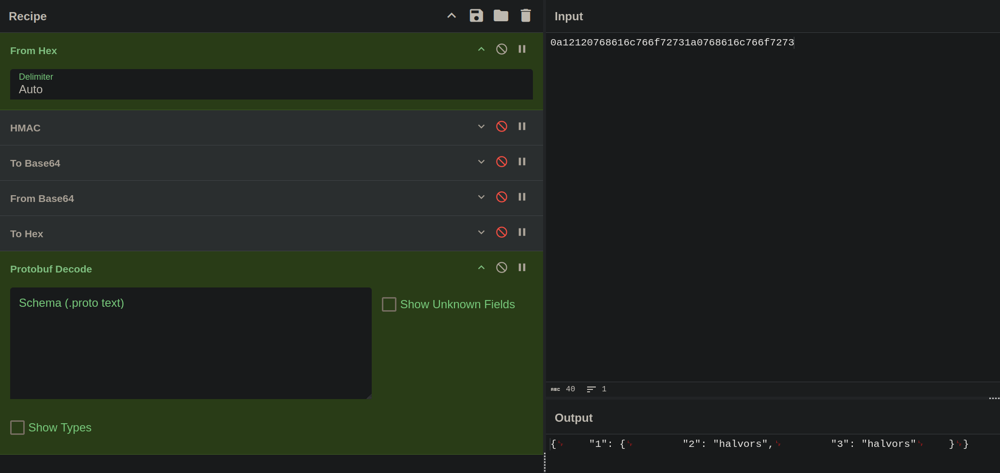

Yep. It's def protobuf.

I was giving Massive Ad Client from 2007 crap for raw bytes in http packets, and here I'm working on network online middleware from Sony from 2010 and it's the very same thing. Just with more bells and whistles.

And so after rewrite to axum and finding out that http crate doesn't support incorrect headers (non lowercase) I moved back to lesser known http server crate of "trillium"  and was I finally able to make signatures match and pass the check!

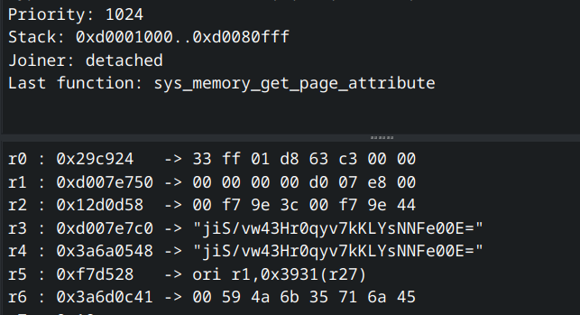

Good, now we just need to figure out how to construct a protobuf response and what suppose to be in it.

## Passing the login: Part 3

I will show you the exact path I took to reverse protobuf payloads of `ticketLogin` and `syncFriends`. This is applicable to others, but for now will be sufficient to demonstrate the approach.

Since we already know it's protobuf, we need to find the particular function reading the payload. Since protobuf is open sourced we can learn that such functions are called `ReadString`, `ReadVarint64*` and others and called in `protobuf/io/coded_stream.cc(p)`. One of logging remnants is pointing us exactly at what we need:

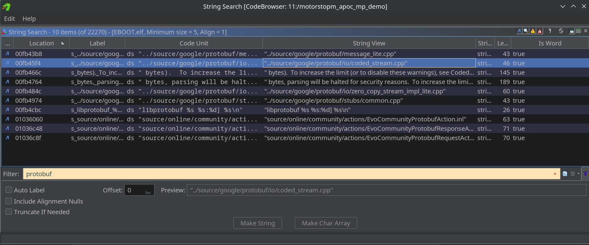

If we follow that log string we find

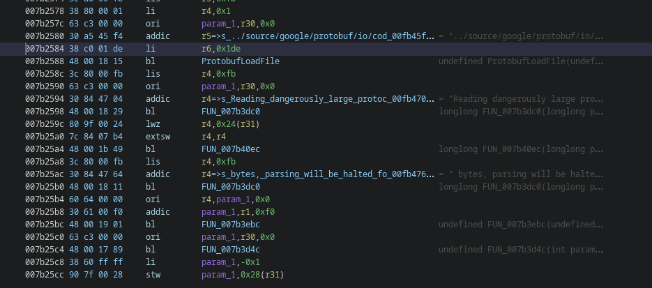

And we look in sources for that log string

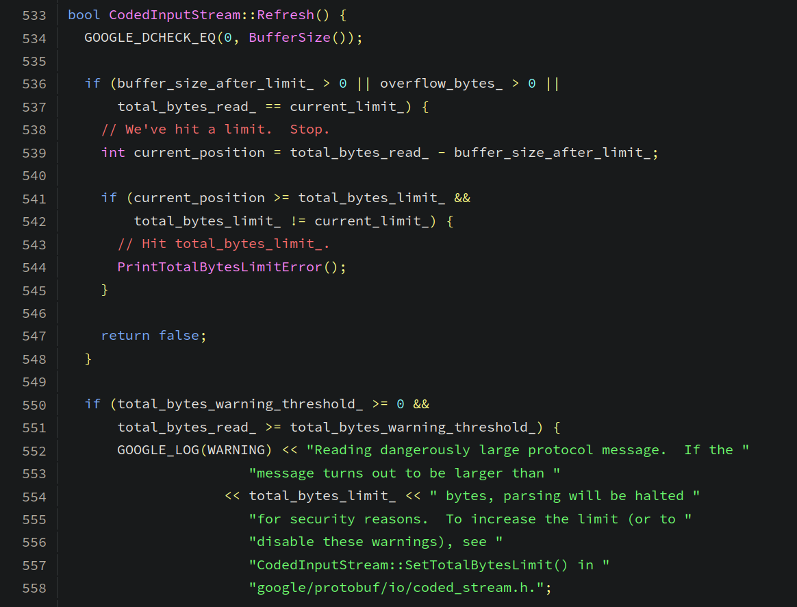

Great! Now we know this is `CodedInputStream::Refresh()`, which is used in:

- `ReadVarint64Slow`
- `Skip`
- `GetDirectBufferPointer`
- `WriteRaw`
- `ReadRaw`
- `ReadStringFallback`
- `ReadTagSlow`

The most interesting to us are `ReadVarint64Slow` and `ReadTagSlow`, since protobuf payloads starts with a tag.

We have nice xrefs in Ghidra, let's check them all.

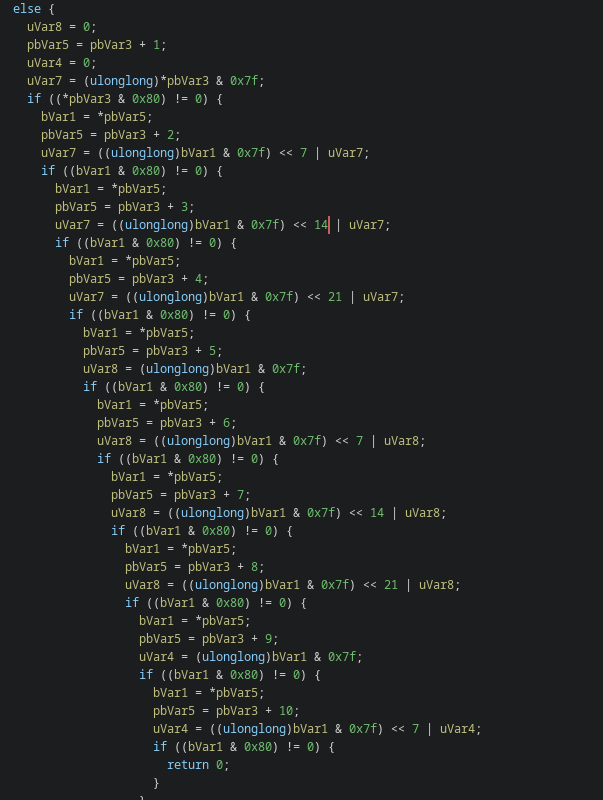

In one of the functions we find a very unique block, which we can easily find in the source code:

```C++
bool CodedInputStream::ReadVarint64Fallback(uint64* value) {
  if (BufferSize() >= kMaxVarintBytes ||
      // Optimization:  We're also safe if the buffer is non-empty and it ends
      // with a byte that would terminate a varint.
      (buffer_end_ > buffer_ && !(buffer_end_[-1] & 0x80))) {
    // Fast path:  We have enough bytes left in the buffer to guarantee that
    // this read won't cross the end, so we can skip the checks.
    const uint8* ptr = buffer_;
    uint32 b;
    // Splitting into 32-bit pieces gives better performance on 32-bit
    // processors.
    uint32 part0 = 0, part1 = 0, part2 = 0;
    b = *(ptr++); part0  = b      ; if (!(b & 0x80)) goto done;
    part0 -= 0x80;
    b = *(ptr++); part0 += b <<  7; if (!(b & 0x80)) goto done;
    part0 -= 0x80 << 7;
    b = *(ptr++); part0 += b << 14; if (!(b & 0x80)) goto done;
    part0 -= 0x80 << 14;
    b = *(ptr++); part0 += b << 21; if (!(b & 0x80)) goto done;
    part0 -= 0x80 << 21;
    b = *(ptr++); part1  = b      ; if (!(b & 0x80)) goto done;
    part1 -= 0x80;
    b = *(ptr++); part1 += b <<  7; if (!(b & 0x80)) goto done;
    part1 -= 0x80 << 7;
    b = *(ptr++); part1 += b << 14; if (!(b & 0x80)) goto done;
    part1 -= 0x80 << 14;
    b = *(ptr++); part1 += b << 21; if (!(b & 0x80)) goto done;
    part1 -= 0x80 << 21;
    b = *(ptr++); part2  = b      ; if (!(b & 0x80)) goto done;
    part2 -= 0x80;
    b = *(ptr++); part2 += b <<  7; if (!(b & 0x80)) goto done;
    // "part2 -= 0x80 << 7" is irrelevant because (0x80 << 7) << 56 is 0.
...
```

I double checked to make sure there are no false positives and marked this function as `ReadVarint64`, since it's not an exact match, but this block is def a u64 parsing logic. And now, we have 24 xrefs, ready for us to check.

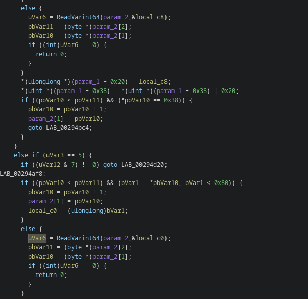

And right off the bat we are inside a parser of some structure. Cool, which means that at the top, as the very first call there would be absolutely totally not already labeled some unknown function we might need!

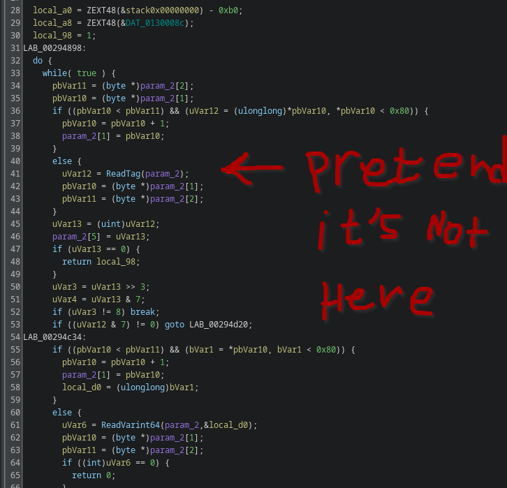

If we assume that `ReadTag` should looks like

```C++
uint32 CodedInputStream::ReadTagFallback() {
  if (BufferSize() >= kMaxVarintBytes ||
      // Optimization:  If the varint ends at exactly the end of the buffer,
      // we can detect that and still use the fast path.
      (buffer_end_ > buffer_ && !(buffer_end_[-1] & 0x80))) {
    uint32 tag;
    const uint8* end = ReadVarint32FromArray(buffer_, &tag);
...
```

and contain `ReadVarint32FromArray` 

```C++
inline const uint8* ReadVarint32FromArray(const uint8* buffer, uint32* value) {
  // Fast path:  We have enough bytes left in the buffer to guarantee that
  // this read won't cross the end, so we can skip the checks.
  const uint8* ptr = buffer;
  uint32 b;
  uint32 result;

  b = *(ptr++); result  = (b & 0x7F)      ; if (!(b & 0x80)) goto done;
  b = *(ptr++); result |= (b & 0x7F) <<  7; if (!(b & 0x80)) goto done;
  b = *(ptr++); result |= (b & 0x7F) << 14; if (!(b & 0x80)) goto done;
  b = *(ptr++); result |= (b & 0x7F) << 21; if (!(b & 0x80)) goto done;
  b = *(ptr++); result |=  b         << 28; if (!(b & 0x80)) goto done;

  // If the input is larger than 32 bits, we still need to read it all
  // and discard the high-order bits.
  for (int i = 0; i < kMaxVarintBytes - kMaxVarint32Bytes; i++) {
    b = *(ptr++); if (!(b & 0x80)) goto done;
  }
...
```

And in the ghidra we have 

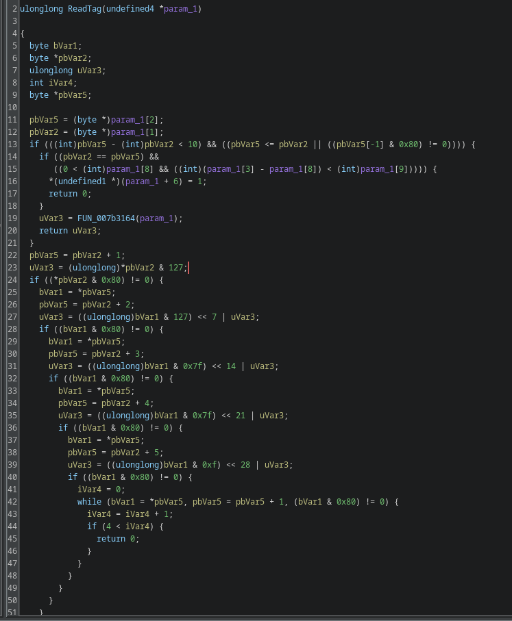

Ehh, let's assume it IS `ReadTag` and label it as such. If my logic is correct, then after getting a response for `ticketLogin` it should be called. Which we can easily check with breakpoint in rpcs3, and it should lead us into `ticketLogin` response parser.

Doing this and checking call stack lead us to `00310c18`

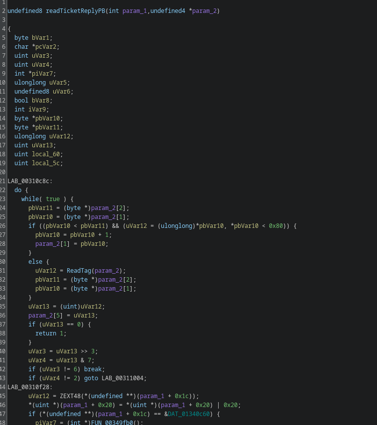

I'll omit checking all the functions like this, but after checking what is called by that function we're able to recreate a `.proto` file for it, looking like:

```
syntax = "proto2";
package ticket;

message TicketReply {
  optional bytes unk1      = 1;
  optional bytes unk2      = 2;
  optional bytes unk3      = 3;
  optional uint32 unk4     = 4;
  optional uint32 unk_enum = 5; #can be 0 or 9, so might be enum
  optional bytes unk5      = 6;
}
```

And now we have payload format and a way to dump those payloads! I did the same for `syncFriends`, which resulted in

syntax = "proto2";
package syncfriends;

message SyncFriendsReply {
  repeated Friend friends = 1;
}

message Friend {
  optional uint64 id       = 1;
  optional string name     = 2;
  optional bytes  unk1     = 3;
  optional uint32 unk2     = 4;
  optional uint32 unk3     = 5;
}


After implementing all of those in the code I again encountered a deafening silience from the game. So I decided to dump dns again and find out that game now requests not only `motorstorm3ps3-beta.ws.online.scee.com`(`ws` probably being `webservice`) but also `motorstorm3ps3-beta.online.scee.com` with port `10071`. By checking the payload being sent I saw that we finally got to `Medius` part of the game. Which to my luck is properly documented and implemented in MultiServerEmu3. Thanks, agent!

So for now let's switch from poking around webservice, and get to work on Medius.

## Medius Part 1

